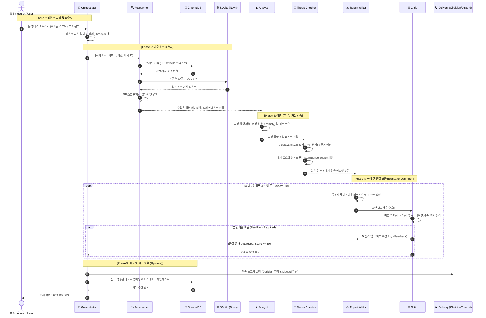
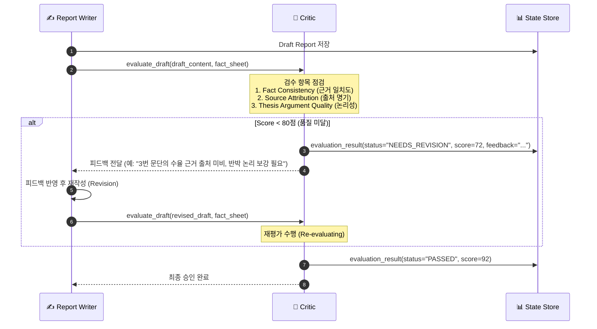
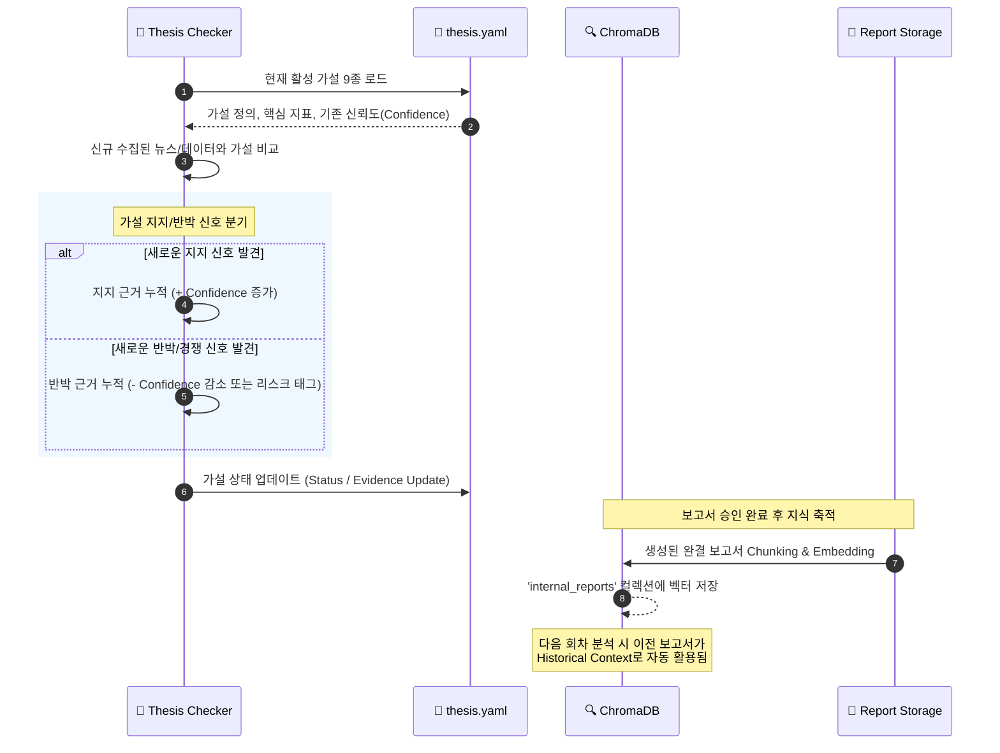

# Argus Pulse — 멀티에이전트 상세 시퀀스 다이어그램

> **작성일자**: 2026-09-02  
> **프로젝트**: Argus Pulse (LangGraph Multi-Agent Market Intelligence Engine)  
> **문서 버전**: v1.0

---

## 1. 전체 실행 흐름 (End-to-End Sequence)

시스템 스케줄러(Cron/이벤트)에 의해 구동되어 자료 수집, 6개 에이전트의 협업 분석, 품질 검수, 배포 및 지식 재인제스트까지의 전체 흐름입니다.

---

## 2. 세부 상호작용: Critic 검수 및 피드백 루프 (Quality Gate)

`Report Writer`와 `Critic` 사이의 반복적인 품질 교정 과정을 상세화한 시퀀스입니다.

---

## 3. 세부 상호작용: Thesis(가설) 검증 및 지식 순환 (Knowledge Flywheel)

새로운 뉴스와 지식을 바탕으로 기존 가설을 업데이트하고, 완성된 리포트가 다시 RAG의 컨텍스트로 흡수되는 구조입니다.

---

## 4. 컴포넌트별 상태(State) 전이 규격

| 단계 | 입력 State | 출력 State | 주요 처리 내용 |
|---|---|---|---|
| **Researcher** | `query`, `thesis_ids`, `timeframe` | `rag_chunks`, `news_records` | 벡터 유사도 검색 + SQLite 질의 |
| **Analyst** | `rag_chunks`, `news_records` | `insights`, `market_signals` | 데이터 요약 및 이상 패턴 추출 |
| **Thesis Checker** | `insights`, `thesis_yaml` | `thesis_eval_results`, `confidence` | 가설 지지/반박 근거 매핑 |
| **Report Writer** | `insights`, `thesis_eval_results`, `feedback` | `draft_report`, `revision_count` | 템플릿 기반 리포트 생성 및 수정 |
| **Critic** | `draft_report`, `insights` | `critic_score`, `feedback`, `is_approved` | 품질 점수 산출 및 승인 판정 |
