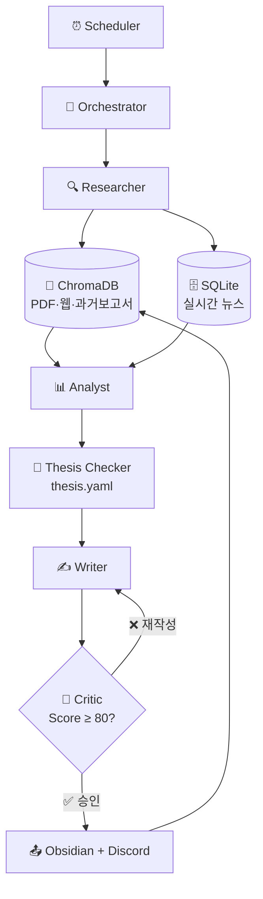

# Argus Pulse — 시퀀스 개요

> **작성일**: 2026-09-02  
> **원본**: [2026-09-02-detailed-sequence-diagram.md](2026-09-02-detailed-sequence-diagram.md)

---

## 전체 흐름 (5단계)



| 단계 | 담당 | 핵심 처리 |
|---|---|---|
| **1. 라우팅** | Orchestrator | 태스크 범위 및 대상 Thesis 식별 |
| **2. 리서치** | Researcher | ChromaDB 유사도 검색 + SQLite 뉴스 조회 |
| **3. 분석** | Analyst → Thesis Checker | 이상 신호 추출 + 가설 지지/반박 점수화 |
| **4. 작성** | Writer ↔ Critic | 초안 생성 → 품질 검수 → 최대 2회 재작성 |
| **5. 배포** | Orchestrator | Obsidian 저장 + Discord 전송 + RAG 재인제스트 |

---

## Critic 품질 기준

```
Score < 80  →  ❌ 재작성 (피드백 포함)
Score ≥ 80  →  ✅ 승인 및 배포
최대 2회 루프
```

검수 항목: 팩트 일치성 / 출처 명기 / 논리성 / 할루시네이션

---

## Knowledge Flywheel

```
신규 뉴스 → 분석 → 보고서 생성
                         ↓
              ChromaDB 재인제스트
                         ↓
           다음 회차 분석의 컨텍스트로 활용 🔄
```

→ 시간이 쌓일수록 분석 품질이 자동으로 향상됩니다.

---

## 에이전트별 입출력

| 에이전트 | 입력 | 출력 |
|---|---|---|
| Researcher | query, thesis_ids | rag_chunks, news_records |
| Analyst | rag_chunks, news_records | insights, market_signals |
| Thesis Checker | insights, thesis_yaml | confidence_score, evidence |
| Writer | insights, evidence, feedback | draft_report |
| Critic | draft_report, insights | score, feedback, is_approved |
