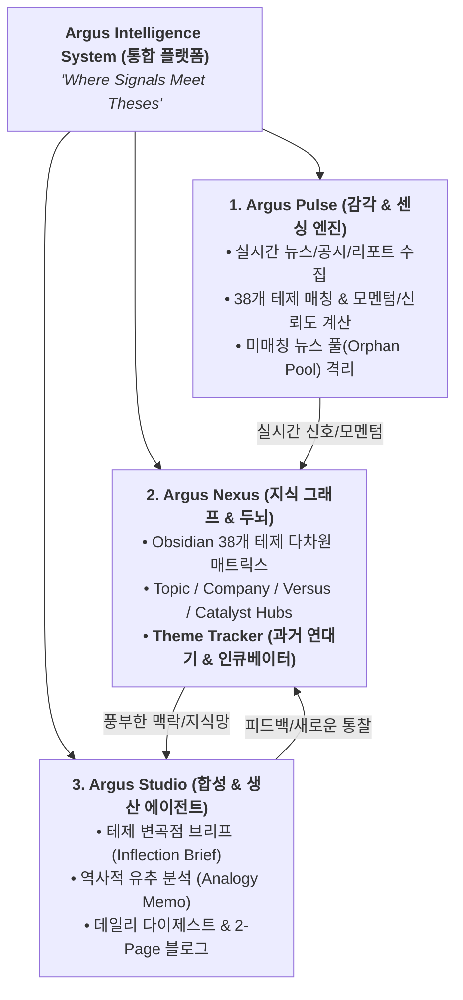
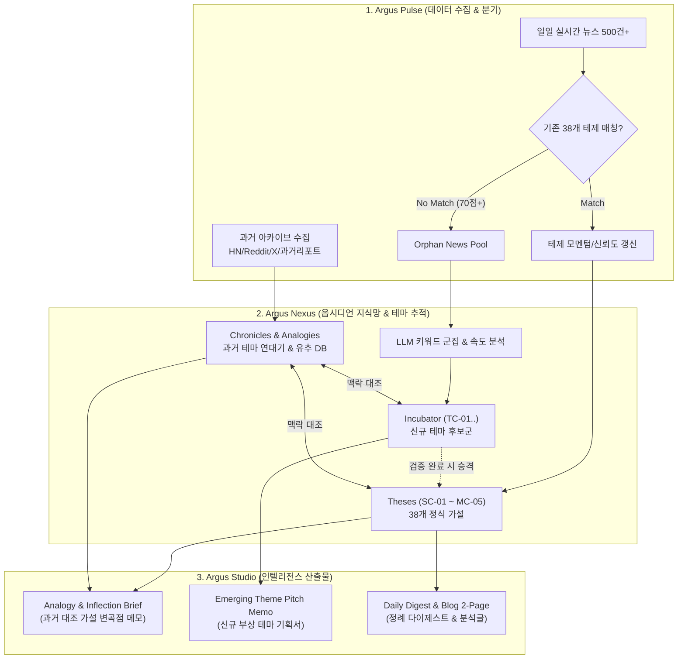

# Argus System: 시스템 네이밍 체계 및 테마 추적기(Theme Tracker) 연동 타당성 검토서

> **문서 번호**: ARCH-20260906-01  
> **작성 일자**: 2026-09-06  
> **핵심 주제**: 
> 1. Argus Intelligence System 통합 브랜드 및 계층별 네이밍 정의  
> 2. 가설(Thesis) 기반 지식망과 **테마 추적기(Theme Tracker: 과거 연대기 + 신규 테마 발굴)** 연동 가능성 및 통합 아키텍처 심층 검토  
> **연동 판정**: 🟢 **100% 연동 가능 및 최적의 시너지 구조 (완전 일치)**

---

## 1. Argus System 브랜드 및 계층별 아키텍처 정의

본 시스템은 **38개 투자 가설(Theses)**, **실시간 모멘텀 연산**, **옵시디언 6차원 지식 그래프**, **AI 다각도 콘텐츠 생산**이 결합된 'Thesis-driven Investment Intelligence OS'입니다.



### 3대 핵심 모듈 정의
1. **`Argus Pulse` (Sensing Engine)**:
   * 100개의 눈으로 시장의 파동(Pulse)을 실시간 감지하고 테제별 모멘텀 점수를 산출하는 백엔드 파이프라인.
2. **`Argus Nexus` (Knowledge Network)**:
   * 옵시디언 기반의 양방향 지식 그래프. 테제, 기업, 토픽, 과거 역사, 신규 테마가 교차하는 중심 지식 결절점.
3. **`Argus Studio` (Synthesis Agent)**:
   * 축적된 지식과 실시간 신호를 결합하여 투자 메모, 반증 리포트, 블로그, 다이제스트를 자동 집필하는 지능형 에이전트.

---

## 2. 테마 추적기(Theme Tracker)의 2대 축과 시스템 연동 필요성

테마 추적기(Theme Tracker)는 다음 2가지 하위 시스템으로 구성됩니다:

```
┌────────────────────────────────────────────────────────────────────────┐
│                     Theme Tracker (테마 추적 시스템)                    │
├───────────────────────────────────┬────────────────────────────────────┤
│  A. 과거 테마 추적기 (Chronicle)    │  B. 신규 테마 발굴기 (Discovery)   │
│  - HBM2/3, CXL 등 과거 내러티브 복원│  - 미탐색 고득점 뉴스 클러스터링   │
│  - [회의론 ➔ 수율 ➔ 빅테크 ➔ 리레이팅]│  - 약한 신호(Weak Signal) 감지     │
│  - '역사적 유추(Historical Analogy)'│  - 테제 인큐베이션 (Level 0~2 승격) │
└───────────────────────────────────┴────────────────────────────────────┘
```

### 왜 Argus System과 테마 추적기의 결합이 필수적인가?
1. **가설의 정체 방지**: 38개 테제에만 갇혀 있으면 새로운 주도 섹터(예: 원자력 SMR, 유리기판, CPO)가 부상할 때 시스템이 눈이 멀게 됨 ➔ **신규 테마 발굴(Discovery)**로 보완.
2. **판단의 깊이 강화**: 현재 발생하는 변곡점이 과거 사이클의 어느 지점에 해당하는지 과거 데이터로 검증 ➔ **과거 테마 연대기(Chronicle)**로 보완.

---

## 3. 통합 연동 아키텍처 및 데이터 흐름 (Data Pipeline)



---

## 4. 모듈별 상세 연동 방안

### (1) Argus Pulse 연동 (수집 및 파이프라인)
* **`collector.py` & `scorer.py` 고도화**:
  * 뉴스가 수집되면 기존 38개 테제(`SC-01` ~ `MC-05`)와 1차 매칭.
  * 매칭된 뉴스는 해당 테제의 **모멘텀 점수($\text{Momentum}$)와 지지/반증 신뢰도**를 업데이트.
  * **미매칭 고득점(70점+) 뉴스**: 버리지 않고 `orphan_news` 테이블에 적재 ➔ `theme_discoverer.py`가 매일 밤 클러스터링하여 신규 테마 후보(`TC-01`, `TC-02`...)로 인큐베이션.
* **`historical_harvester.py` 추가**:
  * Hacker News, Reddit, 과거 증권사 PDF에서 수집한 과거 내러티브를 ChromaDB의 `argus_history` 컬렉션에 임베딩.

### (2) Argus Nexus 연동 (Obsidian 지식 구조 확장)
옵시디언 볼트(`agent_vault/argus/`) 내에 테마 추적기 전용 디렉터리를 자연스럽게 편입합니다:

```
agent_vault/argus/
├── 00-Argus-Master-MOC.md          # 마스터 MOC (신규 테마 레이더 & 연대기 섹션 추가)
├── Theses/                         # 38개 정식 테제 (SC-01 ~ MC-05)
├── Incubator/                      # [신설] 신규 발굴 테마 후보 (TC-01, TC-02...)
├── Chronicles/                     # [신설] 과거 테마 연대기 (Chronicle-HBM2-HBM3.md 등)
├── Analogies/                      # [신설] 과거 vs 현재 1:1 비교 분석 노트
├── Hubs-Topic/                     # 16개 토픽 허브
├── Hubs-Company/                   # 15개 기업 허브
└── Hubs-Versus/                    # 4개 격돌 허브
```

* **Dataview 동적 대시보드 확장**:
  * `00-Argus-Master-MOC.md`에 `### 🧭 신규 테마 발굴 레이더 (Incubation Radar)` 테이블을 추가하여, 새롭게 감지된 후보 테마와 급증 키워드를 실시간 표시.
  * 테제 상세 페이지에 `과거 유사 테마(Historical Analogy)` 링크를 자동 양방향 연결.

### (3) Argus Studio 연동 (콘텐츠 및 보고서 생성)
* **`analogy_engine.py`**:
  * 블로그나 다이제스트를 작성할 때, "현재의 HBM4 논쟁은 2020년 HBM2E 수율 논쟁 당시와 다음 3가지 측면에서 유사하다"는 **역사적 유추 단락을 자동 삽입**.
* **`theme_pitch_writer.py`**:
  * 신규 테마 후보(`TC-XX`)가 3일 연속 뉴스 급증을 기록하면 자동으로 **1-Page Theme Pitch Memo**를 생성하여 사용자에게 브리핑.

---

## 5. 결론 및 로드맵

| 단계 | 목표 | 주요 작업 | 예상 소요 |
|---|---|---|---|
| **Step 1 (완료)** | **네이밍 & 아키텍처 정립** | • Argus System 브랜드 체계 확립 (`Pulse` / `Nexus` / `Studio`)<br/>• 지식 그래프 38개 테제 섹터 코드화 (`SC-01` ~ `MC-05`) | 즉시 완료 |
| **Step 2 (단기)** | **신규 테마 인큐베이터 연동** | • 미매칭 뉴스 풀(Orphan Pool) 격리 및 클러스터링 로직 구현<br/>• Obsidian `Incubator/` 폴더 및 Master MOC 레이더 뷰 추가 | 3~5일 |
| **Step 3 (중기)** | **과거 테마 연대기(Chronicle) 구축** | • Hacker News/과거 리포트 아카이브 수집기 구현<br/>• `Chronicle-HBM2-to-HBM3.md` 등 과거 내러티브 복원 노트 생성 | 1~2주 |
| **Step 4 (고도화)**| **역사적 유추(Analogy) 에이전트 연동** | • Studio 에이전트에 과거 vs 현재 대조 분석 프롬프트 주입<br/>• 테제 생애주기(Lifecycle) 상태 전이 자동화 | 2주 |

> **최종 판정**: **테마 추적기(과거 연대기 + 실시간 발굴)는 Argus System의 두뇌(Argus Nexus)와 감각(Argus Pulse)에 완전히 밀착되어 시스템의 완성도를 극대화하는 핵심 모듈입니다.**
