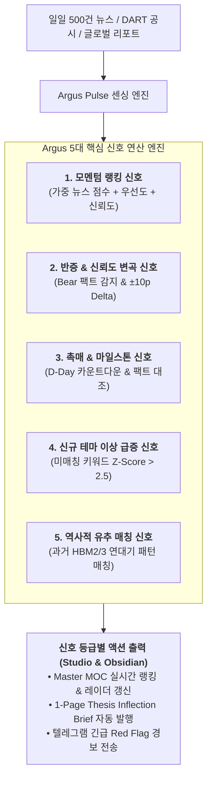

# Argus 테제 신호 체계(Thesis Signaling System) 핵심 기능 및 운영 명세서

> **문서 번호**: SPEC-20260906-03  
> **작성 일자**: 2026-09-06  
> **문서 유형**: 시스템 핵심 기능 정의 및 신호 알고리즘 명세서  
> **핵심 정의**: 실시간 시장 데이터(뉴스/공시/마일스톤)를 입력받아 41개 투자 가설(Theses)의 **모멘텀, 신뢰도 변곡점, 반증(Falsification), 신규 테마 및 역사적 유추 신호를 연산하는 다차원 인텔리전스 신호망**

---

## 1. Argus 테제 신호 체계 개요 (Overview)

단순한 키워드 알림(Alert)을 넘어, **"내가 세운 투자 가설이 시장에서 강화되고 있는가, 아니면 깨지고 있는가?"**를 실시간으로 판별하여 투자 의사결정에 직결되는 시그널을 제공합니다.

---

## 2. 5대 핵심 신호 기능 상세 (Core 5 Functions)

### ① 실시간 모멘텀 신호 엔진 (Momentum Signal Engine)
* **기능**: 41개 테제에 실시간 유입되는 뉴스의 양과 질, 신선도를 복합 연산하여 1위~41위 순위를 실시간 매깁니다.
* **수식**:
  $$\text{Raw Momentum} = \sum (\text{뉴스 점수} \times \text{시간 가중치 1.2 / 1.0})$$
  $$\text{종합 모멘텀 점수} = \text{Raw Momentum} + (\text{Priority} \times 10) + (\text{Confidence} \times 0.2)$$
* **신호 출력**: 상위 10개 테제 실시간 랭킹 변동 및 급상승(Surge) 신호 포착.

### ② 반증 및 신뢰도 변곡 신호 (Falsification & Confidence Delta Signal)
* **기능**: 가설을 지지하는 뉴스뿐만 아니라, 가설이 틀렸음을 가리키는 **반증 증거(Bear Case)**를 상시 감시합니다.
* **트리거 조건**:
  * 특정 테제의 신뢰도 점수가 최근 48시간 내 $\pm 10\text{p}$ 이상 급변할 때
  * 사전에 등록된 `falsification_trigger` 사건(예: HBM4 표준화 무산, 수율 하락 공시) 발생 시
* **신호 출력**: **`🚨 Red Flag Alert`** 및 **`Thesis Inflection Brief`** 1-Page 분석 메모 자동 발행.

### ③ 촉매 & 마일스톤 카운트다운 신호 (Catalyst & Milestone Signal)
* **기능**: 테제 프론트매터에 등록된 핵심 이벤트(테이프아웃, 주총, 3자 회동, 실적 발표)의 시간표를 추적합니다.
* **동작 방식**: 이벤트 D-7, D-1일 사전 알림 및 이벤트 발생 당일 실제 결과와 가설의 정합성을 사후 검증(Audit)하는 신호 발생.

### ④ 신규 테마 이상 급증 신호 (Emerging Theme Spike Signal - Incubator 연동)
* **기능**: 41개 기존 테제와 매칭되지 않는 뉴스 풀(`orphan_news`)에서 키워드 출현 속도를 측정합니다.
* **트리거 조건**: $\text{Z-Score} > 2.5$ 이상 급증하고 3개 이상의 독립 매체에서 보도될 때.
* **신호 출력**: **`🧭 신규 테마 감지 신호`** ➔ `Incubator/TC-XX.md` 자동 생성 및 MOC 레이더 등록.

### ⑤ 역사적 유추 매칭 신호 (Historical Analogy Rhyme Signal - Chronicle 연동)
* **기능**: 현재 발생하는 사건의 역학 구도가 과거 연대기(`Chronicles/`)의 4단계(회의론 ➔ 수율 ➔ 숏티지 ➔ 리레이팅) 중 어느 국면과 유사한지 패턴을 매칭합니다.
* **신호 출력**: 유사도($\text{Rhyme Score} \ge 80\%$) 매칭 시 향후 전개될 주가/실적 사이클 시나리오 제시.

---

## 3. 신호 등급 체계 및 대응 액션 (Signal Severity Levels)

| 등급 | 신호 명칭 | 트리거 조건 | 시스템 액션 |
|:---:|:---|:---|:---|
| **Level 1** (INFO) | **모멘텀 펄스** | 일상적 뉴스 유입 및 순위 변동 | • Master MOC Dataview 테이블 갱신 • 일일 모닝 다이제스트에 반영 |
| **Level 2** (WATCH) | **테마 인큐베이션** | 미매칭 신규 키워드 출현 속도 급증 | • `Incubator/TC-XX.md` 생성 • 14일 관찰 타이머 가동 |
| **Level 3** (ACTION) | **가설 변곡점 브리프** | 테제 신뢰도 $\pm 10\text{p}$ 급변 또는 마일스톤 도래 | • **1-Page Thesis Inflection Brief 자동 작성** • 텔레그램 브리핑 전송 |
| **Level 4** (CRITICAL) | **반증 레드 플래그** | 핵심 전제 훼손 및 대체재/기술 실패 발생 | • **🚨 긴급 리스크 경보 전송** • 포트폴리오 비중 축소/헷지 시그널 |

---

## 4. 데이터 저장 및 옵시디언 연동

1. **테제 프론트매터 자동 기록**:
   * 각 테제 파일(`thesis/T#-XX.md`)의 `rank`, `momentum`, `confidence`, `last_checked` 필드가 파이썬 엔진에 의해 실시간 갱신됩니다.
2. **Master MOC 대시보드 표출**:
   * `00-Argus-Master-MOC.md` 상에서 모멘텀 Top 10, 역발상 헷지 7종, 인큐베이터 레이더, 유추 매트릭스로 분기되어 표시됩니다.
