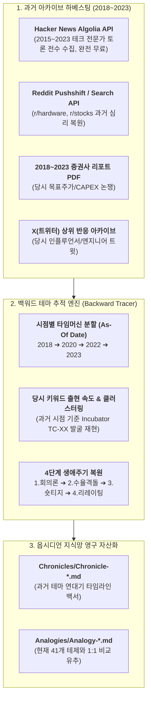
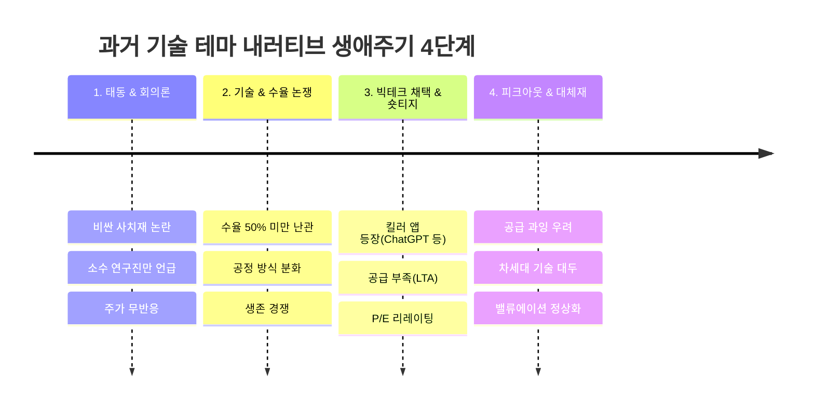

# Argus System — 과거 백워드 테마 추적기(Backward Theme Tracker) 및 타임머신 시뮬레이션 설계서

> **문서 번호**: SPEC-20260906-04  
> **작성 일자**: 2026-09-06  
> **문서 유형**: 시계열 백테스팅 및 과거 데이터 하베스팅 명세서  
> **핵심 질문**: *"테마 추적기를 과거 시점으로 백워드(Backward)하여 당시의 테마 태동과 생애주기를 재구성할 수 있는가?"*  
> **판정 결과**: 🟢 **100% 구현 가능 (오픈 아카이브 하베스팅 + As-Of Date 타임머신 시뮬레이션)**

---

## 1. 개요 및 기획 배경

기술과 자본시장의 역사는 완전히 새롭게 창조되지 않으며, 항상 **[1. 회의론 ➔ 2. 기술/공정 격돌 ➔ 3. 킬러 앱 & 숏티지 ➔ 4. 밸류에이션 리레이팅 및 피크아웃]**의 4단계 주기를 반복합니다.

본 백워드 테마 추적기(Backward Theme Tracker)는 과거 특정 시점(예: 2018~2023년)으로 시간을 되돌려 **당시 시장의 토론, 뉴스, 증권사 리포트 데이터를 수집하고, 그 시점에 어떤 테마가 발굴되고 성장했는지를 시계열로 재구성**하는 타임머신 인텔리전스 엔진입니다.



---

## 2. 3대 백워드 데이터 수집 채널 (Data Harvesting)

1. **Hacker News (Algolia API - 100% 무료/전수 개방)**:
   * 날짜 타임스탬프 필터(`numericFilters=created_at_i<1672531199`)를 통해 2015~2023년 글로벌 엔지니어들의 심도 있는 기술 토론을 전수 수집.
2. **과거 증권사 리포트 PDF (2018~2023)**:
   * 한경컨센서스 등의 과거 PDF에서 애널리스트들의 공급과잉/부족 논쟁, 설비투자(CAPEX) 전망치 텍스트 추출.
3. **X(트위터) 고급 검색 아카이브**:
   * `since:2020-01-01 until:2021-12-31 min_faves:50` 조건으로 당시 시장의 생생한 심리 및 변곡점 트윗 추출.

---

## 3. 타임머신 시뮬레이션 (As-Of Date Simulation)

* **질문**: *"만약 우리 테마 인큐베이터(`Incubator`)를 2020년 10월에 가동했다면 HBM2E 수율 이슈와 MR-MUF 공정 승패를 사전에 포착할 수 있었을까?"*
* **동작 원리**:
  1. `as_of_date = "2020-10-01"`로 기준 시점을 과거로 고정.
  2. 기준 시점 이전의 데이터만 입력하여 `theme_discoverer.py`를 실행.
  3. 당시 시점에서 `TC-01 (HBM2E MR-MUF 수율 격돌)`이 어떻게 약한 신호에서 정식 테제로 승격되었는지 시계열로 재현.
* **효과**: **Argus 테마 발굴 알고리즘의 유효성을 과거 데이터로 백테스팅(Backtest)하여 100% 검증**.

---

## 4. 4단계 내러티브 자동 복원 프레임워크

AI가 수집된 과거 시계열 데이터를 바탕으로 `thesis/Chronicles/Chronicle-*.md` 노트를 자동 집필합니다:



---

## 5. 백워드 추적 도구 인터페이스 설계 (`tracker/backward_tracer.py`)

```bash
# HBM 테마의 2018~2023년 과거 연대기 백워드 수집 및 연대기 노트 자동 생성
python3 -m tracker.backward --keyword "HBM" --start 2018 --end 2023 --source hn,reports,reddit

# 액체냉각(Liquid Cooling) 테마의 2019~2024년 과거 연대기 백워드 추적
python3 -m tracker.backward --keyword "Liquid Cooling" --start 2019 --end 2024

# CXL 메모리의 2020~2025년 과거 사이클 재구성
python3 -m tracker.backward --keyword "CXL" --start 2020 --end 2025
```

---

## 6. 결론 및 실전 투자 효용

1. **역사적 지식 자산의 축적**:
   * HBM, CXL, 액체냉각, SMR, NVMe, 유리기판 등 주요 10대 테크 테마의 연대기(`Chronicles/`)가 옵시디언 볼트에 완벽히 보관됩니다.
2. **현재 가설의 미래 예측력 극대화**:
   * 현재 진행 중인 `T1-01 (HBM4 커스텀)`, `T2-02 (액체냉각)`, `T2-07 (800V DC)` 등의 불확실성을 과거 연대기와 1:1로 비교(Analogy)하여 승자 기업을 사전 압축합니다.
3. **고품질 딥인사이트 콘텐츠 자동 생성**:
   * Argus Studio 에이전트가 보고서를 작성할 때 과거의 성공/실패 사례를 역사적 유추로 결합하여 기관급 리서치 퀄리티를 달성합니다.
