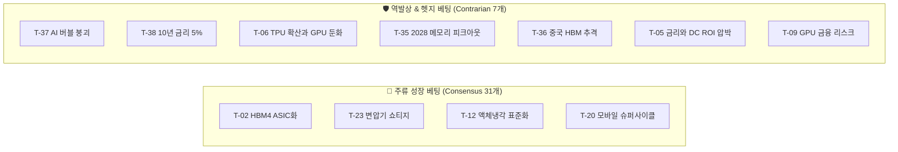

# 🧭 투자 테제 교차 차원(Cross-cutting Dimensions) 상세 설계 및 구현 가이드

> **작성일**: 2026-09-06  
> **시스템**: Argus Pulse / Obsidian Knowledge Graph System  
> **목적**: 38개 투자 가설을 1차원적 섹터 구분을 넘어, **컨센서스 성격, 밸류체인 스택(L0~L5), 투자 시계, 지정학 공급망, 대결(Vs) 구도**의 5대 교차 차원으로 입체 분석하는 종합 설계서

---

## 1. 교차 차원(Cross-cutting Dimensions) 도입 배경 및 필요성

기존의 섹터 분류(예: '반도체', '전력', '로봇')는 산업 카테고리를 나누는 데 유용하지만, **실전 투자 전략 수립** 시 다음과 같은 질문에 답하지 못합니다:

1. **"현재 시장의 과도한 낙관론에 대응할 역발상/헷지 테제는 무엇인가?"** (컨센서스 축 부재)
2. **"이 가설이 밸류체인의 최상단(소부장)인가, 아니면 최종 엔드포인트(디바이스)인가?"** (스택 계층 축 부재)
3. **"지금 당장 실적에 반영되는 단기주인가, 3년 뒤 패러다임 전환주인가?"** (시간축 부재)
4. **"어떤 국가/기업 진영이 제로섬 경쟁을 벌이고 있는가?"** (지정학 & 대결 축 부재)

교차 차원은 이러한 다각적 관점을 메타데이터로 구조화하여, 옵시디언에서 **단 하나의 볼트로 무한한 관점의 투자 대시보드**를 생성할 수 있게 만듭니다.

---

## 2. 5대 교차 차원 상세 정의 및 분석 프레임워크

```
                                  ┌── 1. 컨센서스 성격 (Consensus vs Contrarian)
                                  ├── 2. 6계층 밸류체인 스택 (Value Chain Layer L0~L5)
[38개 테제 다차원 분석 프레임워크] ──┼── 3. 투자 시계 및 성숙도 (Time Horizon)
                                  ├── 4. 지정학 & 국가 공급망 (Geography & Geopolitics)
                                  └── 5. 제로섬 대결 & 트레이드오프 (Versus & Trade-offs)
```

---

### Dimension 1: 컨센서스 성격 (`thesis_nature`)

시장의 지배적 기대치(Market Consensus)와 가설의 방향성을 비교하여 **포트폴리오의 공격과 수비 밸런스**를 맞춥니다.



* **`consensus` (주류 상승 가설 | 31개)**:
  - **정의**: 월가 및 여의도 컨센서스와 일치하며, AI 인프라 확장에 따른 직접적 수혜와 실적 성장이 입증되고 있는 가설.
  - **투자 활용**: 주도주 포트폴리오 비중 확대 (Long 포지션).
* **`contrarian` (역발상 & 꼬리 리스크 가설 | 7개)**:
  - **정의**: 시장의 지배적 낙관론에 경고를 던지거나, CAPEX 피크아웃, 대체재 출현, 금융 부실 등 하방 리스크를 지적하는 가설.
  - **투자 활용**: 과열 국면 비중 축소, 쇼티지 완화 시점 헷지, 풋옵션/인버스 방어 전략.

---

### Dimension 2: 6계층 밸류체인 수직 스택 (`stack_layer`)

원자재/소부장부터 최종 소비자가 만나는 디바이스까지 **병목(Bottleneck)의 수직 이동**을 추적합니다.

```
[L5: 엔드 디바이스 & 피지컬] ── AI 스마트폰, AI PC, 로보택시, 휴머노이드 로봇 (T-04, 17, 18, 20, 21, 27, 30)
          ▲
[L4: 모델 & 엔터프라이즈 SW] ── 파운데이션 LLM, 온프레미스 AI, 바이오 신약 모델 (T-25, 31, 34)
          ▲
[L3: 클라우드 & 네트워킹]   ── CSP 인프라, CPO 광스위칭, UEC 이더넷, 네오클라우드 (T-08, 09, 14, 26, 29)
          ▲
[L2: 물리 인프라 & 전력]   ── 초고압 변압기, 전력망 그리드, CDU 액체냉각, SMR 원전, BESS (T-01, 12, 13, 22, 23)
          ▲
[L1: 칩 제조 & 첨단 패키징] ── 2nm 파운드리, HBM4 적층, CoWoS 인터포저, 커스텀 ASIC (T-02, 06, 07, 10, 15, 16, 19, 24, 28, 35, 36)
          ▲
[L0: 소재/부품/장비/원자재] ── 리튬 광산, 식각/세정액, 유리기판, TC 본더 (T-03, 11, 32, 33)
```

| 스택 레이어 | 명칭 | 핵심 설명 | 대표 테제 |
|:---:|:---|:---|:---|
| **`L0`** | **소재/부품/원자재** | 패키징 기판, 리튬 배터리 소재, 반도체 전/후공정 케미컬 및 장비 | `T-03`, `T-11`, `T-32`, `T-33` |
| **`L1`** | **칩 제조 & 패키징** | 선단 파운드리(GAA), 커스텀 HBM, 2.5D 인터포저 집적, ASIC 팹리스 | `T-02`, `T-06`, `T-07`, `T-10`, `T-15`, `T-16`, `T-19`, `T-24`, `T-28`, `T-35`, `T-36` |
| **`L2`** | **물리 인프라/전력·냉각** | 데이터센터 PUE 저감 냉각 솔루션, 송배전망, 소형모듈원전, 대용량 ESS | `T-01`, `T-12`, `T-13`, `T-22`, `T-23` |
| **`L3`** | **클라우드 & 네트워킹** | 초고속 AI 패브릭(UEC/CPO), GPU 호스팅 클라우드, 국가 컴퓨트 허브 | `T-05`, `T-08`, `T-09`, `T-14`, `T-26`, `T-29`, `T-37` |
| **`L4`** | **모델 & 엔터프라이즈 SW**| 독점적 LLM API, 오픈소스 SLM, 도메인 특화 버티컬 AI 소프트웨어 | `T-25`, `T-31`, `T-34` |
| **`L5`** | **엔드포인트 & 피지컬 디바이스** | 스마트폰/PC 교체, 공간지능 글래스, 완전자율주행, 피지컬 로봇 | `T-04`, `T-17`, `T-18`, `T-20`, `T-21`, `T-27`, `T-30` |

---

### Dimension 3: 투자 시계 및 촉매 속도 (`time_horizon`)

가설이 현실화되어 **재무제표(EPS)에 찍히는 시점과 밸류에이션 리레이팅 주기**를 3단계로 구분합니다.

* **단기 실적 확인기 (2026~2027)**:
  - 쇼티지(공급부족)로 인해 가격(P)과 물량(Q)이 동반 상승하며 EPS가 서프라이즈를 내는 단계.
  - 테제: `T-01`(DC 전력), `T-02`(HBM4), `T-04`(온디바이스 NPU), `T-20`(모바일 교체), `T-23`(변압기)
* **중기 기술 변곡기 (2027~2028)**:
  - 1세대 표준이 한계에 부딪히며 신기술이 본격 채택되거나, 사이클 피크아웃 논쟁이 벌어지는 단계.
  - 테제: `T-11`(유리기판), `T-13`(SMR 무탄소 전력), `T-14`(CPO 광스위치), `T-16`(2nm GAA), `T-35`(메모리 피크아웃)
* **장기 패러다임 전환기 (2028+)**:
  - 인류의 산업 구조와 일상이 근본적으로 재편되는 피지컬 AI 상용화 단계.
  - 테제: `T-03`(전고체 배터리), `T-17`(휴머노이드 로봇), `T-28`(3D DRAM), `T-34`(AI 신약 개발)

---

### Dimension 4: 지정학 & 국가 공급망 (`geography`)

AI 패권 전쟁 속에서 각국 공급망의 지리적 위치와 수혜/위험을 매핑합니다.

* **`US` (북미)**: 빅테크 CSP(MS/구글/메타/아마존), AI 팹리스(엔비디아/브로드컴), 네오클라우드, 전력 유틸리티
* **`KR` (한국)**: HBM 메모리 과점(SK하이닉스/삼성전자), 초고압 변압기(HD현대일렉), ESS/배터리(LG엔솔), 소부장
* **`TW` (대만)**: 선단 파운드리 및 CoWoS 어드밴스드 패키징 독점(TSMC, ASE)
* **`CN` (중국)**: 레거시 반도체 국산화(CXMT, SMIC), LFP 공급망, 내수 폐쇄형 AI

---

### Dimension 5: 제로섬 대결 & 트레이드오프 (`related_vs`)

승자와 패자가 갈리는 기술 및 기업 진영 간의 **대결 구도(Versus Hubs)**를 4대 테마로 정립합니다.

1. **`Vs-GPU-vs-TPU-ASIC` (범용 GPU vs 커스텀 ASIC)**:
   - 엔비디아 독점 생태계(`T-08`) vs 구글 TPU·메타 MTIA 등 빅테크 자체 가속기(`T-06`, `T-15`, `T-24`)
2. **`Vs-TSMC동맹-vs-삼성턴키` (분리형 외주 생태계 vs 수직계열화 턴키)**:
   - SK하이닉스-TSMC-엔비디아 삼각편대 vs 삼성전자 메모리·파운드리·패키징 원팀 (`T-02`, `T-10`, `T-16`)
3. **`Vs-공랭-vs-액체냉각` (레거시 냉각 vs 차세대 직접액체냉각)**:
   - 랙당 40kW 한계의 팬 공랭 vs 랙당 100kW+ CDU/DLC 직접액체냉각 (`T-01`, `T-12`)
4. **`Vs-인피니밴드-vs-울트라이더넷(UEC)` (독점 인터커넥트 vs 오픈 표준 패브릭)**:
   - 엔비디아 인피니밴드 독점망 vs 브로드컴/아리스타/시스코 중심의 UEC 컨소시엄 (`T-29`, `T-14`)

---

## 3. 38개 전체 테제 5대 교차 차원 마스터 매핑 테이블

| ID | 가설 제목 | 6대 섹터 | 성격 (`nature`) | 스택 (`layer`) | 공급망 (`geo`) | 투자 시계 (`horizon`) | 연관 대결 (`vs`) |
|:---:|:---|:---:|:---:|:---:|:---:|:---:|:---|
| **T-01** | 데이터센터의 변화 | S2 인프라 | `consensus` | **L2 인프라** | `US, KR` | 2026~2027 | `Vs-공랭-vs-액체냉각` |
| **T-02** | 메모리 산업의 변화 | S1 컴퓨트 | `consensus` | **L1 제조** | `KR, US, TW`| 2026~2027 | `Vs-TSMC동맹-vs-삼성턴키` |
| **T-03** | 전고체 배터리의 변화 | S3 피지컬 | `consensus` | **L0 소재** | `KR, JP, US`| 2026H2~2028| - |
| **T-04** | 온디바이스 AI의 변화 | S3 피지컬 | `consensus` | **L5 디바이스**| `US, KR` | 2026~2027 | - |
| **T-05** | 금리와 데이터센터 | S6 매크로 | `contrarian`| **L3 클라우드**| `US` | 2026~2027 | - |
| **T-06** | TPU 증가와 GPU 수요 둔화 | S1 컴퓨트 | `contrarian`| **L1 제조** | `US, TW` | 2026~2027 | `Vs-GPU-vs-TPU-ASIC` |
| **T-07** | CXL 메모리의 확대 | S1 컴퓨트 | `consensus` | **L1 제조** | `KR, US` | 2026H2~2027| - |
| **T-08** | 엔비디아와 네오클라우드 | S6 매크로 | `consensus` | **L3 클라우드**| `US` | 2026~2027 | `Vs-GPU-vs-TPU-ASIC` |
| **T-09** | 엔비디아와 GPU 금융 | S6 매크로 | `contrarian`| **L3 클라우드**| `US` | 2026~2027 | - |
| **T-10** | 첨단 패키징과 CoWoS의 병목 | S1 컴퓨트 | `consensus` | **L1 제조** | `TW, KR, US`| 2026~2027 | `Vs-TSMC동맹-vs-삼성턴키` |
| **T-11** | 유리기판의 차세대 패키징 침투 | S1 컴퓨트 | `consensus` | **L0 소재** | `KR, US` | 2027~2028 | - |
| **T-12** | 데이터센터 액체냉각의 표준화 | S2 인프라 | `consensus` | **L2 인프라** | `US, KR` | 2026~2027 | `Vs-공랭-vs-액체냉각` |
| **T-13** | SMR과 데이터센터 무탄소 전력 PPA | S2 인프라 | `consensus` | **L2 인프라** | `US, KR` | 2027~2028 | - |
| **T-14** | 실리콘 포토닉스와 CPO의 상용화 | S1 컴퓨트 | `consensus` | **L3 네트워킹**| `US, TW` | 2027~2028 | `Vs-인피니밴드-vs-울트라이더넷` |
| **T-15** | AI 추론 시장 폭발과 LPU·ASIC 분화| S1 컴퓨트 | `consensus` | **L1 제조** | `US, KR` | 2026~2027 | `Vs-GPU-vs-TPU-ASIC` |
| **T-16** | 파운드리 2nm 공정과 GAA 격돌 | S1 컴퓨트 | `consensus` | **L1 제조** | `TW, KR, US`| 2026H2~2027| `Vs-TSMC동맹-vs-삼성턴키` |
| **T-17** | 휴머노이드 로봇과 액추에이터 공급망| S3 피지컬 | `consensus` | **L5 디바이스**| `US, KR` | 2027~2029 | - |
| **T-18** | End-to-End AI 자율주행과 로보택시 | S3 피지컬 | `consensus` | **L5 디바이스**| `US, KR` | 2026~2027 | - |
| **T-19** | 피지컬 AI와 공간지능 반도체 | S3 피지컬 | `consensus` | **L1 제조** | `US, JP` | 2026~2028 | - |
| **T-20** | 행동형 AI 에이전트와 모바일 교체 | S3 피지컬 | `consensus` | **L5 디바이스**| `US, KR` | 2026~2027 | - |
| **T-21** | AI PC 보급 확대와 Arm 기반 윈도우 | S3 피지컬 | `consensus` | **L5 디바이스**| `US` | 2026~2027 | - |
| **T-22** | AI 전력망용 대용량 ESS와 LFP 공급망| S2 인프라 | `consensus` | **L2 인프라** | `KR, US, CN`| 2026~2027 | - |
| **T-23** | 변압기·초고압 그리드 쇼티지 장기화 | S2 인프라 | `consensus` | **L2 인프라** | `KR, US, EU`| 2026~2028 | - |
| **T-24** | 빅테크 커스텀 ASIC 증가와 DSP | S1 컴퓨트 | `consensus` | **L1 제조** | `US, KR, TW`| 2026~2027 | `Vs-GPU-vs-TPU-ASIC` |
| **T-25** | 오픈소스 모델 고도화와 온프레미스 | S4 엔터SW | `consensus` | **L4 모델SW** | `US` | 2026~2027 | - |
| **T-26** | 소버린 AI와 국가 단위 컴퓨트 | S5 지정학 | `consensus` | **L3 클라우드**| `Global, KR`| 2026~2028 | - |
| **T-27** | AI 스마트 글래스와 경량 AR 광학계 | S3 피지컬 | `consensus` | **L5 디바이스**| `US, KR` | 2026~2027 | - |
| **T-28** | 3D DRAM 기술 전환과 400단 V-NAND | S1 컴퓨트 | `consensus` | **L1 제조** | `KR, US` | 2027~2029 | - |
| **T-29** | 초고속 AI 네트워킹 UEC vs 인피니밴드| S1 컴퓨트 | `consensus` | **L3 네트워킹**| `US` | 2026~2027 | `Vs-인피니밴드-vs-울트라이더넷` |
| **T-30** | 피지컬 AI와 로봇의 상용화 | S3 피지컬 | `consensus` | **L5 디바이스**| `KR, US` | 2026~2028 | - |
| **T-31** | AI 소프트웨어 레이어의 과점화 | S4 엔터SW | `consensus` | **L4 모델SW** | `US` | 2026~2027 | - |
| **T-32** | ESS와 한국 배터리의 미국 수혜 | S2 인프라 | `consensus` | **L0 소재** | `KR, US` | 2026~2027 | - |
| **T-33** | 반도체 소부장의 내재화 | S1 컴퓨트 | `consensus` | **L0 소재** | `KR` | 2026~2027 | - |
| **T-34** | 바이오 AI와 신약 개발 가속 | S4 엔터SW | `consensus` | **L4 모델SW** | `US, KR` | 2026~2028 | - |
| **T-35** | 메모리 2028년 피크아웃 | S1 컴퓨트 | `contrarian`| **L1 제조** | `KR, US` | 2027H2~2028| - |
| **T-36** | 중국 반도체의 HBM 생산 가능성 | S5 지정학 | `contrarian`| **L1 제조** | `CN, KR` | 2026~2027 | - |
| **T-37** | AI 버블 가능성 | S6 매크로 | `contrarian`| **L3 클라우드**| `US` | 2026~2027 | - |
| **T-38** | 10년 금리 5% 재진입 가능성 | S6 매크로 | `contrarian`| **L6 매크로** | `US` | 2026~2027 | - |

---

## 4. 옵시디언 Dataview 활용 가이드 (교차 차원별 뷰)

새로운 교차 차원 메타데이터가 적용되면 옵시디언에서 아래 쿼리들을 활용해 원하는 관점의 대시보드를 즉시 렌더링할 수 있습니다.

### 🛡️ 1) 역발상 & 리스크 헷지 테제 전용 뷰 (Contrarian Dashboard)
```dataview
TABLE hypothesis AS "핵심 가설", sector AS "섹터", confidence AS "신뢰도", momentum AS "모멘텀"
FROM "argus/Theses"
WHERE thesis_nature = "contrarian"
SORT momentum DESC
```

### 🧱 2) 6계층 밸류체인 스택별 테제 뷰 (Value Chain Stack View)
```dataview
TABLE stack_layer AS "스택 레이어", title AS "가설 제목", related_companies AS "핵심 기업"
FROM "argus/Theses"
SORT stack_layer ASC, rank ASC
```

### 🗺️ 3) 한국(KR) 핵심 수혜 테제 뷰 (Korea Alpha View)
```dataview
TABLE title AS "가설 제목", hypothesis AS "핵심 가설", momentum AS "모멘텀"
FROM "argus/Theses"
WHERE contains(geography, "KR")
SORT momentum DESC
LIMIT 10
```

---

## 5. 결론 및 다음 실행 단계

교차 차원 프레임워크는 지식 베이스를 단순한 '노트 보관함'에서 **'다각도 투자 시뮬레이션 엔진'**으로 격상시킵니다.
1. 38개 테제 프론트매터 일괄 적용 (`scripts/apply_cross_cutting_dimensions.py`)
2. 4대 대결 허브(`Vs-*.md`) 생성 및 볼트 동기화
3. `00-Argus-Master-MOC` 대시보드에 교차 차원 Dataview 블록 내장
