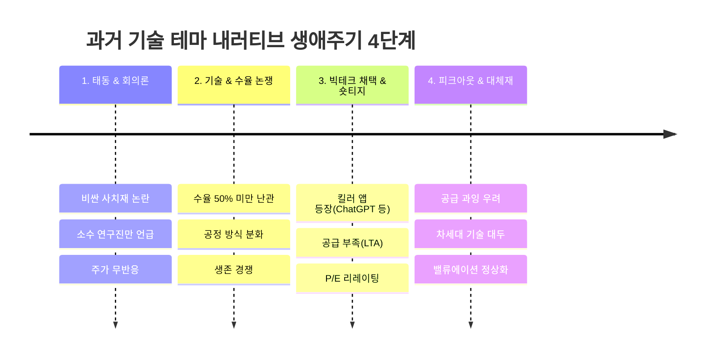

# Argus System — 과거 연대기(Chronicle) 및 역사적 유추 매트릭스(Analogy Matrix) 심층 가이드

> **문서 번호**: SPEC-20260906-02  
> **작성 일자**: 2026-09-06  
> **문서 유형**: 역사적 데이터 마이닝 및 비교 유추(Analogy) 엔진 명세서  
> **철학**: *"역사는 그대로 반복되지 않지만, 각운(Rhyme)을 맞춘다." — 마크 트웨인*

---

## 1. 개요 및 기획 배경

기술과 시장의 역사는 항상 유사한 **심리적·구조적 사이클**을 반복합니다.
새로운 혁신 기술이 등장할 때 시장 참여자들은 언제나 **[1. 회의론 ➔ 2. 수율/양산 논쟁 ➔ 3. 빅테크 채택 & 숏티지 ➔ 4. 밸류에이션 리레이팅 및 피크아웃]**의 4단계 주기를 거칩니다.

```
┌──────────────────────────────────────────────────────────────────────────────┐
│                  과거 연대기(Chronicle) & 유추 매트릭스(Analogy)               │
├──────────────────────────────────────┬───────────────────────────────────────┤
│  1. 과거 테마 연대기 (Chronicles/)   │  2. 역사적 유추 분석 노트 (Analogies/) │
├──────────────────────────────────────┼───────────────────────────────────────┤
│  • 과거 HBM2/3, CXL, LPU, 액체냉각   │  • 현재 가설과 과거 사건의 1:1 대조   │
│    도입 당시의 실제 내러티브 타임라인│  • 공통점(What Rhymes) & 차이점 분석  │
│  • Hacker News / Reddit / 과거리포트 │  • 과거 승패 요인을 현재 종목에 대입 │
└──────────────────────────────────────┴───────────────────────────────────────┘
```

---

## 2. 과거 테마 연대기 (Chronicles) 4단계 프레임워크

과거 연대기 노트(`thesis/Chronicles/Chronicle-*.md`)는 다음 4단계 타임라인으로 과거 내러티브를 재구성합니다:



### 대표 연대기 예시: `Chronicle-HBM2-to-HBM3`
1. **2018~2019 (HBM2)**: *"비싸고 발열 심해서 GPU 일부에만 쓰이는 틈새 규격"* (회의론 팽배, 삼성이 HBM 개발팀 축소).
2. **2020~2021 (HBM2E)**: *"MR-MUF 공정 도입과 엔비디아 A100 탑재"* (SK하이닉스의 승부수).
3. **2022~2023 (HBM3)**: *"ChatGPT 폭발과 엔비디아 H100 독점 공급"* (P/E 30배 리레이팅 및 주가 100% 랠리).
4. **2024~2026 (HBM3E~HBM4)**: *"빅테크 커스텀 베이스다이 요구와 16단 적층 한계"* (차세대 국면 진입).

---

## 3. 역사적 유추 매트릭스 (Analogy Matrix) 작동 원리

현재 우리가 추적 중인 41개 테제 중 불확실성이 큰 테제를 과거 연대기와 1:1로 매핑하여 분석합니다:

| 현재 가설 (Current Thesis) | 과거 유사 사건 (Historical Analogy) | 공통점 (What Rhymes) | 차이점 및 변수 (What is Different) |
|:---|:---|:---|:---|
| **[[T1-01]] HBM4 커스텀 파운드리 전환** | **2020년 HBM2E MR-MUF 수율 격돌** | • 패키징 공정 난이도 급상승<br/>• 고객사(엔비디아) 선점 기업이 독점 | • 과거: 표준 메모리<br/>• 현재: TSMC 파운드리와의 '삼각 동맹' 필수 |
| **[[T1-03]] CXL 2.0/3.0 메모리 풀링** | **2016년 NVMe PCIe SSD 도입기** | • 초기 고비용 논란<br/>• OS/서버 에코시스템 성숙 필요 | • CXL은 DRAM 풀링으로 TCO 절감 효과가 훨씬 즉각적임 |
| **[[T2-02]] 데이터센터 액체냉각(DLC) 표준화** | **2000년대 PC 수냉 ➔ 서버 공랭 한계** | • 누수 위험 우려로 초기 도입 지연<br/>• 칩 발열 1,000W 돌파로 강제 전환 | • 규제(PUE 탄소 배출 규제)가 표준화를 강제함 |
| **[[T2-03]] 빅테크의 원전 SMR 무탄소 PPA** | **2010년대 구글/애플의 신재생 100% PPA** | • 전력 수급을 위해 발전소 직결 계약<br/>• 전력 유틸리티 주가 리레이팅 | • 간헐성 없는 24/7 기저부하(Baseload) 확보가 필수 |

---

## 4. 마크다운 파일 표준 스키마

### (1) 연대기 노트 (`thesis/Chronicles/Chronicle-*.md`)
```yaml
---
title: "Chronicle: HBM2에서 HBM3까지 — 수율과 독점의 역사"
type: chronicle
period: "2018~2023"
core_entity: "SK하이닉스, 삼성전자, NVIDIA"
narrative_stages:
  - "1. 회의론 (2018~2019)"
  - "2. MR-MUF 공정 결단 (2020~2021)"
  - "3. H100 독점 공급 (2022~2023)"
related_theses:
  - "[[T2-01-메모리-산업의-변화|T2-01]]"
  - "[[T2-02-첨단-패키징과-CoWoS의-병목|T2-02]]"
---
```

### (2) 유추 비교 노트 (`thesis/Analogies/Analogy-*.md`)
```yaml
---
title: "Analogy: 2020 HBM2E 수율 격돌 vs 2026 HBM4 커스텀 파운드리"
type: analogy
current_thesis: "[[T2-01-메모리-산업의-변화|T2-01]]"
historical_chronicle: "[[Chronicle-HBM2-to-HBM3-수율과-독점의-역사|HBM2-to-HBM3]]"
confidence_score: 88
rhyme_score: 90
key_takeaway: "공정 난이도가 급변할 때 선제적으로 고객사 맞춤 공정을 도입한 기업이 시장의 70% 이상을 독식한다."
---
```

---

## 5. 생성 에이전트(Studio) 및 옵시디언 연동

1. **블로그 및 다이제스트 자동 주입 (`blog_writer.py`)**:
   * `--analogy` 플래그 사용 시, AI가 현재 작성 중인 주제와 가장 유사한 `Analogies/` 노트를 검색하여 **"역사적 유추(Historical Precedent)"** 섹션을 본문에 2개 문단으로 자동 삽입.
2. **Master MOC 대시보드**:
   * `00-Argus-Master-MOC.md`에 과거 연대기 및 유추 매트릭스를 자동 표시하여 투자 판단의 맥락을 제공.
