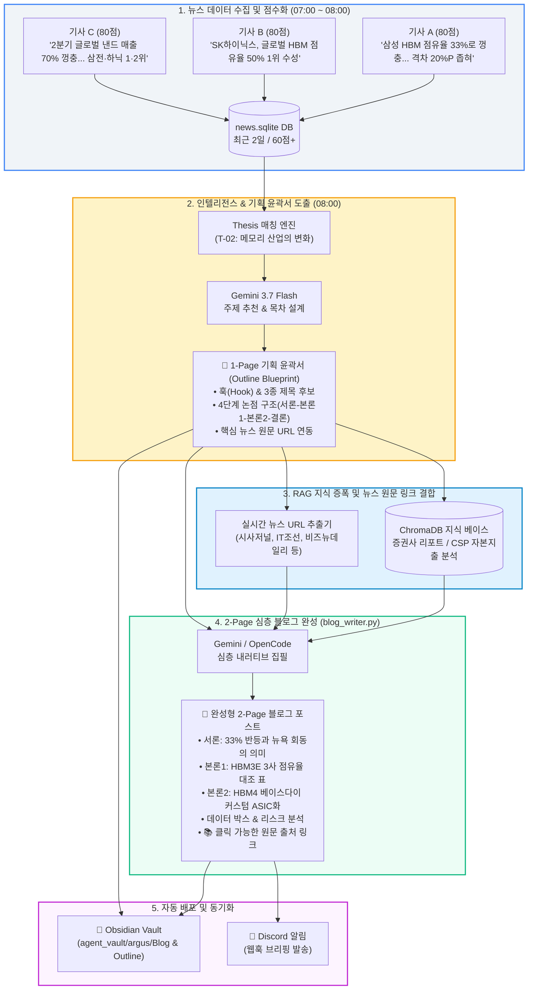

# 🔍 Argus Pulse — 뉴스 입력 ➔ 기획 윤곽서 ➔ 블로그 생성 시각적 추적 보고서

> **작성일자**: 2026-09-06  
> **문서 목적**: 실시간 뉴스 입력부터 1-Page 기획 윤곽서(Outline Blueprint), 최종 2-Page 완성형 블로그 집필까지 데이터가 변환·심화되는 전 과정을 시각적 다이어그램 및 단계별 대조표로 확인  
> **기준 대상**: 2026-09-06 당일 1순위 콘텐츠 — *「삼성전자의 33% 맹추격, 하지만 '진짜 전쟁'은 HBM4 커스텀 수주전이다」*

---

## 1. 🗺️ 데이터 변환 엔드투엔드 시각적 흐름도 (Visual Architecture)



---

## 2. ⏱️ 시간(시각)순 실행 타임라인 (Execution Timeline)

| 시각 (Time) | 실행 단계 | 실행 주체 | 처리 내용 및 산출물 |
|---|---|---|---|
| **07:00** | 뉴스 자동 인입 | `b_0826_news_research` | 글로벌 IT/반도체 뉴스 크롤링, 감성/임팩트 점수(80점 부여) 후 SQLite 저장 |
| **08:00:00** | 아침 크론 배치 트리거 | macOS Crontab / `topic_generator.py` | 최근 2일 고득점 뉴스 15건 로드, Active Thesis 키워드 매칭 |
| **08:00:15** | 기획 윤곽 도출 | LLM (`gemini-3.7-flash`) | 3대 추천 주제 선별 및 4단계 아웃라인 수립 (`logs/2026-09-06-topics.json`) |
| **08:00:20** | 윤곽서 파일 저장 | `save_outline_file` | [`output/outline/2026-09-06-outline-...md`](file:///Users/chansoojeon/Library/CloudStorage/Dropbox/03_code/b_0901_Argus_pulse/output/outline/2026-09-06-outline-%EC%82%BC%EC%84%B1%EC%A0%84%EC%9E%90%EC%9D%98-33-%EB%A7%B9%EC%B6%94%EA%B2%A9-%ED%95%98%EC%A7%80%EB%A7%8C-%EC%A7%84%EC%A7%9C-%EC%A0%84%EC%9F%81%EC%9D%80-HBM4-%EC%BB%A4%EC%8A%A4%ED%85%80-%EC%88%98%EC%A3%BC%EC%A0%84%EC%9D%B4%EB%8B%A4.md) 생성 및 옵시디언 미러링 |
| **08:00:25** | 블로그 자동 집필 호출 | `blog_writer.py --auto --rag` | 1순위 주제 자동 선택, RAG 벡터 검색(5개 청크) 및 실제 기사 URL 5건 바인딩 |
| **08:00:50** | 2-Page 블로그 완성 | LLM (`blog_writer.py`) | 비교 표, 데이터 박스, 참고문헌 포함 110줄(10.9KB) 블로그 생성 |
| **08:00:52** | 실시간 동기화 & 알림 | `obsidian_sync` & `notifier` | Obsidian Vault 미러링 및 Discord 웹훅 임베드 알림 전송 완료 |

---

## 3. 🔍 3단계 데이터 변환 상세 대조 (Input ➔ Outline ➔ Blog)

```
[1단계: 뉴스 원문 데이터]
 ├── SK하이닉스 2Q 점유율 50% 수성 (80점)
 ├── 삼성전자 33%로 맹추격, 격차 20%p 축소 (80점)
 └── 마이크론 15% 안팎 정체 및 공급망 변화
                    │
                    ▼ (인텔리전스 필터링 & T-02 가설 결합)
[2단계: 1-Page 기획 윤곽서 (Outline Blueprint)]
 ├── 🎯 관점: 기업격돌 (삼성 vs SK)
 ├── 🪝 훅: "33% 점유율 뒤에 숨겨진 차세대 HBM4 커스텀 ASIC화 판도"
 ├── 📑 3종 제목: 직관형(A) / 의문형(B) / 스토리형(C)
 └── 🗺️ 4단계 논점 구조 (서론 ➔ 본론1 ➔ 본론2 ➔ 결론)
                    │
                    ▼ (RAG 리포트 주입 + 수치 데이터화 + 표/각주 생성)
[3단계: 2-Page 정식 블로그 포스트 (Complete Article)]
 ├── 💡 3사(삼성·SK·마이크론) 전략 & 밸류에이션 비교 표
 ├── 📊 수치 데이터 박스 (대역폭 1.2TB/s ➔ 2TB/s+, 수출단가 +31%)
 ├── 🔬 심층 논점: '턴키 내재화' vs 'TSMC CoWoS 연합'의 베이스 다이 격돌
 └── 📚 실제 언론사 기사 원문 하이퍼링크 5건 자동 연동
```

---

## 4. 📊 팩트 ➔ 논점 ➔ 블로그 본문 1:1 매핑 트레이스 (Fact-to-Article Matrix)

| 구분 | [Stage 1] 수집 뉴스 팩트 (Input) | [Stage 2] 기획 윤곽서 설계 (Outline) | [Stage 3] 최종 블로그 구현 내용 (Output) |
|---|---|---|---|
| **기획 프레임** | • 삼성 HBM 점유율 33% 껑충 (80점)<br/>• SK하이닉스 50% 수성 (80점) | **주제 & 훅(Hook)**<br/>"숫자 뒤에 숨겨진 HBM4 커스텀 ASIC화 판도 분석" | • **한 줄 요약**: "2분기 33% 반등은 사실이되 HBM3E 게임은 끝물... HBM4 베이스 다이 커스텀 수주전이 본질"<br/>• **제목 3종** 중 최적 제목 확정 |
| **서론 (도입부)** | • 이재용-젠슨 황 뉴욕 회동 기사<br/>• 점유율 격차 20%p 축소 데이터 | **서론 논점**<br/>"단순 점유율 반등이 아닌 메모리 지형 변화 시그널" | • "HBM 시장은 지금 두 개의 시계가 돌고 있다 (HBM3E 단기 시계 vs HBM4 커스텀 시계)"<br/>• 독점 균열의 신호탄 해석 |
| **본론 1 (양산전)** | • 마이크론 수율 정체 보도<br/>• 8월 반도체 수출액 역대 최대 경신 | **본론 1 논점**<br/>"HBM3E 양산 드라이브가 만든 추격과 마이크론 공백 흡수" | • **3사 비교 표 (Table)** 완비<br/>• **💡 데이터 박스**: 점유율 50% vs 33%, HBM 수출단가 +31% 급등 수치 명시 |
| **본론 2 (기술전)** | • HBM4 로직 베이스 다이 도입 기사<br/>• CXMT(창신메모리) D램 진입 소식 | **본론 2 논점 (반론/검증)**<br/>"단순 D램 적층 종료 ➔ 파운드리/패키징 결합 커스텀 ASIC화" | • **삼성의 턴키(Turnkey) 내재화** vs **SK하이닉스의 TSMC CoWoS 동맹** 구조 비교<br/>• 분기 단가 협상 ➔ 장기 LTA(장기공급계약) 락인 패러다임 전환 논증<br/>• CXMT 추격 리스크 검증 |
| **결론 (투자뷰)** | • 10월 28일 엔비디아-삼전-하닉 3자 회동 예정 | **결론 논점**<br/>"범용 메모리 치킨게임 종말과 베라 루빈 수주전 분수령" | • **핵심 인사이트 3선** 제시<br/>• **리스크 요인 & 다음에 주목할 이벤트(10/28 3자 회동, Vera Rubin 아키텍처)** 체크리스트 명시 |
| **출처 섹션** | • 수집된 실제 뉴스 URL 5건<br/>• 증권사 분석 청크 5건 | **참고 자료 체크포인트**<br/>실제 기사 하이퍼링크 배치 확정 | • **## 📚 참고 자료 및 출처**<br/>- 비즈뉴데일리, 시사저널, IT조선, 충청신문, 충청일보 등 5개 실제 기사 링크 표기 |

---

## 5. 📂 오늘 생성된 산출물 레지스트리 (Artifacts Registry)

| 구분 | 파일 경로 (클릭 가능) | 옵시디언 동기화 경로 (Vault) |
|---|---|---|
| **오늘의 추천 주제 로그** | [`logs/2026-09-06-topics.json`](file:///Users/chansoojeon/Library/CloudStorage/Dropbox/03_code/b_0901_Argus_pulse/logs/2026-09-06-topics.json) | — |
| **1-Page 기획 윤곽서** | [`output/outline/2026-09-06-outline-삼성전자의-33-맹추격-하지만-진짜-전쟁은-HBM4-커스텀-수주전이다.md`](file:///Users/chansoojeon/Library/CloudStorage/Dropbox/03_code/b_0901_Argus_pulse/output/outline/2026-09-06-outline-%EC%82%BC%EC%84%B1%EC%A0%84%EC%9E%90%EC%9D%98-33-%EB%A7%B9%EC%B6%94%EA%B2%A9-%ED%95%98%EC%A7%80%EB%A7%8C-%EC%A7%84%EC%A7%9C-%EC%A0%84%EC%9F%81%EC%9D%80-HBM4-%EC%BB%A4%EC%8A%A4%ED%85%80-%EC%88%98%EC%A3%BC%EC%A0%84%EC%9D%B4%EB%8B%A4.md) | `agent_vault/argus/Outline/2026-09-06-outline-...` |
| **2-Page 완성형 블로그** | [`output/blog/2026-09-06-blog-삼성전자의-33-맹추격-하지만-진짜-전쟁은-HBM4-커스텀-수주전이다.md`](file:///Users/chansoojeon/Library/CloudStorage/Dropbox/03_code/b_0901_Argus_pulse/output/blog/2026-09-06-blog-%EC%82%BC%EC%84%B1%EC%A0%84%EC%9E%90%EC%9D%98-33-%EB%A7%B9%EC%B6%94%EA%B2%A9-%ED%95%98%EC%A7%80%EB%A7%8C-%EC%A7%84%EC%A7%9C-%EC%A0%84%EC%9F%81%EC%9D%80-HBM4-%EC%BB%A4%EC%8A%A4%ED%85%80-%EC%88%98%EC%A3%BC%EC%A0%84%EC%9D%B4%EB%8B%A4.md) | `agent_vault/argus/Blog/2026-09-06-blog-...` |
| **일일 종합 작업 보고서** | [`docs/2026-09-06-work-summary.md`](file:///Users/chansoojeon/Library/CloudStorage/Dropbox/03_code/b_0901_Argus_pulse/docs/2026-09-06-work-summary.md) | — |
