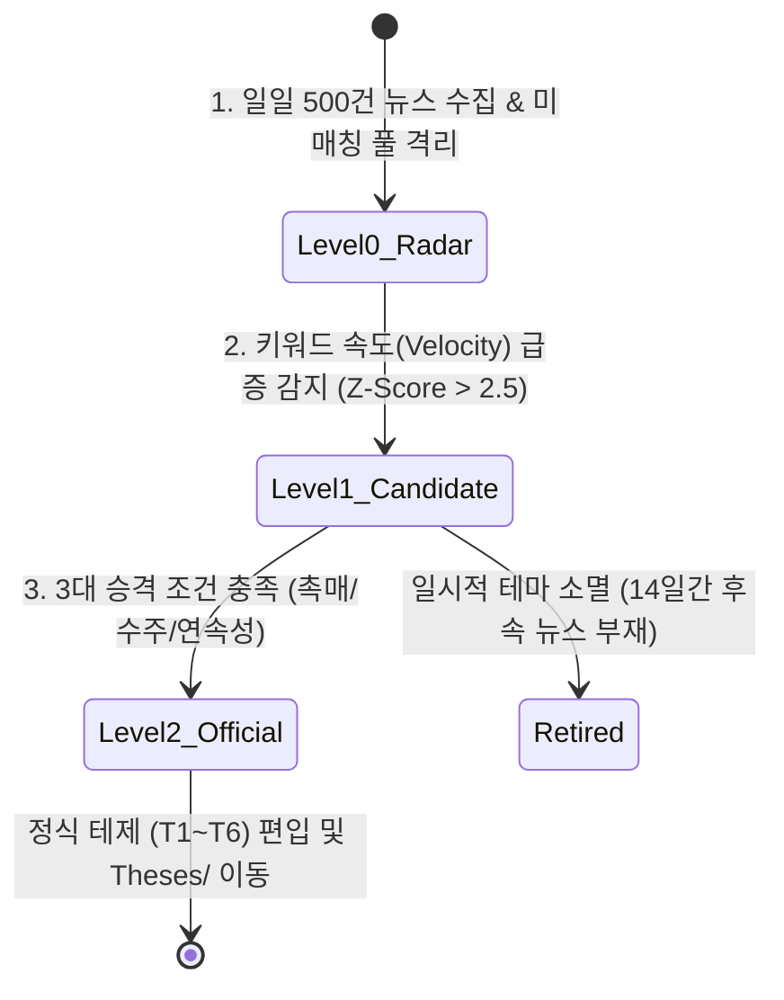

# Argus System & Obsidian 1:1 미러링 폴더 아키텍처 및 테마 인큐베이터(Incubator) 설계서

> **문서 번호**: ARCH-20260906-03  
> **작성 일자**: 2026-09-06  
> **문서 유형**: 지식 볼트 구조 설계 및 테마 인큐베이션 엔진 명세서  
> **핵심 주제**:
> 1. 로컬 코드베이스(`thesis/`)와 옵시디언 볼트(`agent_vault/argus/`)의 1:1 완벽 미러링 구조  
> 2. 가설 생애주기 3단계(과거 연대기 ➔ 현재 테제 ➔ 미래 인큐베이터)의 디렉터리 배치  
> 3. **테제 인큐베이터(Incubator: `TC-XX`)의 상세 작동 메커니즘 및 승격 알고리즘**

---

## 1. 지식 볼트 1:1 미러링 폴더 구조

로컬 리포지토리의 `thesis/` 디렉터리와 옵시디언 볼트의 `agent_vault/argus/` 디렉터리는 **완전한 1:1 대칭(Mirroring)**을 이룹니다.

```
agent_vault/argus/ (Obsidian)  <──[1:1 Sync]──>  b_0901_Argus_pulse/thesis/ (Local)
│
├── 00-Argus-Master-MOC.md          # 🧭 중앙 사령탑 (41개 테제 + 인큐베이터 + 연대기 종합 대시보드)
│
├── ── 1. 가설 생애주기 레이어 (Thematic Lifecycle) ──
├── Theses/                         # 🧠 [현재] 41개 정식 테제 (T1-01 ~ T6-02)
├── Incubator/                      # 🧭 [미래/신규] 미매칭 뉴스에서 발굴된 후보 테제 (TC-01, TC-02...)
├── Chronicles/                     # 📜 [과거] HBM2/3, CXL 등 과거 테마 연대기 백서
├── Analogies/                      # ⚖️ [유추] 과거 vs 현재 1:1 비교 분석 노트
│
├── ── 2. 지식 결절점 레이어 (Knowledge Hubs) ──
├── Topics/                         # ⚡ 17개 핵심 기술/토픽 허브
├── Companies/                      # 🏢 18개 핵심 수혜 기업 허브
├── Vs/                             # ⚔️ 4개 기술/진영 대결 허브
│
└── ── 3. 에이전트 생성물 레이어 (Agent Outputs) ──
    ├── Blog/                       # ✍️ 2-Page 심층 분석 블로그
    ├── Digest/                     # 📰 일일 모닝 브리핑
    ├── Review/                     # 📊 위클리/먼슬리 리뷰
    ├── Thread/                     # 🧵 SNS 요약 스레드
    └── Docs/                       # 📚 시스템 아키텍처 및 연구 문서
```

---

## 2. 1:1 미러링 구조의 핵심 이점

1. **인지 부하 제로 (Cognitive Clarity)**:  
   파이썬 코드로 문서를 조작하든, 옵시디언 UI에서 그래프 뷰를 탐색하든 파일 경로와 계층이 완전히 동일하여 탐색 혼선이 없습니다.
2. **동기화 엔진 무결성**:  
   `obsidian_sync.py`가 폴더 간 1:1 복사 및 검증을 수행하므로 경로 변환 오류나 링크 깨짐이 원천적으로 방지됩니다.
3. **Dataview 쿼리 통일성**:  
   `FROM "argus/Theses"` 및 `FROM "argus/Incubator"` 쿼리가 볼트 내 어디서나 일관되게 동작합니다.

---

## 3. 테마 인큐베이터(Incubator) 상세 설계

### (1) 인큐베이터의 정의 및 존재 목적
* **문제의식**: 기존 41개 테제(`Theses/`)에만 갇혀 있으면 새로운 주도 테마(예: 차세대 원전 SMR, 유리기판, 광반도체 CPO 초기 국면)가 태동할 때 시스템이 감지하지 못합니다. 반대로 모든 뉴스를 무분별하게 테제로 등록하면 시스템이 노이즈로 오염됩니다.
* **해결책**: 신규 테마를 즉시 정식 테제로 등록하지 않고, **검증 샌드박스인 `Incubator/`에서 관찰·인큐베이션한 뒤 신뢰성이 입증되면 정식 테제로 승격**시키는 완충 장치입니다.

### (2) 3단계 생애주기 파이프라인 (Thematic Incubation Pipeline)



1. **Level 0. 약한 신호 탐지 (Weak Signal Radar)**:
   * 41개 테제에 매칭되지 않는 고득점(70점+) 뉴스를 `orphan_news` 풀에 적재.
   * 최근 3일간 특정 기술/기업 키워드의 출현 빈도가 과거 대비 급증(Z-Score)하는 패턴 탐지.
2. **Level 1. 후보 테제 입소 (`TC-01`, `TC-02`...)**:
   * 3개 이상의 독립 언론사에서 유사 키워드가 군집(Cluster)을 형성하면 `Incubator/TC-01-키워드.md` 파일 자동 생성.
   * `incubation_score` 부여 및 14일 관찰 타이머 가동.
3. **Level 2. 정식 테제 승격 (Official Promotion)**:
   * **승격 3대 조건**:
     1. 관찰 기간 중 후속 뉴스 점수 지속 유입 (모멘텀 지속성)
     2. 실질적 산업 촉매 발생 (빅테크 CAPEX 집행, LTA 수주 공시)
     3. 기존 41개 테제와의 인과관계 맵 연결 완료
   * 승격 시 `TC-01` 파일이 `Theses/T2-10-신규테제명.md`로 정식 번호를 부여받고 이동.

---

## 4. 인큐베이터 마크다운 파일 표준 스키마 (`TC-XX.md`)

```yaml
---
id: TC-01
title: "자유전자레이저(FEL) 기반 극자외선 노광원 상용화"
sector: "AI 컴퓨트 & 차세대 반도체 (후보)"
sector_candidate: "T1"
stage: "candidate"              # radar | candidate | promoted | retired
incubation_score: 82            # 0 ~ 100
first_detected: "2026-09-06"
observation_days: 3
news_velocity_zscore: 3.1
keywords:
  - "자유전자레이저"
  - "FEL"
  - "EUV 광원"
  - "펠리클"
candidate_companies:
  - "ASML"
  - "삼성전자"
  - "포항가속기연구소"
promotion_triggers:
  - "빅테크/파운드리 공동 R&D 투자 발표"
  - "High-NA EUV 대체 출력 1kW 달성 기사 확인"
---

# 🧭 TC-01 자유전자레이저(FEL) 기반 극자외선 노광원 상용화

## 1. 신규 테마 발굴 배경 (Why Now)
- 최근 3일간 ASML의 차세대 EUV 광원 기술로 FEL 관련 외신 보도가 4건 연속 급증.
- 기존 주석 플라즈마(LPP) 방식의 전력 효율 한계를 극복할 차세대 광원으로 부상.

## 2. 기존 정식 테제와의 인과관계 가설
- **[[T2-04-파운드리-2nm-공정과-GAA-격돌|T2-04 2nm 파운드리]]** ──선단공정 한계 돌파──► **TC-01 FEL 광원**

## 3. 정식 테제 승격 체크리스트
- [ ] 14일 이내 추가 팩트/공시 5건 이상 유입
- [ ] 반증 시나리오(장비 단가 과다로 도입 실패) 검증
```

---

## 5. Master MOC 연동 (실시간 레이더 대시보드)

`00-Argus-Master-MOC.md` 상에 다음 Dataview 쿼리가 삽입되어 인큐베이터를 실시간 모니터링합니다:

```dataview
TABLE incubation_score AS "인큐베이션 점수", sector_candidate AS "예상 섹터", observation_days AS "관찰 일수", candidate_companies AS "후보 기업"
FROM "argus/Incubator" OR "Incubator" OR "thesis/Incubator"
WHERE stage = "candidate"
SORT incubation_score DESC
```
