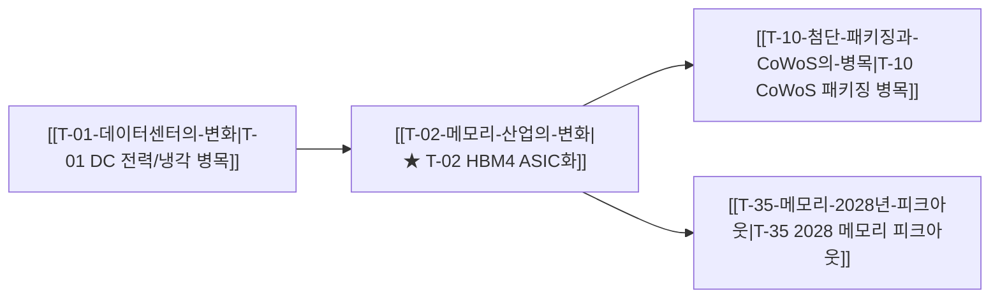

# 🌐 옵시디언 상호링크(Bidirectional Linking) 아키텍처 및 구현 가이드

> **작성일**: 2026-09-06  
> **시스템**: Argus Pulse / Nexus  
> **목적**: 38개 투자 테제(Theses), 기업(Companies), 기술 토픽(Topics), 산출물(Blog·Review·Digest·Thread) 간 4계층 유기적 상호링크 구축 가이드 및 표준 명세

---

## 1. 아키텍처 개요 (4-Tier Architecture)

```
[Layer 0: Master MOC (00-Argus-Master-MOC.md)]
          │ (전체 산업 밸류체인 및 4대 섹터 조망)
          ▼
[Layer 1: Category & Theme Hubs (컴퓨트/메모리, 인프라/전력, 피지컬AI, 매크로)]
          │ (섹터별 가설 군집화)
          ▼
[Layer 2: Thesis Nodes (T-01 ~ T-38)] ◄───► [Entity Nodes (기업/기술 허브: SK하이닉스, HBM 등)]
          │ (인과관계 링크: 선행 ➔ 동반 ➔ 파생 후행 병목)
          ▼
[Layer 3: Outputs (Blog, Review, Digest, Thread)]
          │ (실시간 인텔리전스 & 사후 검증)
          └─► [Dataview Dynamic Backlink Table로 테제에 자동 역집계]
```

---

## 2. 파일 표준 템플릿 명세

### A. 테제(Thesis) 표준 템플릿 (`thesis/T-XX-*.md`)

```markdown
---
aliases:
  - T-02
  - T-02 메모리 산업의 변화
  - 메모리 산업의 변화
  - HBM4 커스텀 ASIC
confidence: 75
direction: bullish
hypothesis: HBM4 전환으로 메모리가 범용 원자재에서 커스텀 ASIC으로 성격이 바뀐다
id: T-02
keywords:
  - HBM
  - HBM4
  - 커스텀HBM
priority: 5
rank: 3
related_companies:
  - SK하이닉스
  - 삼성전자
  - NVIDIA
  - TSMC
related_theses:
  - T-01
  - T-07
  - T-10
  - T-11
  - T-35
  - T-36
status: active
time_horizon: 2026~2027
title: 메모리 산업의 변화
---

# T-02 메모리 산업의 변화

> 🧭 **상위 인덱스**: [[00-Argus-Master-MOC|Master MOC]] ➔ [[00-Argus-Master-MOC#1-💾-ai-컴퓨트--차세대-반도체-compute--silicon|AI 컴퓨트 & 반도체]]

---

## 🎯 핵심 가설
HBM4로 전환되는 2026~2027년, 메모리는 범용 원자재에서 **고객 맞춤형 주문형 반도체([[Topic-HBM|커스텀 ASIC]])**로 성격이 완전히 바뀐다.

---

## 🔗 테제 네트워크 (상호 연관 가설)



- 🔼 **선행 가설 (상위 인프라 수요)**:
  - [[T-01-데이터센터의-변화|T-01 데이터센터의 변화]] — 연산 병목의 메모리 전이
- ➡️ **동반 및 대체 가설**:
  - [[T-07-CXL-메모리의-확대|T-07 CXL 메모리의 확대]] — CXL 메모리 풀링 병행
  - [[T-36-중국반도체의-HBM-생산가능성|T-36 중국 반도체의 HBM 생산 가능성]] — 후발주자 추격 리스크
- 🔽 **파생 및 후행 병목 가설**:
  - [[T-10-첨단-패키징과-CoWoS의-병목|T-10 첨단 패키징과 CoWoS의 병목]] — 베이스 다이 결합 병목
  - [[T-35-메모리-2028년-피크아웃|T-35 메모리 2028년 피크아웃]] — 2028년 사이클 피크아웃 논쟁

---

## 🏢 연관 기업 & 핵심 기술 허브
- **핵심 제조사 & 고객사**: [[Company-SK하이닉스|SK하이닉스]], [[Company-삼성전자|삼성전자]], [[Company-NVIDIA|NVIDIA]], [[Company-TSMC|TSMC]]
- **핵심 개념 & 토픽**: [[Topic-HBM|HBM (High Bandwidth Memory)]], [[Topic-CoWoS|CoWoS]]

---

## 📈 지지 근거
- 2026-09-05: HBM4 전환 시 선단 파운드리 기반의 커스텀 베이스 다이 적용 필수화...

---

## 📉 반박 근거
- 2026-09-05: 중국 CXMT의 5세대 HBM3E 소량 생산 등 후발주자 추격...

---

## 📑 관련 산출물 (자동 집계)

```dataview
TABLE file.mtime AS "작성일", angle AS "관점", tags AS "태그"
FROM "argus" OR "output"
WHERE contains(thesis, "T-02") OR contains(file.outlinks, this.file.link)
SORT file.mtime DESC
```
```

---

### B. 기업 허브(Company Hub) 표준 템플릿 (`thesis/Company-*.md` / `Companies/*`)

```markdown
---
aliases:
  - SK하이닉스
  - Hynix
  - 000660
type: company
ticker: "000660.KS"
sector: 반도체
---

# 🏢 SK하이닉스

> 🧭 **상위 인덱스**: [[00-Argus-Master-MOC|Master MOC]] ➔ [[00-Argus-Master-MOC#🏢-핵심-기업company-hubs--개념concept-hubs-허브-목록|기업 허브]]

## 🔗 연관 투자 가설 (Thesis Mapping)
- [[T-02-메모리-산업의-변화|T-02 메모리 산업의 변화 (핵심 수혜)]]
- [[T-07-CXL-메모리의-확대|T-07 CXL 메모리의 확대]]
- [[T-10-첨단-패키징과-CoWoS의-병목|T-10 첨단 패키징과 CoWoS의 병목]]
- [[T-35-메모리-2028년-피크아웃|T-35 메모리 2028년 피크아웃]]

## 📑 관련 리포트 & 블로그 (Dataview)
```dataview
TABLE file.mtime AS "작성일", tags AS "태그"
FROM "argus" OR "output"
WHERE contains(file.outlinks, this.file.link) OR contains(file.text, "SK하이닉스")
SORT file.mtime DESC
LIMIT 10
```
```

---

### C. 기술/토픽 허브(Topic Hub) 표준 템플릿 (`thesis/Topic-*.md`)

```markdown
---
aliases:
  - HBM
  - 고대역폭메모리
  - HBM4
type: topic
category: 반도체 하드웨어
---

# 💡 HBM (High Bandwidth Memory)

> 🧭 **상위 인덱스**: [[00-Argus-Master-MOC|Master MOC]]

## 🔗 연관 투자 테제 매핑
- [[T-02-메모리-산업의-변화|T-02 메모리 산업의 변화]]
- [[T-10-첨단-패키징과-CoWoS의-병목|T-10 첨단 패키징과 CoWoS의 병목]]
- [[T-11-유리기판의-차세대-패키징-침투|T-11 유리기판의 차세대 패키징 침투]]

## 📑 HBM 관련 분석 리포트 (Dataview)
```dataview
TABLE file.mtime AS "작성일", title AS "제목"
FROM "argus" OR "output"
WHERE contains(file.tags, "HBM") OR contains(file.text, "HBM")
SORT file.mtime DESC
```
```

---

## 3. 구축된 파일 인덱스

| 파일명 | 저장 위치 | 설명 |
|:---|:---|:---|
| **`00-Argus-Master-MOC.md`** | `thesis/`, `agent_vault/argus/` | 전체 38개 테제 분류 및 종합 대시보드 |
| **`T-02-메모리-산업의-변화.md`** | `thesis/`, `agent_vault/argus/Theses/` | 상호링크 완성형 테제 예시 |
| **`Topic-HBM.md`** | `thesis/`, `agent_vault/argus/Topics/` | 기술/개념 허브 예시 |
| **`Company-SK하이닉스.md`** | `thesis/`, `agent_vault/Companies/KR/...` | 기업 허브 예시 |
| **`2026-09-06-blog-HBM4...md`** | `output/blog/`, `agent_vault/argus/Blog/` | 상호링크 적용 블로그 예시 |
