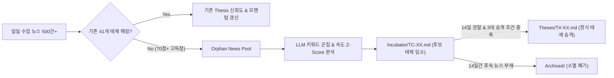

# Argus System — 테마 인큐베이터(Incubator) 심층 가이드 및 운영 명세서

> **문서 번호**: SPEC-20260906-01  
> **작성 일자**: 2026-09-06  
> **문서 유형**: 인큐베이션 서브시스템 아키텍처 및 알고리즘 명세서  
> **목적**: 41개 정식 테제 밖의 미탐색 고득점 뉴스에서 '신규 부상 테마'를 자동 포착·보육·승격시키는 전용 샌드박스 엔진 정의

---

## 1. 개요 및 설계 철학

### 1) 왜 인큐베이터가 필요한가?
* **정체 방지**: 투자 시장의 초과수익(Alpha)은 항상 대중에게 알려지지 않은 **태동기(Emerging Stage)**의 새로운 내러티브에서 발생합니다. 41개 기존 테제에만 갇혀 있으면 새로운 메가트렌드를 놓치게 됩니다.
* **노이즈 차단**: 확인되지 않은 일회성 테마주 뉴스나 찌라시를 곧바로 정식 테제로 등록하면 지식 그래프가 오염되고 신뢰도가 추락합니다.
* **해결책**: **`Incubator/`**라는 완충 보육 구역을 두고, **[약한 신호 탐지 ➔ 14일 관찰 ➔ 3대 조건 검증 ➔ 정식 테제 승격]**의 엄격한 라이프사이클을 가동합니다.



---

## 2. 인큐베이션 3단계 생애주기 (Promotion Lifecycle)

### [Step 1] Level 0: 약한 신호 탐지 (Weak Signal Detection)
1. **미매칭 뉴스 격리**: 41개 테제 키워드와 매칭되지 않는 70점 이상의 뉴스를 `orphan_news` 테이블에 보관.
2. **키워드 출현 속도(Velocity) 측정**:
   $$\text{Z-Score} = \frac{\text{최근 3일간 키워드 출현 빈도} - \text{과거 30일 평균}}{\text{표준편차}}$$
   $\text{Z-Score} > 2.5$ 이상 급증한 신규 기술/기업 키워드를 추출.

### [Step 2] Level 1: 후보 테제 입소 (`TC-01`, `TC-02`...)
* 3개 이상의 독립 언론사에서 해당 키워드가 군집을 형성하면 `thesis/Incubator/TC-XX.md` 자동 생성.
* **인큐베이션 점수 계산식**:
  $$\text{Incubation Score} = (\text{뉴스 평균 점수} \times 0.4) + (\text{뉴스 발생량} \times 5) + (\text{언론사 다양성} \times 10)$$
* **14일 관찰 타이머** 가동.

### [Step 3] Level 2: 정식 테제 승격 (Promotion to Official Thesis)
다음 **3대 승격 조건**을 모두 충족하면 사용자의 확인 또는 자동 승격을 통해 `Theses/` 디렉터리로 이동:
1. **모멘텀 지속성**: 14일 동안 최소 3회 이상 유의미한 후속 기사 유입.
2. **산업적 실체(Catalyst)**: 빅테크의 CAPEX 계약, 공시, 양산 로드맵 발표 확인.
3. **가치사슬 인과관계**: 기존 41개 테제 중 어떤 병목(Bottleneck)과 연결되는지 가설 맵 수립 완료.

---

## 3. 인큐베이터 마크다운 표준 스키마 (`thesis/Incubator/TC-XX.md`)

```yaml
---
id: TC-01
title: "자유전자레이저(FEL) 기반 극자외선 노광원 상용화"
sector_candidate: "T1"          # 승격 시 예상 편입 섹터 (T1~T6)
stage: "candidate"              # candidate(보육중) | promoted(승격) | retired(폐기)
incubation_score: 84            # 0 ~ 100점
first_detected: "2026-09-06"
observation_days: 3
keywords:
  - "자유전자레이저"
  - "FEL"
  - "EUV 광원"
candidate_companies:
  - "ASML"
  - "삼성전자"
promotion_triggers:
  - "1kW급 FEL 가속기 실증 계약 공시"
  - "High-NA EUV 대체 로드맵 발표"
aliases:
  - TC-01
  - TC-01 자유전자레이저(FEL) 기반 극자외선 노광원 상용화
---
```

---

## 4. Master MOC 연동 및 시각화

`00-Argus-Master-MOC.md`에 전용 Dataview 테이블을 구성하여 실시간으로 보육 현황을 모니터링합니다:

```dataview
TABLE incubation_score AS "인큐베이션 점수", sector_candidate AS "예상 섹터", observation_days AS "관찰 일수", candidate_companies AS "핵심 후보 기업"
FROM "argus/Incubator" OR "Incubator" OR "thesis/Incubator"
WHERE stage = "candidate"
SORT incubation_score DESC
```
