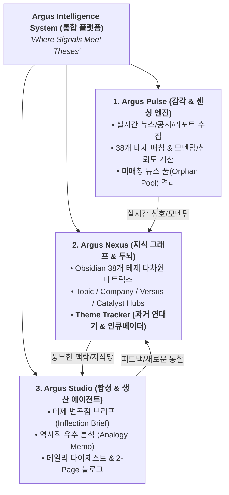
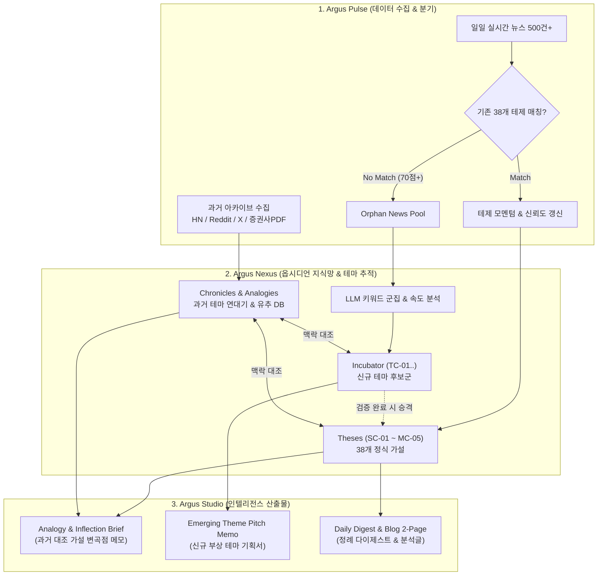

# Argus 시스템과 테마 추적기(Theme Tracker) 통합 연동 아키텍처 및 타당성 분석 보고서

> **문서 번호**: ARCH-20260906-02  
> **작성 일자**: 2026-09-06  
> **문서 유형**: 시스템 아키텍처 및 서브모듈 통합 기획서  
> **핵심 주제**: 
> 1. Argus System의 3대 핵심 기둥(`Argus Pulse`, `Argus Nexus`, `Argus Studio`) 정립  
> 2. **테마 추적기(Theme Tracker: 과거 연대기 + 실시간 신규 테마 발굴)**와의 기술적 연동 타당성 검토  
> 3. 옵시디언 지식망(Knowledge Graph) 및 데이터 파이프라인 통합 설계  
> **최종 판정**: 🟢 **100% 연동 가능 및 핵심 지능 모듈로서의 최적 시너지 (완전 일치)**

---

## 1. 개요 및 시스템 정체성 (Overview)

**Argus System**은 100개의 눈으로 시장을 감시하는 '아르고스(Argus)'처럼, 시장의 미세한 신호를 감지하고 38개 투자 가설(Theses)을 지속적으로 검증·진화시키는 **Thesis-driven Investment Intelligence OS**입니다.



---

## 2. 테마 추적기(Theme Tracker)의 2대 축

테마 추적기는 단일 기능이 아니며, **과거 데이터의 패턴 학습**과 **미래 신규 테마의 조기 포착**이라는 두 축으로 구성됩니다.

```
┌────────────────────────────────────────────────────────────────────────────────────────┐
│                          Theme Tracker (테마 추적 시스템)                               │
├───────────────────────────────────────────┬────────────────────────────────────────────┤
│  A. 과거 테마 추적기 (Argus Chronicle)     │  B. 신규 테마 발굴기 (Emerging Discovery)  │
├───────────────────────────────────────────┼────────────────────────────────────────────┤
│  • 과거 HBM2/3, CXL, LPU 등 내러티브 복원 │  • 기존 38개 테제 미매칭 고득점 뉴스 추출  │
│  • [회의론 ➔ 수율 ➔ 빅테크 ➔ 리레이팅] 주기│  • 키워드 출현 속도(Velocity) 급증 탐지   │
│  • 현재 가설과의 '역사적 유추(Analogy)'   │  • 3단계 테제 인큐베이션 (Level 0 ➔ 1 ➔ 2) │
└───────────────────────────────────────────┴────────────────────────────────────────────┘
```

---

## 3. 전체 데이터 흐름 및 파이프라인 (Data Pipeline)



---

## 4. 모듈별 상세 연동 명세

### 1) Argus Pulse 연동 (수집 및 스코어링)
* **미매칭 고득점 뉴스 풀(Orphan Pool) 격리**:
  * 기존 38개 테제와 매칭되지 않지만 중요도 점수가 70점 이상인 뉴스를 별도 `orphan_news` 테이블에 보관.
  * 매일 밤 `theme_discoverer.py`가 이를 클러스터링하여 신규 테마를 탐지.
* **과거 아카이브 인덱싱**:
  * Hacker News API, Reddit, 과거 증권사 PDF에서 수집한 2018~2023년 기술 내러티브 데이터를 ChromaDB `argus_history` 컬렉션에 적재.

### 2) Argus Nexus 연동 (Obsidian 볼트 지식망)
옵시디언 볼트(`agent_vault/argus/`)를 테마 추적기를 수용할 수 있도록 확장:

```
agent_vault/argus/
├── 00-Argus-Master-MOC.md          # 마스터 MOC (신규 테마 레이더 & 연대기 섹션 추가)
├── Theses/                         # 38개 정식 테제 (SC-01 ~ MC-05)
├── Incubator/                      # [신설] 신규 발굴 테마 후보 (TC-01, TC-02...)
├── Chronicles/                     # [신설] 과거 테마 연대기 (Chronicle-HBM2-HBM3.md 등)
├── Analogies/                      # [신설] 과거 vs 현재 1:1 비교 분석 노트
├── Hubs-Topic/                     # 16개 토픽 허브
├── Hubs-Company/                   # 15개 기업 허브
└── Hubs-Versus/                    # 4개 격돌 허브
```

* **인큐베이션 승격 체계**:
  $$\text{Level 0 (노이즈/레이더)} \longrightarrow \text{Level 1 (후보 테제: TC-01)} \longrightarrow \text{Level 2 (정식 테제: SC-14 / T-39)}$$

### 3) Argus Studio 연동 (인텔리전스 생성기)
* **역사적 유추(Historical Analogy) 자동 주입**:
  * 블로그 및 다이제스트 작성 시 "현재의 HBM4 커스텀 논쟁은 2020년 HBM2E 수율 논쟁 당시와 다음 3가지 패턴이 일치한다"는 딥인사이트 단락 자동 생성.
* **테마 피치 메모(Theme Pitch Memo)**:
  * 신규 테마가 3일 연속 급증세를 보이면 1-Page 투자 기획서를 자동 작성하여 사용자에게 브리핑.

---

## 5. 단계별 구현 로드맵 (Action Plan)

| 단계 | 목표 | 주요 산출물 | 예상 소요 |
|:---|:---|:---|:---|
| **Step 1** | **Obsidian 볼트 확장** | `Incubator/`, `Chronicles/` 디렉터리 생성 및 `00-Argus-Master-MOC.md` 레이더 뷰 추가 | 1일 |
| **Step 2** | **신규 테마 발굴기 구현** | `theme_discoverer.py` (Orphan 뉴스 클러스터링 & `TC-XX` 생성 엔진) | 3~4일 |
| **Step 3** | **과거 테마 연대기 구축** | `historical_harvester.py` (HN/Reddit/과거리포트 수집) 및 `Chronicle-*.md` 생성 | 1~2주 |
| **Step 4** | **Studio 유추 프롬프트 결합** | `blog_writer.py`, `daily_digest.py`에 `--analogy` 과거 대조 앵글 주입 | 2~3일 |

---

## 6. 결론

테마 추적기(과거 연대기 + 신규 테마 발굴)는 **Argus System**의 두뇌인 **Argus Nexus**와 감각 신경인 **Argus Pulse**에 완벽하게 일치하는 자연스러운 확장입니다. 이를 통해 단순한 뉴스 브리핑을 넘어 **"역사를 통해 배우고, 다음 주도주를 먼저 포착하는 독보적인 투자 인텔리전스 OS"**가 완성됩니다.
