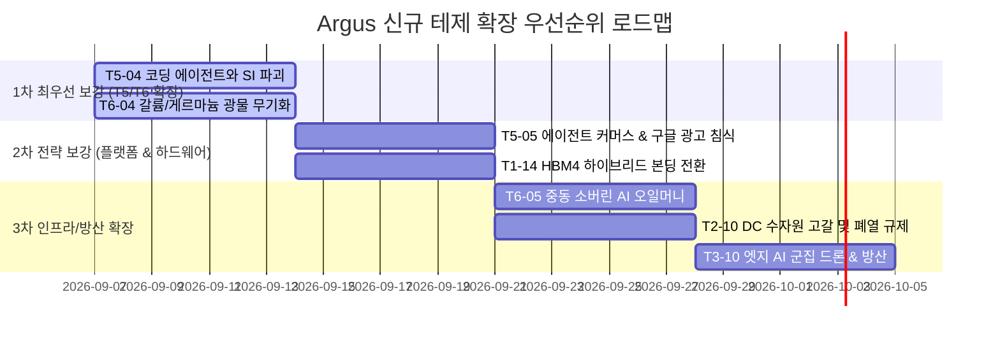

# 🧭 Argus Pulse 투자 테제 포트폴리오 진단 및 신규 테제 후보군 검토 리포트

> **작성일**: 2026-09-06  
> **시스템**: Argus Pulse / Obsidian Knowledge Graph System  
> **문서 목적**: 현재 등록된 43개 테제의 섹터별 포트폴리오 밸런스 및 블라인드 스팟(Blind Spot)을 분석하고, 2026~2028년 시장 변곡점을 선점할 수 있는 신규 테제 후보군 8선을 심층 검토하여 문서화함.

---

## 1. 📊 현재 43개 테제 포트폴리오 현황 및 섹터 밸런스 진단

현재 Argus 시스템은 6대 섹터에 걸쳐 총 43개의 정식 투자 가설(Theses)을 운영하고 있습니다.

```
[현재 6대 섹터 테제 분포 현황]
- T1 (AI 컴퓨트 & 차세대 반도체)        : 13개 (30.2%) ── HBM, CXL, 파운드리, 소부장 완비
- T2 (AI 데이터센터 & 전력·냉각 인프라)  :  9개 (20.9%) ── 초고압 그리드, 액체냉각, SMR 완비
- T3 (피지컬 AI, 모빌리티 & 로보틱스)    :  9개 (20.9%) ── 자율주행, 휴머노이드, 온디바이스 완비
- T4 (매크로 자본시장, 금리 & 밸류)     :  6개 (14.0%) ── CapEx/ROI, 금리, GPU금융 완비
- T5 (AI 엔터프라이즈 SW & 에이전트)    :  3개 ( 7.0%) ── ⚠️ [확장 최우선] 실질 에이전트 침투 부족
- T6 (지정학, 소버린 AI & 공급망 안보)  :  3개 ( 7.0%) ── ⚠️ [확장 최우선] 광물 안보/중동 자본 부족
```

### 🔍 핵심 공백(Blind Spot) 분석
1. **AI 소프트웨어 & 에이전트 레이어(T5)의 불균형**:
   - 하드웨어(T1~T3) 투자가 실제 현금 흐름으로 전환되는 최종 접점인 '소프트웨어 엔지니어링 에이전트(Devin, Cursor)' 및 '에이전트 커머스' 영역의 구조적 변화가 미반영되어 있음.
2. **지정학적 원자재 통제 및 글로벌 자본 역학(T6) 보강 필요**:
   - 미·중 기술 패권 전쟁이 장비 제재를 넘어선 '화합물 반도체 광물(갈륨/게르마늄/안티몬) 무기화'와 '중동 오일머니(MGX/사우디 PIF)의 AI 인프라 장악'으로 전선이 확대되고 있음.
3. **차세대 패키징 물리적 한계 돌파(T1/T2)**:
   - HBM4 16단 이상의 하이브리드 본딩(Cu-Cu) 전환 및 대규모 수랭식 데이터센터의 수자원(Water Scarcity) 규제 이슈가 대두됨.

---

## 🚀 2. 신규 테제 후보군 8선 심층 검토 (Candidate Theses Deep Dive)

### 💻 [영역 A] AI 엔터프라이즈 SW & 에이전트 경제 (T5 섹터)

#### 후보 1: `T5-04` 코딩 에이전트(Software Engineering Agent)와 전통 SI·IT 아웃소싱 파괴
* **가설 명제**: Devin, Cursor, Claude Code, GitHub Copilot 등 자율 코딩 에이전트의 발전으로 단순 개발/유지보수 업무의 70%가 자동화되며, 인건비 맨아워(Man-hour) 기반의 글로벌 SI 및 인도 IT 아웃소싱(인포시스, TCS) 모델이 구조적으로 붕괴하고 1인 개발사 및 고수익 소프트웨어 스튜디오로 재편된다.
* **투자 성격**: `contrarian / 🛡️ 파괴적 혁신 (Disruption)`
* **스택 레이어**: `L4 (모델/SW) & L5 (버티컬 에이전트)`
* **투자 시계**: `2026~2028`
* **밸류체인 수혜/피해 기업**:
  - **수혜 기업**: Anthropic, Microsoft (GitHub), OpenAI, Cursor, Cognition (Devin)
  - **피해/마진 압박**: Infosys, Tata Consultancy Services (TCS), Cognizant, Wipro, 국내 레거시 SI 3사

#### 후보 2: `T5-05` 검색 광고(CPC) 모델 해체와 에이전트 커머스(Agentic Commerce) 전환
* **가설 명제**: 사용자가 검색창에 키워드를 입력하고 웹 링크를 클릭하는 20년간의 '검색-광고' 패러다임이 AI 에이전트가 직접 제품을 비교·협상·결제하는 '에이전트 커머스'로 전환되면서, 구글의 검색 광고(CPC) 수익 모델이 침식되고 '에이전트 추천 프로토콜 및 결제 수수료' 시장이 급부상한다.
* **투자 성격**: `contrarian / 🚀 플랫폼 시프트 (Platform Shift)`
* **스택 레이어**: `L5 (앱/플랫폼/커머스)`
* **투자 시계**: `2026~2028`
* **밸류체인 수혜/피해 기업**:
  - **수혜 기업**: OpenAI (SearchGPT/Operator), Perplexity, Shopify, Stripe, Amazon
  - **피해/리스크**: Alphabet (구글 검색 광고 수익성 및 트래픽 점유율 침식)

---

### 🌐 [영역 B] 글로벌 공급망 안보 & 지정학적 자본 (T6 섹터)

#### 후보 3: `T6-04` 화합물 반도체 핵심 광물(갈륨·게르마늄·안티몬) 무기화와 서방 정제 공급망 병목
* **가설 명제**: 중국이 AI 전력 변환기(GaN/SiC)와 군사용 레이더, 첨단 광학계에 필수적인 갈륨(98% 독점), 게르마늄, 안티몬의 수출 통제를 전면화함에 따라, 서방 진영의 대체 정제 인프라 부족과 허가 지연으로 AI 전력 반도체 및 방산 부품 공급망에 심각한 원자재 쇼티지가 발생한다.
* **투자 성격**: `contrarian / 🛡️ 공급망 병목 (Bottleneck)`
* **스택 레이어**: `L1 (소재/광물)`
* **투자 시계**: `2026~2027`
* **밸류체인 수혜/피해 기업**:
  - **수혜 기업**: MP Materials, Lynas Rare Earths, Albemarle, 서방 리사이클링/정제 기업
  - **피해/리스크**: Wolfspeed, Onsemi, STMicroelectronics, 록히드마틴

#### 후보 4: `T6-05` 중동 소버린 오일머니(MGX·사우디 PIF)의 글로벌 AI 인프라 자본 지배력 확대
* **가설 명제**: UAE(MGX, G42)와 사우디(ALAT, PIF) 등 중동 국부펀드가 수천억 달러의 오일머니를 무기로 미국 프론티어 AI 랩, 글로벌 파운드리, 원자력/전력망 인프라의 핵심 지분을 장악하며 글로벌 AI 생태계의 최대 자금줄이자 지정학적 캐스팅보트로 부상한다.
* **투자 성격**: `consensus / 🚀 자본 지배력 (Sovereign Capital)`
* **스택 레이어**: `L6 (매크로 자본시장)`
* **투자 시계**: `2026~2030`
* **밸류체인 수혜/피해 기업**:
  - **수혜 기업**: OpenAI, TSMC, G42, Brookfield Infrastructure, GE Vernova, 엔비디아
  - **리스크**: 서방 규제 당국(CFIUS 안보 심사 강화에 따른 딜 무산 위험)

---

### 🔬 [영역 C] 차세대 하드웨어, 인프라 & 방산 AI (T1 / T2 / T3)

#### 후보 5: `T1-14` HBM4 하이브리드 본딩(Cu-Cu Direct Bonding) 전환과 패키징 장비 재편
* **가설 명제**: 16단/20단 이상 HBM4 및 3D 칩렛 적층에서 기존 마이크로범프(MR-MUF/TC-NCF)의 물리적 높이와 방열 한계로 인해 구리 직접 접합(하이브리드 본딩)이 필수 표준으로 정착되며 본딩 장비 생태계의 대전환이 일어난다.
* **투자 성격**: `consensus / 🚀 기술 변곡점 (Inflection)`
* **스택 레이어**: `L1 (패키징/장비)`
* **투자 시계**: `2026~2028`
* **밸류체인 수혜/피해 기업**:
  - **수혜 기업**: Besi (BE Semiconductor), Applied Materials, 한미반도체, TSMC, SK하이닉스
  - **피해 기업**: 레거시 칩 본더 및 범프 소재 제조사

#### 후보 6: `T2-10` AI 데이터센터 수자원(Water Scarcity) 고갈과 폐열 재활용(Heat Reuse) 규제
* **가설 명제**: 100MW+ 대규모 수랭식 데이터센터의 일일 수백만 갤런 냉각수 소비로 인한 지역 수자원 고갈 분쟁과, 유럽/미국 각국의 냉각수 재활용 의무화 및 폐열 지역난방 연계 규제가 데이터센터 신규 인허가의 새로운 최대 병목이 된다.
* **투자 성격**: `contrarian / 🛡️ 인프라 환경 규제 (ESG / Bottleneck)`
* **스택 레이어**: `L2 (인프라/수자원)`
* **투자 시계**: `2026~2028`
* **밸류체인 수혜/피해 기업**:
  - **수혜 기업**: Ecolab, Xylem, Carrier Global, Vertiv (수처리 및 폐루프 냉각 솔루션)
  - **피해 기업**: 수자원 확보 대책 없이 공격적 확장을 시도하는 미승인 데이터센터 개발사

#### 후보 7: `T3-10` 엣지 AI 자율 군집 드론과 방산 안보(Defense Tech)의 패러다임 전환
* **가설 명제**: 저전력 온디바이스 AI 칩과 컴퓨터 비전 알고리즘을 탑재한 자율 군집 드론(Swarm Drones) 및 무인 유무인 복합 체계가 현대전의 핵심 전력으로 확립되며, 팔란티어(Palantir), 안두릴(Anduril) 등 방산 AI 기업과 K-방산 기업의 수혜가 가속화된다.
* **투자 성격**: `consensus / 🚀 피지컬 AI 방산 (Defense Tech)`
* **스택 레이어**: `L5 (피지컬/방산 응용)`
* **투자 시계**: `2026~2030`
* **밸류체인 수혜/피해 기업**:
  - **수혜 기업**: Palantir Technologies, Anduril Industries, 한화에어로스페이스, LIG넥스원, KAI
  - **피해 기업**: AI 소프트웨어가 결여된 순수 레거시 재래식 화력 제조사

#### 후보 8: `TC-01 -> T1-15` 자유전자레이저(FEL) 기반 극자외선 노광원 상용화 (인큐베이터 승격)
* **가설 명제**: 2nm 이하 초미세 공정에서 기존 ASML 주석 플라즈마(LPP) EUV 광원의 출력 한계와 막대한 전력 소모를 돌파하기 위해 대형 가속기 기반 FEL 광원이 차세대 파운드리 팹의 공동 광원으로 도입된다.
* **투자 성격**: `contrarian / 🚀 차세대 노광 장비`
* **스택 레이어**: `L1 (노광 장비/소재)`
* **현재 상태**: `Incubator` 인큐베이션 진행 중 (관찰 점수 84점)

---

## 🎯 3. 단계별 테제 도입 우선순위 및 로드맵



| 우선순위 | 테제 ID | 가설 제목 | 주력 섹터 | 추천 전략 |
| :---: | :---: | :---| :---: | :---|
| **1순위 (강력 추천)** | **`T5-04`** | **코딩 에이전트와 전통 SI·IT 아웃소싱 파괴** | T5 | T5 섹터 즉시 보강, 소프트웨어 생산성 파괴 추적 |
| **2순위 (강력 추천)** | **`T6-04`** | **갈륨·게르마늄 광물 무기화와 공급망 병목** | T6 | T6 섹터 즉시 보강, AI 전력/방산 원자재 안보 추적 |
| **3순위 (추천)** | **`T5-05`** | **검색 광고 해체와 에이전트 커머스 전환** | T5 | 구글 검색 독점 해체 및 새로운 결제 플랫폼 추적 |
| **4순위 (추천)** | **`T1-14`** | **HBM4 하이브리드 본딩 전면 전환** | T1 | HBM4 16단 양산(2026) 핵심 패키징 장비 수혜주 선점 |

---

## 4. 📑 옵시디언 지식 그래프 연동 및 향후 운영 방안

1. **테제 파일 생성 시 규칙 준수**:
   - YAML 프론트매터의 `sector_id`, `thesis_nature`, `stack_layer`, `geography`를 완비하여 다차원 MOC 및 데이터뷰 대시보드와 자동 바인딩.
2. **Company Hub 및 Vs 토픽 동시 생성**:
   - `T5-04` 도입 시 `Company-Infosys.md`, `Company-Cognition.md` 등 신규 허브 개설.
   - `T6-04` 도입 시 `Company-MP_Materials.md`, `Topic-화합물반도체광물.md` 등 연결.
3. **자동 동기화 파이프라인**:
   - 테제 등록 즉시 `thesis_loader.py --sync` (모멘텀 랭킹) 및 `obsidian_sync.py`를 실행하여 iCloud 볼트와 100% 미러링 유지.
