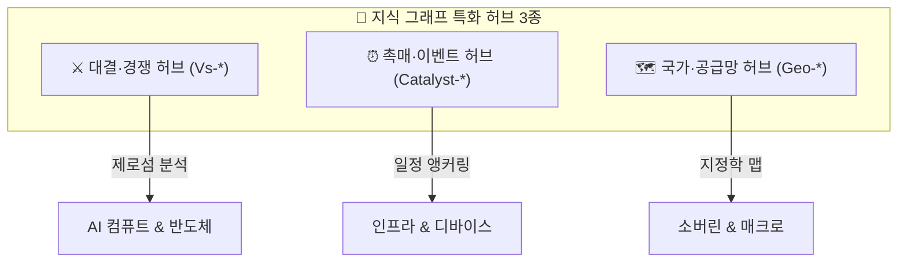

# 🧭 투자 테제 4대 섹터 확장 및 다차원(Multi-Dimensional) 분류 프레임워크

> **작성일**: 2026-09-06  
> **시스템**: Argus Pulse / Obsidian Knowledge Graph System  
> **목적**: 기존 4대 섹터 체계의 한계를 보완하고, 6대 섹터 분화, 4대 교차 차원(컨센서스, 밸류체인 스택, 시계열, 지정학), 특화 허브(Vs/Catalyst/Geo)를 도입하여 지식 그래프를 입체화하는 설계 명세

---

## 1. 개요 및 배경

기존의 **4대 섹터 체계**(① AI 컴퓨트 & 반도체, ② AI 데이터센터 & 전력·냉각, ③ 피지컬 AI & 엣지 디바이스, ④ 매크로 & 빅테크 생태계)는 기술 가치사슬의 거시적 흐름을 조망하기에 훌륭한 뼈대입니다.

그러나 실전 투자 의사결정과 옵시디언 그래프 뷰의 분석 깊이를 극대화하기 위해서는 다음과 같은 **다차원적 확장(Multi-Dimensional Dimensions)**이 필수적입니다:
1. **섹터 분화 (4대 ➔ 6대 섹터)**: 소프트웨어/에이전트 및 지정학/소버린 테마의 독립성 확보
2. **교차 차원 메타데이터 (Cross-cutting Dimensions)**: 컨센서스 vs 역발상, 밸류체인 스택(L0~L5), 투자 시계(단기~장기)
3. **특화 허브 노트 (Specialized Hubs)**: 기술/진영 대결(Vs), 핵심 일정 촉매(Catalyst), 국가별 공급망(Geo)

---

## 2. 섹터 체계 고도화: 4대 섹터 ➔ 6대 섹터 분화안

```
[기존 4대 섹터]                                    [확장 6대 섹터 체계]
1. AI 컴퓨트 & 반도체             ────────► 1. 💾 AI 컴퓨트 & 차세대 반도체 (Compute & Silicon)
2. AI 데이터센터 & 전력·냉각     ────────► 2. ⚡ AI 데이터센터 & 전력·냉각 인프라 (Power & Cooling)
3. 피지컬 AI & 엣지 디바이스       ────────► 3. 🤖 피지컬 AI, 모빌리티 & 로보틱스 (Physical AI & Robotics)
4. 매크로 & 빅테크 생태계         ───┬────► 4. 💻 AI 엔터프라이즈 SW & 버티컬 에이전트 (Enterprise SW & Agents) [신설]
                                     ├────► 5. 🌐 지정학, 소버린 AI & 공급망 안보 (Geopolitics & Sovereign Tech) [신설]
                                     └────► 6. 🏛️ 매크로 자본시장, 금리 & 밸류에이션 (Macro, Rates & Valuation)
```

### 4대 ➔ 6대 섹터별 매핑 상세

| 섹터 번호 | 섹터 명칭 | 핵심 포커스 | 소속 테제 (Theses) |
|:---|:---|:---|:---|
| **Sector 1** | **💾 AI 컴퓨트 & 차세대 반도체** | HBM4, 선단 파운드리, 2.5D/3D 패키징, CXL, 커스텀 ASIC | `T-02`, `T-06`, `T-07`, `T-10`, `T-11`, `T-14`, `T-15`, `T-16`, `T-24`, `T-28`, `T-29`, `T-33`, `T-35` |
| **Sector 2** | **⚡ AI 데이터센터 & 전력·냉각 인프라** | 초고압 변압기, 전력망, 액체냉각(DLC/CDU), SMR 원전, 대용량 ESS | `T-01`, `T-12`, `T-13`, `T-22`, `T-23`, `T-32` |
| **Sector 3** | **🤖 피지컬 AI, 모빌리티 & 로보틱스** | 공간지능, VLA 모델, E2E 자율주행, 휴머노이드 액추에이터, 전고체 | `T-03`, `T-04`, `T-17`, `T-18`, `T-19`, `T-20`, `T-21`, `T-27`, `T-30` |
| **Sector 4** | **💻 AI 엔터프라이즈 SW & 버티컬 에이전트** *(신설)* | LLM 파운데이션 과점, 온프레미스 사설 AI, B2B 업무 자동화, 바이오 AI | `T-25`, `T-31`, `T-34` *(+ 향후 B2B Agent 가설 확장)* |
| **Sector 5** | **🌐 지정학, 소버린 AI & 공급망 안보** *(신설)* | 각국 정부 자체 컴퓨트 인프라, 미·중 반도체 통제, 중국 로컬라이제이션 | `T-26`, `T-36` *(+ 향후 반도체 수출규제 가설 확장)* |
| **Sector 6** | **🏛️ 매크로 자본시장, 금리 & 밸류에이션** | 10년 금리 5%, 빅테크 CAPEX ROI 검증, GPU 리스 금융, AI 버블 리스크 | `T-05`, `T-08`, `T-09`, `T-37`, `T-38` |

---

## 3. 4대 교차 차원 (Cross-cutting Dimensions) 프레임워크

단순 카테고리 구분을 넘어, 투자 관점에 따라 다각도로 필터링할 수 있는 **4대 입체 메타데이터 축**을 정의합니다.

```
                  ┌── [1. 컨센서스 성격 (Consensus vs Contrarian)] ──► 상승 베팅 vs 버블/피크 헷지
                  ├── [2. 밸류체인 스택 (Stack Layer L0~L5)] ──────► 소재/부품 ➔ 인프라 ➔ 디바이스
[테제 다차원 축]  ───┼── [3. 투자 시계 (Time Horizon)] ──────────────► 단기 실적 ➔ 장기 패러다임
                  └── [4. 지역/공급망 (Geography)] ───────────────► 북미, 한국, 대만, 중국
```

### ① 컨센서스 vs 역발상/리스크 (`thesis_nature`)
* **`consensus` (주류 상승 가설)**: 시장 참여자 대다수가 동의하며 이익 성장이 확인되는 테제
  - 예: `T-01`(DC 전력난), `T-02`(HBM4 ASIC화), `T-04`(온디바이스 NPU), `T-23`(변압기 쇼티지)
* **`contrarian` (역발상 & 꼬리 리스크 가설)**: 시장의 지배적 낙관론에 의문을 제기하거나 하방 리스크를 경고하는 헷지 테제
  - 예: `T-06`(TPU 확산으로 GPU 수요 둔화), `T-35`(2028년 메모리 피크아웃), `T-36`(중국 HBM 진입), `T-37`(AI 버블 붕괴), `T-38`(10년 금리 5% 재진입)
> 💡 **활용법**: 옵시디언에서 Dataview를 통해 **"리스크 헷지 테제 대시보드"**를 별도로 추출하여 포트폴리오 방어 전략에 활용.

### ② 6계층 밸류체인 스택 (`stack_layer`)
* **`L0` (소재/부품/장비/원자재)**: 리튬 조달, 식각/세정 소재, 유리기판, TC 본더 (`T-11`, `T-32`, `T-33`)
* **`L1` (칩 제조/첨단 패키징)**: 파운드리, 선단 로직, HBM 적층, CoWoS 인터포저 (`T-02`, `T-10`, `T-16`, `T-28`)
* **`L2` (물리 인프라/전력·냉각)**: 초고압 변압기, 전력망 그리드, CDU 액체냉각, SMR 원전, BESS (`T-01`, `T-12`, `T-13`, `T-22`, `T-23`)
* **`L3` (컴퓨트 플랫폼 & 네트워킹)**: CSP 클라우드, 광 인터커넥트(CPO), 초고속 이더넷(UEC), 네오클라우드 (`T-08`, `T-09`, `T-14`, `T-29`)
* **`L4` (모델 & 엔터프라이즈 SW)**: LLM 파운데이션 모델, 오픈소스 가중치, 온프레미스 AI (`T-25`, `T-26`, `T-31`, `T-34`)
* **`L5` (엔드포인트 디바이스 & 피지컬)**: AI 스마트폰, AI PC, AR 스마트글래스, 자율주행 로보택시, 휴머노이드 로봇 (`T-03`, `T-04`, `T-17`, `T-18`, `T-19`, `T-20`, `T-21`, `T-27`, `T-30`)

### ③ 투자 시계 (`time_horizon`)
* **단기 (2026~2027 실적 확인기)**: 현재 공급 부족으로 실적 P·Q가 급증하는 구간 (`T-02`, `T-20`, `T-23`)
* **중기 (2027~2028 기술 변곡기)**: 차세대 공정 및 아키텍처 전환 구간 (`T-11`, `T-13`, `T-14`, `T-16`, `T-35`)
* **장기 (2028+ 패러다임 전환기)**: 상용화 초기 및 근본적 산업 재편 구간 (`T-03`, `T-17`, `T-28`, `T-30`, `T-34`)

### ④ 지리/공급망 축 (`geography`)
* **`US` (북미)**: 빅테크 CSP, AI 반도체 팹리스, 네오클라우드, 전력 유틸리티
* **`KR` (한국)**: HBM 메모리 과점 제조, 초고압 변압기, 2차전지/ESS, 반도체 소부장
* **`TW` (대만)**: 선단 파운드리 독점, CoWoS 첨단 패키징 생태계
* **`CN` (중국)**: 레거시 반도체 로컬라이제이션, LFP 배터리 공급망, 내수 AI 생태계

---

## 4. 특화 허브(Specialized Hubs) 체계

옵시디언 지식 그래프에서 개별 테제들을 횡단 연결하는 3대 특화 허브 노드를 신설합니다.



### ① ⚔️ 대결/트레이드오프 허브 (Vs-Hubs)
상호 대체 또는 제로섬 경쟁 관계에 있는 기술·기업 진영을 대조 분석:
- `Vs-GPU-vs-TPU-ASIC.md`: 엔비디아 범용 GPU 진영 vs 빅테크 자체 ASIC 진영 (`T-06`, `T-15`, `T-24`, `T-08`)
- `Vs-공랭-vs-액체냉각.md`: 기존 공랭 인프라 vs 차세대 DLC/CDU 액체냉각 표준 (`T-01`, `T-12`)
- `Vs-TSMC동맹-vs-삼성턴키.md`: SK하이닉스-TSMC 연합 vs 삼성 메모리·파운드리 원팀 (`T-02`, `T-10`, `T-16`)
- `Vs-인피니밴드-vs-울트라이더넷(UEC).md`: 엔비디아 독점 인터커넥트 vs 오픈 표준 UEC 연합 (`T-29`, `T-14`)

### ② ⏰ 핵심 일정 & 촉매 허브 (Catalyst-Hubs)
특정 시점에 가설의 성패를 가르는 메가 마일스톤 노드:
- `Catalyst-엔비디아-Vera-Rubin-양산.md` (2026H2~2027H1: `T-02`, `T-10`, `T-14`, `T-29` 검증)
- `Catalyst-HBM4-16단-고객사-퀄.md` (2026Q4~2027Q1: `T-02`, `T-35` 검증)
- `Catalyst-미국-전력망-인허가-패스트트랙.md` (2026~2027: `T-01`, `T-13`, `T-23` 검증)
- `Catalyst-FSD-v13-로보택시-상용승인.md` (2026~2027: `T-18`, `T-19` 검증)

### ③ 🗺️ 국가/공급망 허브 (Geo-Hubs)
- `Geo-미국-빅테크.md`, `Geo-한국-반도체-배터리.md`, `Geo-대만-파운드리-패키징.md`, `Geo-중국-로컬라이제이션.md`

---

## 5. 테제 Frontmatter 표준 확장 명세 (YAML)

새로운 다차원 분류 체계를 완벽히 반영한 테제 마크다운 프론트매터 표준 스키마:

```yaml
---
id: T-02
title: 메모리 산업의 변화
aliases:
  - T-02
  - T-02 메모리 산업의 변화
  - 메모리 산업의 변화
  - HBM4 커스텀 ASIC

# ── 다차원 분류 메타데이터 ──
sector: AI 컴퓨트 & 차세대 반도체      # 6대 섹터 중 택1
sector_id: S1                         # S1 ~ S6
thesis_nature: consensus              # consensus (주류 상승) | contrarian (역발상/리스크)
stack_layer: L1                       # L0(소부장) | L1(칩/패키징) | L2(인프라) | L3(클라우드) | L4(모델/SW) | L5(디바이스)
time_horizon: 2026~2027               # 단기(2026~2027) | 중기(2027~2028) | 장기(2028+)
geography:
  - KR
  - US
  - TW

# ── 밸류체인 & 가설 상태 ──
direction: bullish                    # bullish | bearish | neutral
confidence: 75                        # 0 ~ 100
priority: 5                           # 1 ~ 5
rank: 3
momentum: 6488.0

# ── 상호링크 네트워크 ──
related_theses:
  - T-01
  - T-07
  - T-10
  - T-11
  - T-35
  - T-36
related_companies:
  - SK하이닉스
  - 삼성전자
  - Micron
  - NVIDIA
  - TSMC
related_topics:
  - Topic-HBM
  - Topic-CoWoS
  - Topic-CXL
related_vs:
  - Vs-TSMC동맹-vs-삼성턴키
related_catalysts:
  - Catalyst-HBM4-16단-고객사-퀄
  - Catalyst-엔비디아-Vera-Rubin-양산
---
```

---

## 6. 결론 및 향후 적용 로드맵

1. **Master MOC 업데이트**: 4대 섹터 ➔ 6대 섹터 및 다차원 대시보드 섹션 추가
2. **테제 Frontmatter 확장**: 38개 테제에 `thesis_nature`, `stack_layer`, `geography`, `related_vs` 속성 일괄 반영
3. **특화 허브 생성**: 4대 `Vs-*` 대결 허브 및 핵심 `Catalyst-*` 일정 허브 생성
4. **옵시디언 볼트 동기화**: `agent_vault/argus/`로 일괄 배포
