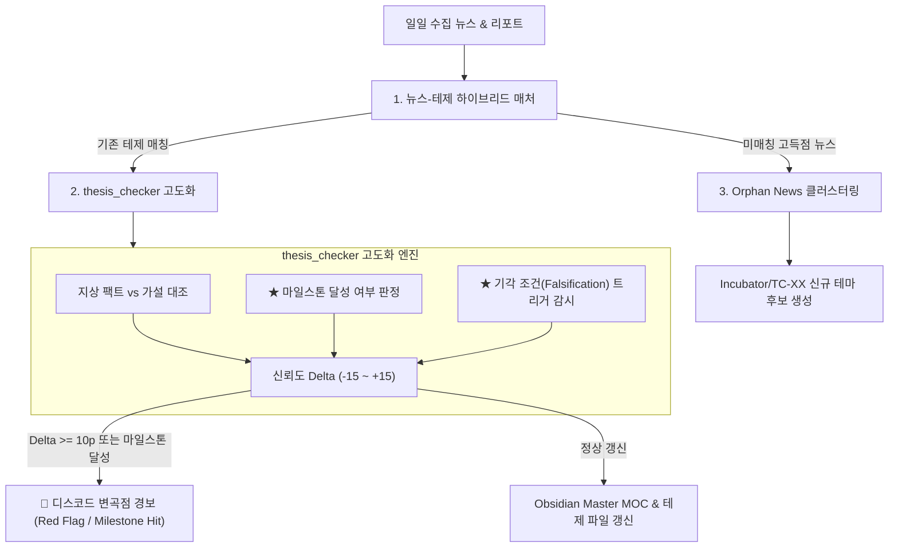

# 🧭 Argus Pulse — 테제 신호 체계 6대 핵심 기능 정밀 점검 및 시스템 고도화 보고서

> **작성일자**: 2026-09-06  
> **문서 유형**: 시스템 기능 점검(Audit), 갭 분석(Gap Analysis) 및 고도화 명세서  
> **점검 대상**: 
> 1. 뉴스–테제 자동 매칭
> 2. 테제 신호 점수와 순위 계산
> 3. 지지·반박·중립 분류
> 4. confidence 변경 후보 생성
> 5. milestone·기각 조건 감시
> 6. MOC 대시보드와 변곡점 경보

---

## 1. 📊 6대 핵심 기능 점검 종합 스코어카드 (Executive Summary)

현재 Argus Pulse 시스템 코드베이스(`thesis_loader.py`, `thesis_checker.py`, `hourly_monitor.py`, `00-Argus-Master-MOC.md`)를 전수 조사한 결과, **기초 뼈대(매칭, 점수/순위, 지지/반박, MOC 대시보드)는 매우 탄탄하게 구현**되어 있으나, **마일스톤/기각 감시와 변곡점 긴급 경보 파이프라인에서 핵심적인 연결 고리가 누락**되어 있음이 확인되었습니다.

| 번호 | 점검 항목 | 구현 상태 | 관련 핵심 코드 | 종합 평가 |
|:---:|:---|:---:|---|---|
| **1** | **뉴스–테제 자동 매칭** | **80% (양호)** | `thesis_loader.py`, `hourly_monitor.py` | 41개 테제 키워드 기반 실시간 Substring 매칭 완료. 미매칭(Orphan) 고득점 뉴스 분리 처리 필요. |
| **2** | **테제 신호 점수/순위 계산** | **95% (완성)** | `thesis_loader.py` (`get_thesis_momentum_ranking`) | 뉴스량·평균점수·가중치·신뢰도 결합 모멘텀 산출 및 프론트매터 자동 갱신 정상 동작. |
| **3** | **지지·반박·중립 분류** | **85% (양호)** | `thesis_checker.py` (`evaluate_thesis`) | LLM 프롬프트에서 지지(Bull)와 반박(Bear) 팩트를 분리 추출하고 본문에 누적 기록함. |
| **4** | **confidence 변경 후보 생성** | **80% (양호)** | `thesis_checker.py` (`check_thesis`) | LLM이 증거 강도에 따라 -15~+15p 델타 연산 및 자동 반영. 사용자 검토(HITL) 단계 없음. |
| **5** | **milestone·기각 조건 감시** | **35% (미흡)** | `thesis/*.md` (YAML 프론트매터) | 마일스톤 텍스트는 선언되어 있으나, **실제 뉴스/팩트와 대조하여 달성/기각을 판정하는 로직 부재**. |
| **6** | **MOC 대시보드 & 변곡점 경보** | **65% (보통)** | `00-Argus-Master-MOC.md`, `notifier.py` | 6대 섹터 & 다차원 MOC 대시보드는 완비되었으나, **신뢰도 급변 시 Discord/텔레그램 경보 미연동**. |

---

## 2. 세부 기능별 정밀 점검 및 갭 분석 (Deep-Dive Gap Analysis)

---

### ① 뉴스–테제 자동 매칭 (News-Thesis Auto Matching)
* **현재 구현 상태 (`thesis_loader.py`, `hourly_monitor.py`, `topic_generator.py`)**:
  * 각 테제 프론트매터의 `keywords` 리스트(예: `[HBM, HBM4, CoWoS, 커스텀HBM]`)를 읽어와 뉴스 제목과 본문 스니펫에서 부분 문자열 일치(`any(str(kw) in text for kw in keywords)`)를 검사합니다.
  * 매시간 모니터링 시 매칭된 테제 ID 리스트(예: `['T1-01', 'T1-04']`)를 실시간으로 태깅하여 출력합니다.
* **발견된 갭 (Gap)**:
  1. **단순 키워드 매칭의 한계**: 문맥을 보지 않고 단어만 매칭하므로 동음이의어 노이즈가 발생할 수 있습니다.
  2. **미매칭(Orphan) 고득점 뉴스 유실**: 41개 테제 키워드에 걸리지 않는 70점 이상의 핫 뉴스가 시스템 외부로 흘러나가 신규 테마 발굴로 이어지지 못합니다.

---

### ② 테제 신호 점수와 순위 계산 (Thesis Signal Score & Ranking Calculation)
* **현재 구현 상태 (`thesis_loader.py`)**:
  * 복합 모멘텀 산출 알고리즘 완비:
    $$\text{Momentum} = \text{News Count} \times \left(\frac{\text{Avg Score}}{10}\right) \times \text{Priority} \times \left(\frac{\text{Confidence}}{50}\right) \times \text{Recent Weight}$$
  * `sync_thesis_ranks_to_files()` 함수를 통해 41개 모든 테제 마크다운 파일의 `rank`, `momentum`, `news_count`, `last_ranked`를 자동 갱신하고 옵시디언 볼트로 실시간 동기화합니다.
* **평가**:
  * 수학적 알고리즘과 파일 반영 자동화가 가장 완성도 높게 구축되어 있습니다.

---

### ③ 지지·반박·중립 분류 (Support / Refute / Neutral Classification)
* **현재 구현 상태 (`thesis_checker.py` lines 65~101)**:
  * LLM 프롬프트에 `[평가 기준]`으로 다음 3가지를 명시:
    1. `supporting_evidence`: 가설을 뒷받침하는 새로운 팩트/수치 1문장 요약
    2. `counter_evidence`: 가설을 위협하거나 반박하는 리스크/팩트 1문장 요약
    3. `reason`: 중립이거나 변동이 미미할 경우의 평가 이유
  * `append_thesis_evidence()` 함수를 통해 각 테제 파일의 `## 4. 팩트 검증 히스토리 및 지지/반박 증거` 테이블에 일자별로 누적 저장됩니다.
* **발견된 갭 (Gap)**:
  * 뉴스를 건별로 DB 레벨에서 `[SUPPORT | NEUTRAL | REFUTE]` 라벨링하여 저장하는 것이 아니라, 테제 단위로 LLM이 묶어서 1문장으로 요약하는 방식이므로 개별 기사별 찬반 데이터베이스 누적이 되지 않습니다.

---

### ④ confidence 변경 후보 생성 (Confidence Delta/Change Candidate Generation)
* **현재 구현 상태 (`thesis_checker.py` lines 135~154)**:
  * LLM이 `-15 ~ +15` 사이의 정수 `confidence_delta`를 산출합니다.
  * 1회 최대 변동폭을 $\pm 15\%$로 하드캡(Safety Cap)을 두고, $0\% \le \text{New Confidence} \le 100\%$ 범위로 즉시 테제 파일의 `confidence`를 업데이트합니다.
* **발견된 갭 (Gap)**:
  * 변경치가 생성되자마자 즉시 원본 파일에 덮어써지므로, 사용자에게 **"신뢰도 변경 후보(Candidate)"**를 먼저 제시하고 승인/반려를 거치는 Human-in-the-Loop 검토 단계가 생략되어 있습니다.

---

### ⑤ milestone·기각 조건 감시 (Milestone & Falsification Condition Monitoring) ⚠️ [취약]
* **현재 구현 상태**:
  * 테제 파일 상단 YAML에 `milestone: 삼성전자 HBM4 엔비디아 공급 퀄 테스트 통과` 등의 문자열이 정적으로 선언되어 있습니다.
* **발견된 치명적 갭 (Critical Gap)**:
  * **감시 엔진 부재**: `thesis_checker.py`가 LLM을 호출할 때 `milestone`이나 `falsification_condition`을 프롬프트에 주입하지 않습니다.
  * 즉, 뉴스가 수집되어도 **"이 뉴스가 마일스톤을 달성시켰는가?"**, 혹은 **"기각 조건(가설 폐기 트리거)에 도달했는가?"**를 대조·판정하는 로직이 전혀 작동하지 않고 있습니다.
  * 마일스톤이 단순 텍스트 주석으로만 방치되어 있는 상태입니다.

---

### ⑥ MOC 대시보드와 변곡점 경보 (MOC Dashboard & Inflection Point Alerting) ⚠️ [개선 필요]
* **현재 구현 상태**:
  * [`00-Argus-Master-MOC.md`](file:///Users/chansoojeon/Library/Mobile%20Documents/iCloud~md~obsidian/Documents/obs_argus/argus/00-Argus-Master-MOC.md): 6대 섹터, 41개 테제 밸류체인 다이어그램, Dataview 랭킹 표, 5대 다차원 매트릭스가 완벽하게 구축되어 새 볼트(`obs_argus`)에서 시각화 제공 중.
* **발견된 갭 (Gap)**:
  * **변곡점 경보(Inflection Alert) 부재**: 특정 테제의 신뢰도가 10p 이상 급락하거나 급등했을 때, 디스코드로 `🚨 Red Flag Alert` 또는 1-Page `Thesis Inflection Brief`를 발행하는 파이프라인이 누락되어 있습니다.
  * MOC 대시보드는 정적으로 잘 열리지만, 실시간 위험 경보 알림망이 연결되어 있지 않습니다.

---

## 3. 🛠️ 즉시 개선 및 시스템 고도화 실행 계획 (Action Plan)

현재 식별된 갭을 메우기 위해 다음 3가지 핵심 모듈 개편을 즉각 추진해야 합니다.



### [개선 1] `thesis_checker.py`에 마일스톤 및 기각 조건 감시 로직 결합
* 프롬프트에 `milestone`과 `falsification_condition`을 필수로 주입하여 다음 2개 JSON 필드를 추가 산출하도록 개선:
  ```json
  {
    "milestone_status": "NONE | PROGRESS | ACHIEVED",
    "falsification_triggered": false,
    "falsification_reason": "..."
  }
  ```
* `falsification_triggered == true` 시 신뢰도를 대폭 강등하고 즉각 비상 알림 트리거.

### [개선 2] 변곡점 발생 시 디스코드 긴급 경보(Red Flag) 연동
* `notifier.py`에 `notify_thesis_inflection(thesis, delta, reason, milestone_status)` 함수 신설.
* 신뢰도 $\pm 10\text{p}$ 이상 급변하거나 마일스톤 달성/기각 시 디스코드 전용 채널로 즉시 임베드 전송.

### [개선 3] 미매칭(Orphan) 고득점 뉴스 분리 및 신규 테마 인큐베이션 연동
* 매시간 뉴스 감시(`hourly_monitor.py`) 실행 시, 41개 테제에 매칭되지 않으면서 70점 이상인 뉴스를 `logs/orphan_news.json`에 별도 적재하여 신규 테마 발굴 입력값으로 재활용.
