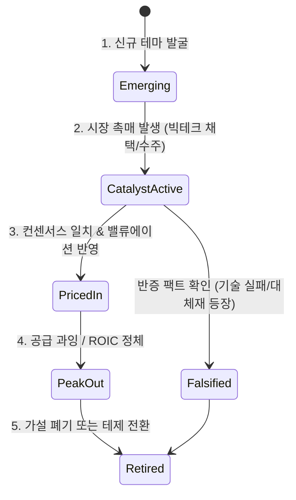

# 🧭 Argus Pulse v2.0 제안서: 콘텐츠 생성을 넘어 'Thesis 추적기' 및 '신규 테마 발굴 엔진'으로의 전환

> **작성일자**: 2026-09-06  
> **문서 유형**: 전략 기획 및 시스템 아키텍처 고도화 제안서  
> **핵심 전환**: 단순 블로그/콘텐츠 생성 공장 ➔ **투자 가설(Thesis) 생애주기 추적 & 미탐색 테마 발굴 인텔리전스 엔진**

---

## 1. 전략적 전환 배경 (Strategic Shift)

```
[기존 패러다임: Content-Centric]
  실시간 뉴스 인입 ──► 기획안 3선 도출 ──► 2-Page 블로그 대량 집필 ──► 단순 퍼블리싱
                                  │
                                  ▼ (한계: 반복적 글쓰기 피로, 알파 창출 한계)

[차세대 패러다임: Intelligence-Centric]
  실시간 뉴스 & 리포트 ──► 1. 38개 Thesis 신뢰도 & 변곡점 상시 추적 (Tracker)
                        ├──► 2. 기존 테제 밖의 '신규 부상 테마' 자동 발굴 (Discovery)
                        └──► 3. 투자 의사결정용 딥 인텔리전스 메모 생성 (New Generators)
```

### 왜 '블로그 생성'에서 'Thesis 추적 & 테마 발굴'로 넘어가야 하는가?
1. **블로그 생성의 구조적 한계**:  
   뉴스가 나오면 비슷한 형식의 2-Page 글을 매일 찍어내는 방식은 '콘텐츠 생산자'의 관점이며, 실제 투자 관점에서는 이미 알려진 사실을 재포장하는 비효율이 발생합니다.
2. **투자 가설(Thesis) 추적의 높은 레버리지**:  
   투자의 알파는 **"내가 세운 가설이 강화되고 있는가, 아니면 깨지고 있는가(Falsification)?"**를 시장보다 빠르게 포착하는 데서 나옵니다.
3. **신규 테마(Theme) 선점의 가치**:  
   시장의 돈은 언제나 기존 테마에서 다음 테마로 이동합니다(예: GPU ➔ 전력/냉각 ➔ HBM4 커스텀 ➔ 낸드/스토리지 ➔ SMR). 기존 38개 테제에 갇히지 않고 **새롭게 태동하는 미탐색 내러티브를 가장 먼저 발견**하는 엔진이 필요합니다.

---

## 2. 핵심 축 1: 고도화된 Thesis 추적기 (Advanced Thesis Tracker)

기존 `thesis_checker.py`와 `thesis_loader.py`의 단순 뉴스 건수 카운팅/신뢰도 가감을 넘어, **입체적인 가설 생애주기 관리 엔진**으로 진화합니다.



### ① 테제 생애주기(Lifecycle) 4단계 상태 머신
각 테제 파일 프론트매터에 `lifecycle_stage`를 부여하고 상태 전이를 추적합니다:
* **Stage 1. 태동기 (Emerging)**: 소수 전문가/컨퍼런스에서만 언급, 시장 관심도 낮음 (예: 과거 CXL, 유리기판 초기).
* **Stage 2. 촉매/확산기 (Catalyst Active)**: 빅테크 CAPEX 집행, 실적 가시화, LTA 수주 발생 ➔ **가장 큰 주가 상승 구간**.
* **Stage 3. 선반영/성숙기 (Priced-in)**: 모든 언론이 보도, 밸류에이션 고평가, 추가 모멘텀 둔화.
* **Stage 4. 변곡/피크아웃 (Inflection / Peak-out)**: 병목 해소, 공급 과잉, 대체 기술 대두 (예: T-35 2028년 메모리 피크아웃).

### ② Bull vs Bear 동적 격돌 검증 (상시 반증 엔진)
* **지지 증거(Bull Evidence)**뿐만 아니라, **반증 증거(Bear/Falsification Evidence)**를 병렬로 수집하여 대조.
* "이 가설이 틀렸음을 증명하는 사건(Falsification Trigger)"이 발생했는지 감시하여, 신뢰도 하락 시 **즉각 경보(Red Flag)** 발송.

### ③ 마일스톤(Milestone) & 촉매 캘린더 트래커
* 테제 파일에 등록된 `milestone`(예: *10월 28일 3자 회동*, *엔비디아 루빈 테이프아웃*, *HBM ASP 전분기 대비 하락*)을 시간표로 추출하여 다가오는 이벤트를 추적하고 결과와 가설을 대조.

### ④ 병목 전이 네트워크 (Bottleneck Spillover Map)
* 테제 간의 인과관계를 추적:
  `T-01 (데이터센터 전력 병목)` ──해결 시도──► `T-12 (액체냉각)` & `T-13 (SMR 전력)` ──가속──► `T-02 (HBM4 커스텀 베이스다이)`

---

## 3. 핵심 축 2: 신규 테마 발굴 엔진 (Emerging Theme Discovery)

기존 38개 테제에 등록되지 않은 뉴스에서 **차세대 주도 테마를 능동적으로 발굴**하는 엔진입니다.

```mermaid
flowchart LR
    NEWS[일일 수집 뉴스 500건+] --> FILTER{기존 T-01~T-38 매칭?}
    FILTER -- Yes --> UPDATE[기존 Thesis 신뢰도 업데이트]
    FILTER -- No (미매칭 고득점 뉴스) --> ORPHAN[Orphan News Pool]
    
    ORPHAN --> CLUSTER[LLM 임베딩 & 클러스터링]
    CLUSTER --> SPIKE[키워드 출현 빈도 급증 탐지 (Z-Score)]
    SPIKE --> INCUBATE[신규 테마 후보 (Candidate Theme) 생성]
    INCUBATE --> MEMO[Theme Pitch Memo 작성]
```

### ① 미매칭 뉴스 풀(Orphan News Pool) 마이닝
* 현재 시스템은 기존 테제 키워드와 매칭되지 않는 뉴스를 버리거나 모니터링만 합니다.
* **개선**: 기존 38개 테제에 속하지 않으면서 점수가 높은(70점+) 뉴스들을 별도의 `Orphan News Pool`로 격리하여 군집 분석(Clustering)을 수행합니다.

### ② 약한 신호(Weak Signal) & 키워드 이상 급증 탐지
* 지난 2주간 출현하지 않다가 이번 주에 갑자기 급증한 신규 엔티티/기술 키워드 자동 추출:
  * 예: *FEL(자유전자레이저)*, *NeoCloud 부채*, *CPO(광집적)*, *eSSD QLC 전환* 등
* 3건 이상의 독립 언론사에서 유사 키워드가 군집을 이루면 **"🚨 부상하는 신규 테마 감지"** 알림 트리거.

### ③ 테제 인큐베이션 파이프라인 (Thematic Incubation)
* 발굴된 테마를 곧바로 정식 테제로 등록하지 않고 3단계 승격 프로세스를 거침:
  1. **Level 0. Noise / Radar**: 키워드 급증 감지 (관찰 목록 등록)
  2. **Level 1. Candidate Thesis (`TC-01`)**: 1장짜리 가설 및 수혜 기업 도출
  3. **Level 2. Official Thesis (`T-39`, `T-40`...)**: 지속적 뉴스 유입 및 마일스톤 확인 시 정식 테제 승격

---

## 4. 핵심 축 3: 새로운 생성기 (Next-Gen Intelligence Generators)

대중을 위한 2-Page 블로그 대신, **투자 의사결정의 질을 비약적으로 높이는 3가지 전문 인텔리전스 문서 생성기**를 구축합니다.

| 신규 생성기 | 문서 성격 | 분량 | 트리거 시점 | 핵심 산출 내용 |
|---|---|---|---|---|
| **1. Thesis Inflection Brief**<br/>(테제 변곡점 브리프) | 투자 메모 | 1-Page | 테제 신뢰도 급변(±10p) 또는 마일스톤 통과 시 | • 가설 지지/훼손 팩트 분석<br/>• 목표주가/밸류에이션 방향성<br/>• 편입/편출 액션 시그널 |
| **2. Falsification & Bear Audit**<br/>(반증 및 역발상 감사 리포트) | 리스크 검증 | 2-Page | 시장 낙관론 과열 또는 반증 뉴스 인입 시 | • "내가 틀렸다면 무엇 때문인가?"<br/>• 3대 리스크 시나리오<br/>• 세컨드 오더(2nd Order) 충격 분석 |
| **3. Emerging Theme Pitch Memo**<br/>(신규 테마 기획 블루프린트) | 가설 제안 | 1-Page | 신규 테마 클러스터 발굴 시 | • 새로운 내러티브 정의<br/>• 왜 지금인가? (Why Now)<br/>• 관련 밸류체인 및 핵심 수혜주 |

---

## 5. 아키텍처 및 일일 스케줄 개편안 (Daily Rhythm)

```
[08:00] 🌅 아침: Thesis 변곡점 감사 & 신규 테마 발굴
   ├── 38개 테제 상태 감사 (어제 밤 대비 신뢰도/랭킹 급변 테제 추출)
   └── 미매칭 뉴스 클러스터링 ➔ 신규 부상 테마 1선 발굴 (Theme Discovery)

[09:00 ~ 21:00] 🔍 매 정각: 실시간 뉴스 감시 & 테제 매칭
   └── 80점+ 충격 뉴스 인입 시 연관 테제 즉시 신뢰도 반영

[13:00] ☀️ 오후: 마일스톤 & 가설 사후 검증 (Review)
   └── 마일스톤 도래 테제 집중 검증 ➔ 'Thesis Inflection Brief' 발행

[21:00] 🌙 야간: 종합 테제 매트릭스 & 인큐베이션 리포트
   ├── 당일 38개 테제 랭킹/모멘텀 매트릭스 동기화 (옵시디언 Master MOC 갱신)
   └── 인큐베이션 중인 후보 테제(TC-XX) 진척도 점검
```

---

## 6. 단계별 구현 로드맵 (Action Plan)

### Phase 1: Thesis Tracker 고도화 (1~2주)
- [ ] `thesis/T-XX.md` 프론트매터에 `lifecycle_stage`, `bear_cases`, `milestones_date` 필드 표준화
- [ ] `thesis_tracker.py` 신설: 신뢰도 변동(Delta) 및 마일스톤 도래 테제 자동 추출 CLI 구축
- [ ] 옵시디언 Master MOC에 테제 생애주기별(태동/확산/성숙/피크아웃) Dataview 표 구축

### Phase 2: Theme Discovery 엔진 구축 (2~3주)
- [ ] `theme_discoverer.py` 구현: SQLite에서 미매칭 고득점 뉴스 필터링
- [ ] LLM 기반 신규 키워드/클러스터링 및 '신규 테마 후보(Candidate Theme)' 자동 생성
- [ ] 주 1회 '신규 부상 테마 탐색 리포트' 자동 생성 파이프라인 연동

### Phase 3: 신규 생성기(Intelligence Generators) 도입 (3~4주)
- [ ] 기존 블로그 생성기(`blog_writer.py`)의 비중을 낮추고, `thesis_brief_writer.py`(1-Page 변곡점 메모) 및 `falsification_auditor.py`(반증 리포트) 신설
- [ ] 디스코드 알림을 블로그 생성 알림에서 **"🚨 테제 변곡점 발생"**, **"💡 신규 테마 포착"** 인텔리전스 중심으로 개편
