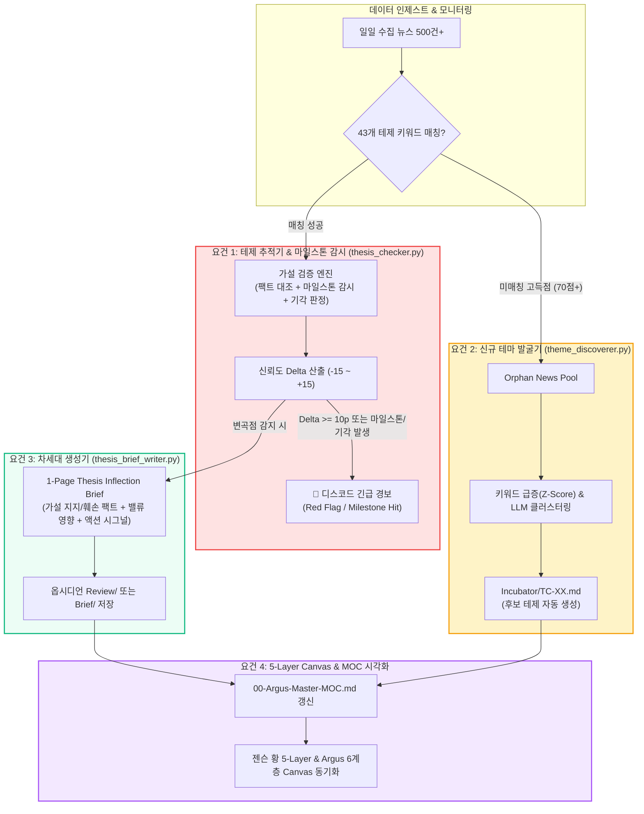

# 📋 Argus Pulse v2.0 시스템 고도화 상세 요건정의서 (SRS)

> **문서 번호**: SRS-20260907-01  
> **작성 일자**: 2026-09-07  
> **프로젝트**: Argus Pulse (투자 인텔리전스 & 테제 의사결정 시스템)  
> **문서 목적**: 단순 블로그 생성을 넘어 **'Thesis 추적기'**, **'신규 테마 발굴기'**, **'차세대 인텔리전스 생성기'**, **'5-Layer Canvas 시각화'**로 전환하기 위한 4대 핵심 기능의 기능적/기술적 요건 정의  

---

## 1. 개요 및 시스템 목표 (System Overview)

### 1.1 배경 및 전략적 방향성
* **현행 문제점**: 기존 시스템은 수집된 뉴스를 가공하여 매일 2-Page 블로그 포스트를 찍어내는 '퍼블리싱 공장'에 치중되어 있어, 실제 투자 수익률(알파) 창출에 직결되는 가설 검증 및 신규 테마 선점 기능이 미흡함.
* **v2.0 핵심 목표**:
  1. 43개 투자 가설(Theses)의 **마일스톤 달성 여부와 기각 조건(Falsification)을 실시간 감시**하여 가설 훼손 시 즉시 경보 발령.
  2. 기존 테제에 매칭되지 않는 70점+ 고득점 뉴스를 마이닝하여 **새롭게 태동하는 테마(Emerging Themes)를 조기 발굴**하고 인큐베이팅.
  3. 2-Page 대중 블로그를 대체하는 **1-Page 심층 투자 의사결정 메모(Thesis Inflection Brief)** 자동 생성.
  4. 젠슨 황의 **5-Layer Cake(에너지·인프라 ➔ 하드웨어 ➔ 시스템SW ➔ 파운데이션 ➔ 에이전트)** 구조와 Argus 6대 섹터(T1~T6)를 완벽히 일치시키는 옵시디언 캔버스(Canvas) 시각화 완성.

---

## 2. 4대 핵심 기능 상세 요건 명세 (Functional Specifications)



---

## 3. [요건 1] `thesis_checker.py` 마일스톤 & 기각 조건 감시 엔진 (Priority: P0)

### 3.1 목적
* 43개 테제의 YAML 프론트매터에 정적으로만 방치되어 있던 `milestone`과 본문의 기각 조건을 **실제 뉴스 데이터와 능동적으로 대조하여 가설 유효성을 판정**하고, 이상 발생 시 즉각 경보를 발송함.

### 3.2 데이터 스키마 보강 (YAML Frontmatter)
기존 `thesis/T#-XX.md` 프론트매터에 기각 조건 및 상태 필드를 정규화합니다:
```yaml
milestone: "삼성전자 HBM4 엔비디아 공급 퀄 테스트 통과"
milestone_status: "NONE" # NONE | PROGRESS | ACHIEVED
falsification_condition: "HBM4 베이스다이 표준화 무산 또는 수율 20% 미만 고착화"
falsification_triggered: false
lifecycle_stage: "Catalyst Active" # Emerging | Catalyst Active | Priced-in | Peak-out | Falsified
```

### 3.3 LLM 평가 프롬프트 고도화 요건
* `thesis_checker.py`의 `evaluate_thesis()` 함수 프롬프트에 `milestone` 및 `falsification_condition`을 필수로 주입.
* **LLM 출력 JSON 스키마**:
  ```json
  {
    "supporting_evidence": "가설을 지지하는 팩트 1문장 (없으면 '없음')",
    "counter_evidence": "가설을 반박하거나 위협하는 리스크 팩트 1문장 (없으면 '없음')",
    "confidence_delta": 0,
    "milestone_status": "NONE",
    "milestone_evidence": "마일스톤 진척 관련 팩트 요약 (없으면 '없음')",
    "falsification_triggered": false,
    "falsification_reason": "기각 조건 도달 이유 (없으면 '없음')",
    "reason": "평가 종합 근거"
  }
  ```

### 3.4 디스코드 긴급 변곡점 경보 연동 명세 (`notifier.py`)
* 함수명: `notify_thesis_inflection(thesis, eval_result, old_conf, new_conf)`
* **발송 조건 (OR 조건)**:
  1. `abs(confidence_delta) >= 10` (신뢰도 10p 이상 급변)
  2. `milestone_status == "ACHIEVED"` (핵심 마일스톤 달성)
  3. `falsification_triggered == True` (가설 기각 트리거 발생)
* **임베드 UI 명세**:
  * 색상: 기각 발생 시 **적색(`0xFF0000`)**, 마일스톤 달성 시 **녹색(`0x00FF00`)**, 급변 시 **황색(`0xFFA500`)**
  * 필드: 테제 ID/명칭, 기존 ➔ 변경 신뢰도, 핵심 지지/반박 팩트, 대응 액션 가이드.

---

## 4. [요건 2] 미매칭 뉴스 풀 기반 신규 테마 발굴기 (`theme_discoverer.py`) (Priority: P0)

### 4.1 목적
* 43개 기존 테제 키워드에 매칭되지 않아 버려지던 70점+ 고득점 뉴스를 마이닝하여, 시장에 새로 부상하는 기술/기업/내러티브를 선제 발굴하고 `Incubator`에 등록.

### 4.2 동작 파이프라인
1. **Orphan News 격리**:
   * `news.sqlite`에서 최근 3일간 `score >= 70`이면서, 43개 테제 키워드와 0건 매칭된 뉴스 추출.
2. **키워드 이상 급증(Spike) 탐지**:
   * 형태소 분석 및 개체명(Entity) 추출을 통해 직전 2주 대비 이번 주 출현 빈도가 $200\%$ 이상 급증한 신규 단어(예: *FEL*, *광집적 CPO*, *유리기판 TGV*, *온사이트 SMR*) 추출.
3. **LLM 기반 테마 군집화 & 명명**:
   * 유사 기사 3건 이상을 그룹핑하여 신규 테마명, 핵심 가설, 관련 기업 추출.
4. **후보 테제(`thesis/Incubator/TC-XX.md`) 자동 생성**:
   * 파일명: `TC-01-[테마명].md`
   * 프론트매터: `status: candidate`, `discovery_date: YYYY-MM-DD`, `watch_days: 14`, `related_companies`, `keywords`.
   * 옵시디언 `obs_argus/argus/Incubator/` 볼트로 자동 동기화.

### 4.3 인큐베이션 생애주기 관리
* 14일간 추가 뉴스 유입량과 신뢰도를 모니터링하여:
  * **승격(Graduation)**: 지속적 뉴스 유입 및 산업 파급력 확인 시 `T-42`, `T-43`... 정식 테제로 승격.
  * **소멸(Discard)**: 1회성 단기 노이즈로 확인 시 아카이브 이동.

---

## 5. [요건 3] 차세대 1-Page 투자 메모 'Thesis Inflection Brief' 생성기 (Priority: P1)

### 5.1 목적
* 대중 배포용 2-Page 블로그 대신, **전문 투자자가 즉시 매매/비중 조절 판단을 내릴 수 있는 1-Page 액션 지향형 인텔리전스 메모** 자동 생성.

### 5.2 스크립트 명세 (`thesis_brief_writer.py`)
* **실행 방식**:
  ```bash
  python thesis_brief_writer.py --id T2-01              # 특정 테제 수동 생성 (예: T2-01 HBM 메모리)
  python thesis_brief_writer.py --inflection-only       # 오늘 변곡점(±10p) 테제 자동 생성
  ```
* **트리거 시점**:
  * 13:00 사후 검증 배치 시 마일스톤 도래 또는 신뢰도 급변 테제 발생 시 자동 호출.

### 5.3 문서 템플릿 표준 명세 (1-Page 포맷)
```markdown
---
title: "[Thesis Brief] T2-01 메모리 산업의 변화 — 마일스톤 달성 및 변곡점 점검"
date: 2026-09-07
thesis_id: T2-01
confidence: 75 -> 85 (+10p)
status: action-required
---

# 🎯 [Thesis Brief] T2-01 메모리 산업의 변화: 변곡점 분석

> **한 줄 결론**: 마일스톤(삼성 HBM4 퀄 테스트) 진척 가시화로 단기 신뢰도 85% 상향. HBM3E 가격 경쟁 노이즈를 뚫고 커스텀 ASIC화 프리미엄 반영 구간 진입.

---

## 1. 팩트 체커: 가설 지지 vs 훼손 데이터 대조
- ✅ **지지 팩트 (Bull)**: 엔비디아-삼성 뉴욕 회동을 통한 4나노 베이스다이 공급 협의 포착.
- ⚠️ **훼손/리스크 (Bear)**: CXMT의 레거시 HBM3E 소량 출하로 범용 가격 교란 가능성.

## 2. 밸류에이션 및 기업 실적 영향도
- **삼성전자**: 파운드리 턴키 수혜로 HBM4 ASP 마진 방어율 +15%p 개선 전망.
- **SK하이닉스**: TSMC 동맹 유지 여부가 2027년 점유율 50% 수성의 분수령.

## 3. 포트폴리오 액션 시그널 & 다음 주목 이벤트
- **투자 시그널**: [비중 확대 (Overweight)] — 범용 메모리 우려에 따른 주가 조정을 비중 확대 기회로 활용.
- **D-Day 이벤트**: 2026년 10월 28일 엔비디아-삼성-SK 3자 공급망 회동 결과.
```

---

## 6. [요건 4] `obs_argus` 볼트 Canvas 및 젠슨 황 5-Layer 매핑 시각화 (Priority: P2)

### 6.1 목적
* 직전에 작성된 [젠슨 황 5-Layer Cake vs Argus MOC 비교 문서](file:///Users/chansoojeon/Library/CloudStorage/Dropbox/03_code/b_0901_Argus_pulse/docs/2026-09-07-jensen-huang-5-layer-cake-vs-argus-moc-comparison.md)의 분석 결과를 옵시디언의 시각적 인터페이스인 **Obsidian Canvas(`.canvas`)**에 반영하여 거시 밸류체인 조망 체계를 완성함.

### 6.2 계층 구조 매핑 명세 (젠슨 황 5-Layer Stack ↔ Argus 6대 섹터 정렬)

| 계층 번호 | 젠슨 황 5-Layer Cake | Argus 6대 섹터 코드 | 캔버스 보드 파일 | 주요 테제 노드 군집 |
|:---:|:---|:---:|:---|:---|
| **Layer 1** | **에너지 & 물리 인프라**<br>(Energy & Facilities) | **`T1`**<br>(에너지·전력·냉각 인프라, 8개) | `01-에너지-전력-냉각-인프라.canvas` | `T1-01`(DC병목), `T1-02`(액체냉각), `T1-03`(SMR), `T1-04`(대용량 ESS), `T1-05`(변압기), `T1-07`(HVDC), `T1-08`(온사이트 발전) |
| **Layer 2** | **컴퓨팅 하드웨어 & 제조**<br>(Hardware Systems) | **`T2`**<br>(AI 컴퓨트·메모리·선단반도체, 10개) | `02-AI컴퓨트-메모리-선단반도체.canvas` | `T2-01`(HBM4), `T2-02`(CoWoS), `T2-03`(유리기판), `T2-04`(2nm GAA), `T2-05`(3D DRAM/NAND), `T2-06`(CXL), `T2-07`(추론 LPU/ASIC) |
| **Layer 3** | **시스템 소프트웨어 & 플랫폼**<br>(CUDA / Distributed Systems) | **`T3`**<br>(초고속 네트워킹·시스템 플랫폼, 8개) | `03-초고속네트워킹-시스템플랫폼.canvas` | `T3-01`(CPO), `T3-02`(UEC), `T3-03`(분산 코로케이션), `T3-04`(네오클라우드), `T3-05`(AFA 스토리지/eSSD), `T3-06`(초고다층 MLB), `T3-07`(장거리 DCI), `T3-08`(클러스터 OS) |
| **Layer 4** | **파운데이션 모델 & AI SW**<br>(Models & Frameworks) | **`T4`**<br>(파운데이션 모델·엔터프라이즈 SW, 4개) | `04-파운데이션모델-엔터프라이즈SW.canvas` | `T4-01`(사설 AI/온프레미스), `T4-02`(SW 레이어 과점화), `T4-03`(바이오 AI 신약), `T4-04`(TPU vs GPU) |
| **Layer 5** | **피지컬 AI & 자율 에이전트**<br>(Physical AI / Robotics / Edge) | **`T5`**<br>(피지컬 AI·자율주행·로보틱스, 9개) | `05-피지컬AI-자율주행-로보틱스.canvas` | `T5-01`(온디바이스 AI), `T5-02`(모바일 에이전트), `T5-03`(AI PC), `T5-05`(E2E 자율주행/로보택시), `T5-06`(휴머노이드), `T5-07`(공간지능) |
| **Macro** | *(자본 순환 매크로 & 지정학 안보)*<br>(Financial ROI & Sovereign AI) | **`T6`**<br>(매크로 자본시장·밸류에이션·지정학, 8개) | `06-매크로-밸류에이션-지정학안보.canvas` | `T6-01`(금리/DC ROI), `T6-02`(GPU 금융), `T6-03`(AI 버블), `T6-05`(5000억$ 매출 갭), `T6-06`(소버린 AI), `T6-07`(중국 HBM), `T6-08`(중국 NAND) |

### 6.3 Canvas 파일 정비 요건
1. 6대 섹터별 전용 Canvas 파일(`01-` ~ `06-`)과 최신 43개 테제 노드 간 링크 및 태그 동기화.
2. `obs_argus/argus/Canvas/00-Argus-5Layer-ValueChain.canvas`를 통합 마스터 캔버스로 생성하여, 에너지(`T1`, 하단) ➔ 컴퓨트 반도체(`T2`) ➔ 네트워킹 플랫폼(`T3`) ➔ 파운데이션 SW(`T4`) ➔ 피지컬 AI(`T5`, 상단)로 이어지는 수직 데이터 흐름 및 외곽 매크로(`T6`) 인과관계 화살표 연결.
3. `00-Argus-Master-MOC.md` 상단에 Canvas 뷰 링크 추가.

---

## 7. 24시간 자동화 파이프라인 및 스케줄러 개편안

```
[08:00] 🌅 아침: 테제 감사 & 신규 테마 발굴 (Theme Discovery)
   ├── 43개 테제 상태 일괄 감사 (thesis_checker.py --smart)
   ├── 신규 테마 발굴기 실행 (theme_discoverer.py) ➔ Incubator/TC-XX 생성
   └── 마일스톤 도래 테제 발견 시 ➔ 디스코드 알림 발송

[09:00 ~ 21:00] 🔍 매 정각: 실시간 뉴스 감시 & 테제 매칭 (hourly_monitor.py)
   ├── 80점+ 핫 뉴스 감지 즉시 알림
   └── 미매칭 고득점(70점+) 뉴스는 logs/orphan_news.json에 분리 적재

[13:00] ☀️ 오후: 마일스톤 사후 검증 & 변곡점 브리프 (thesis_brief_writer.py)
   ├── 마일스톤 달성 또는 신뢰도 급변 테제 추출
   ├── 1-Page 'Thesis Inflection Brief' 자동 집필 및 옵시디언 저장
   └── 디스코드 긴급 경보(Red Flag / Milestone Hit) 발송

[21:00] 🌙 야간: 종합 테제 매트릭스 & 모멘텀 랭킹 갱신 (daily_digest.py)
   ├── 43개 테제 모멘텀 랭킹 동기화 및 Master MOC Dataview 갱신
   └── 인큐베이션 중인 후보 테제(TC-XX) 생존 여부 점검
```

---

## 8. 단계별 구현 마일스톤 및 검증 기준 (Implementation Roadmap)

| 단계 | 구현 대상 | 상세 산출물 | 검증 기준 (Acceptance Criteria) |
|---|---|---|---|
| **Phase 1**<br/>(우선순위 P0) | **마일스톤/기각 감시 & 긴급 경보** | • `thesis_checker.py` 수정<br/>• `notifier.py` 경보 함수 신설 | 마일스톤 뉴스 인입 시 `milestone_status: ACHIEVED`가 판정되고, 디스코드로 빨간/초록 임베드 경보가 5초 이내 발송될 것 |
| **Phase 2**<br/>(우선순위 P0) | **신규 테마 발굴기** | • `theme_discoverer.py` 신설<br/>• `logs/orphan_news.json` 풀 구축 | 미매칭 70점+ 뉴스 3건 이상 군집 시 `thesis/Incubator/TC-XX.md`가 자동 생성되고 옵시디언에 동기화될 것 |
| **Phase 3**<br/>(우선순위 P1) | **Thesis Inflection Brief 생성기** | • `thesis_brief_writer.py` 신설<br/>• 1-Page 투자 메모 템플릿 | 신뢰도 10p 급변 시 1장짜리 투자 메모가 `Review/` 폴더에 마크다운으로 자동 생성될 것 |
| **Phase 4**<br/>(우선순위 P2) | **Canvas & 5-Layer 시각화** | • `00-Argus-5Layer-ValueChain.canvas`<br/>• `00-Argus-Master-MOC.md` 갱신 | 옵시디언 Canvas에서 젠슨 황 5계층 노드가 끊김 없이 화살표로 연결되어 렌더링될 것 |
