# 🎂 젠슨 황의 AI 5단 케이크 vs Argus Master MOC 섹션 비교 분석

> **문서 버전**: 1.0.0  
> **작성일**: 2026-09-07  
> **시스템**: Argus Pulse / Obsidian Knowledge Graph System  
> **목적**: 엔비디아(NVIDIA) 젠슨 황 CEO가 제시한 'AI 5단 케이크(5-Layer AI Stack)'와 Argus Pulse Master MOC의 6대 섹터(T1~T6) 및 6계층 밸류체인 수직 스택(L0~L5)을 비교하고, 기술 공급자 관점과 실전 투자자 관점의 차별화 포인트를 정리

---

## 1. 개요 및 비교 프레임워크

엔비디아(NVIDIA) 젠슨 황 CEO는 컴퓨텍스(Computex) 및 GTC 기조연설에서 AI 시대를 이끄는 **'AI 팩토리 및 5단계 컴퓨팅 스택(5-Layer Cake)'** 모델을 제시했습니다.  
Argus Pulse는 이 기술적 수직 스택을 충실히 반영함과 동시에, 투자 의사결정에 필수적인 **매크로 자본시장(T4)**, **지정학·공급망 안보(T6)**, **소부장 세분화(L0)**, **대결 구도(Versus)**를 결합하여 **3차원 투자 가치사슬 매트릭스**로 확장했습니다.

```mermaid
flowchart TD
    subgraph Jensen["젠슨 황의 5단 케이크 (기술 공급자 관점)"]
        J5["5단: Apps & Physical AI (응용/로봇)"]
        J4["4단: Models & Frameworks (LLM/Omniverse)"]
        J3["3단: System SW / CUDA (가속 라이브러리)"]
        J2["2단: Hardware Systems (GPU/네트워킹)"]
        J1["1단: Energy & Facilities (전력/데이터센터)"]
        J1 --> J2 --> J3 --> J4 --> J5
    end

    subgraph Argus["Argus Master MOC (투자 의사결정 관점)"]
        T6["🏛️ T6: 매크로·금리·CAPEX ROI & 지정학 안보"]
        
        L5["🤖 T5: 피지컬 AI / 엔드포인트 디바이스 (5단)"]
        L4["💻 T4: 파운데이션 모델 & 엔터프라이즈 SW (4단)"]
        L3["🌐 T3: 초고속 네트워킹 & 시스템 플랫폼 (3단)"]
        L2["💾 T2: AI 컴퓨트 & 차세대 반도체 제조 (2단)"]
        L1["⚡ T1: AI 데이터센터 & 전력·냉각 인프라 (1단)"]
        
        T6 -. 자본 공급, ROI 압박 및 무역 규제 .-> L1
        T6 -. 소버린 AI & 국가 컴퓨트 투자 .-> L2
        L1 --> L2 --> L3 --> L4 --> L5
    end
```

---

## 2. 젠슨 황 5단 케이크 vs Argus MOC 종합 매핑표

| 계층 | 젠슨 황의 5단 케이크 (NVIDIA AI Architecture) | Argus Master MOC 섹션 (T1~T6) | 캔버스 보드 파일 | 주요 대응 기업 & 테제 |
|:---:|:---|:---|:---:|:---|
| **5단** | **Applications & AI Agents** • 생성형 AI 앱 & 행동형 에이전트 • 피지컬 AI (자율주행, 휴머노이드 로봇) | **`T5` 피지컬 AI, 모빌리티 & 로보틱스** (9개 테제) | `05-피지컬AI-자율주행-로보틱스.canvas` | • [[Company-Tesla|Tesla]], [[Company-Apple|Apple]], [[Company-현대차|현대차]] • `T5-01`, `T5-02`, `T5-03`, `T5-05`, `T5-06`, `T5-07` |
| **4단** | **Models & AI Frameworks** • 파운데이션 LLM / VLM • NeMo, Megatron, Omniverse | **`T4` 파운데이션 모델 & 엔터프라이즈 SW** (4개 테제) | `04-파운데이션모델-엔터프라이즈SW.canvas` | • [[Company-Microsoft|MS]], [[Company-Alphabet|Google]], [[Company-Meta|Meta]] • `T4-01`, `T4-02`, `T4-03`, `T4-04` |
| **3단** | **System Software / AI-OS** • CUDA 가속 플랫폼 & 라이브러리 • Magnum IO, NCCL, Triton 추론기 | **`T3` 초고속 네트워킹 & 시스템 플랫폼** (4개 테제) | `03-초고속네트워킹-시스템플랫폼.canvas` | • [[Company-Arista|Arista]], [[Company-Broadcom|Broadcom]], [[Company-NVIDIA|NVIDIA]] • `T3-01`, `T3-02`, `T3-03`, `T3-04` |
| **2단** | **Hardware / AI Infrastructure** • GPU, Grace CPU, NVLink Switch • DGX SuperPOD, 스토리지 | **`T2` AI 컴퓨트 & 차세대 반도체** (10개 테제) | `02-AI컴퓨트-메모리-선단반도체.canvas` | • [[Company-TSMC|TSMC]], [[Company-SK하이닉스|SK하이닉스]], [[Company-삼성전자|삼성전자]] • `T2-01`, `T2-02`, `T2-03`, `T2-04`, `T2-08` |
| **1단** | **Energy & Facility Infrastructure** • GW급 전력망 및 변전 설비 • 액체냉각(Liquid Cooling), PUE 저감 | **`T1` AI 데이터센터 & 전력·냉각 인프라** (8개 테제) | `01-에너지-전력-냉각-인프라.canvas` | • [[Company-Vertiv|Vertiv]], [[Company-HD현대일렉트릭|HD현대일렉트릭]], [[Company-LG에너지솔루션|LG에너지솔루션]] • `T1-01`, `T1-02`, `T1-03`, `T1-04`, `T1-05`, `T1-07` |
| **+α** | *(기술/공급자 모델 외곽의 거시 환경)* | **`T6` 매크로 자본시장, 밸류 & 지정학 안보** (8개 테제) | `06-매크로-밸류에이션-지정학안보.canvas` | • [[Company-Fed|연준]], [[Company-US_Treasury|미국채]], [[Company-OpenAI|OpenAI]], [[Company-YMTC|YMTC]] • `T6-01`, `T6-02`, `T6-03`, `T6-05`, `T6-06`, `T6-07` |

---

## 3. 계층별 1:1 심층 비교

### 🍰 1단: 에너지 & 데이터센터 물리 인프라
* **젠슨 황 1단 (Energy & Facilities)**: 기가와트(GW)급 청정 에너지 조달, 액체냉각(Liquid Cooling), 친환경 데이터센터 설계.
* **Argus `T1` (전력·냉각 인프라, 8개 테제)**:
  - 젠슨 황의 1단 개념을 실제 투자 수혜주 발굴이 가능한 8대 세부 밸류체인으로 세분화.
  - **세부 테제**: 데이터센터 병목(`T1-01`), 액체냉각 표준화(`T1-02`), SMR 무탄소 PPA(`T1-03`), AI 전력망용 대용량 ESS/LFP(`T1-04`), 초고압 변압기·그리드 쇼티지(`T1-05`), 한국 배터리 수혜(`T1-06`), 800V/HVDC 전력 혁신(`T1-07`), 온사이트 자체발전(`T1-08`).

---

### 🍰 2단: 컴퓨팅 하드웨어 & 반도체 제조
* **젠슨 황 2단 (Hardware Systems)**: 블랙웰(Blackwell) GPU, Grace CPU, NVLink 스위치, DGX SuperPOD.
* **Argus `T2` (AI 컴퓨트 & 차세대 반도체, 10개 테제)**:
  - 엔비디아 중심의 단일 하드웨어 뷰를 넘어, **소부장**, **칩 제조·패키징**, **대체 칩(ASIC/TPU)**으로 다각화.
  - **소부장 & 패키징**: 유리기판 인터포저(`T2-03`), HBM4 커스텀화(`T2-01`), CoWoS 병목(`T2-02`), 반도체 소부장 국산화(`T2-09`).
  - **파운드리 & 메모리**: 파운드리 2nm GAA 격돌(`T2-04`), 3D DRAM & 400단 V-NAND(`T2-05`), CXL 메모리 풀링(`T2-06`), 메모리 2028 피크아웃(`T2-10`).
  - **대체 아키텍처**: 빅테크 커스텀 ASIC/DSP(`T2-08`), AI 추론 LPU(`T2-07`).

---

### 🍰 3단: 시스템 소프트웨어 & 초고속 통신 플랫폼
* **젠슨 황 3단 (CUDA & Systems Platform)**: 쿠다(CUDA) 플랫폼 락인, Magnum IO, NCCL, 클러스터링 분산 통신.
* **Argus `T3` (초고속 네트워킹 & 시스템 플랫폼, 8개 테제)**:
  - 하드웨어 효율을 극대화하는 통신 규격, 초고속 스토리지, 고다층 기판 및 클러스터 OS에 집중.
  - **세부 테제**: 실리콘 포토닉스와 CPO 상용화(`T3-01`), 초고속 UEC vs 인피니밴드 패권(`T3-02`), 분산형 AI 데이터센터 코로케이션(`T3-03`), 엔비디아와 네오클라우드 파트너십(`T3-04`), AI 올플래시 스토리지와 QLC eSSD 공급망(`T3-05`), 초고다층 기판 MLB와 초저손실 CCL 병목(`T3-06`), 데이터센터 간 초장거리 인터커넥트 DCI(`T3-07`), AI 클러스터 OS와 MFU 가동률 최적화 SW(`T3-08`).

---

### 🍰 4단: 파운데이션 모델 & 엔터프라이즈 SW
* **젠슨 황 4단 (Models & AI Frameworks)**: 파운데이션 LLM, NeMo, Megatron, Omniverse 물리 시뮬레이션.
* **Argus `T4` (파운데이션 모델 & 엔터프라이즈 SW, 4개 테제)**:
  - 소프트웨어 가치사슬의 상업화 및 과점화, 빅테크 모델 진영 분석.
  - **세부 테제**: 오픈소스 모델 고도화와 온프레미스 사설 AI(`T4-01`), AI 소프트웨어 레이어의 과점화(`T4-02`), 바이오 AI와 신약개발 가속(`T4-03`), 구글 TPU 증가와 GPU 수요 분산(`T4-04`).

---

### 🍰 5단: 애플리케이션, 에이전트 & 피지컬 AI
* **젠슨 황 5단 (Apps & Physical AI)**: 생성형 AI 소프트웨어, 자율주행(DRIVE), 휴머노이드 로봇 파운데이션(GR00T).
* **Argus `T5` (피지컬 AI, 모빌리티 & 로보틱스, 9개 테제)**:
  - 디지털 AI가 물리적 하드웨어 및 소비재로 침투하는 전 영역을 포괄.
  - **세부 테제**: 온디바이스 AI NPU(`T5-01`), 행동형 AI 에이전트와 모바일 교체 사이클(`T5-02`), AI PC & Arm 생태계(`T5-03`), AI 스마트 글래스(`T5-04`), End-to-End AI 자율주행·로보택시(`T5-05`), 휴머노이드 로봇 액추에이터(`T5-06`), 피지컬 AI 공간지능 반도체(`T5-07`), 로봇 상용화(`T5-08`), 전고체 배터리(`T5-09`).

---

## 4. Argus Master MOC가 확장한 4대 핵심 차별점

### 1️⃣ 자본 순환 및 ROI 검증 레이어 독립 신설 (`T6 매크로 자본시장`)
- **배경**: 기술이 아무리 뛰어나도 막대한 CAPEX를 회수하지 못하면 투자는 붕괴함.
- **Argus 접근법**: 
  - 고금리와 데이터센터 ROI(`T6-01`).
  - 네오클라우드의 GPU 담보 대출 및 금융 버블 리스크(`T6-02`).
  - AI 버블 가능성 및 조정 시나리오(`T6-03`).
  - 10년물 국채금리 5% 재진입 리스크(`T6-04`).
  - 빅테크의 5,000억 달러 매출 갭과 데이터센터 ROI 딜레마(`T6-05`).

### 2️⃣ 국가 안보 및 무역 통제 축 반영 (`T6 지정학 & 소버린 AI`)
- **배경**: AI는 단순 기업 기술이 아닌 국가 전략 무기화됨.
- **Argus 접근법**:
  - 각국 정부의 자체 인프라 구축인 **소버린 AI(`T6-06`)**.
  - 미국의 대중 반도체 제재 속 중국의 HBM/NAND 추격 가능성(`T6-07`, `T6-08`).

### 3️⃣ 엔비디아 독점 탈피 & 대결 구도 (Versus Hubs) 구조화
- **배경**: 엔비디아의 시각은 '엔비디아 중심의 통합 솔루션'이지만, 시장은 끊임없이 탈(脫)엔비디아와 비용 절감을 추구함.
- **Argus 접근법**:
  - `Vs-GPU-vs-TPU-ASIC` (범용 GPU vs 자체 커스텀 칩)
  - `Vs-TSMC동맹-vs-삼성턴키` (분업 생태계 vs 원스톱 턴키)
  - `Vs-인피니밴드-vs-울트라이더넷` (독점 폐쇄망 vs 오픈 UEC 연합)
  - `Vs-공랭-vs-액체냉각` (레거시 vs 차세대 냉각)

### 4️⃣ 공격과 수비의 포트폴리오 밸런스 (`Consensus vs Contrarian`)
- **배경**: 낙관론에만 편향된 분석은 거품 붕괴 시 치명적 손실 초래.
- **Argus 접근법**:
  - **주류 성장 테제 (Consensus, 31개)**: 실적 가시성이 높은 Long 포지션.
  - **역발상 & 헷지 테제 (Contrarian, 7개)**: 메모리 피크아웃(`T1-13`), AI 버블 붕괴(`T4-04`), 금리 충격(`T4-05`) 등 하방 방어용 포트폴리오 구축.

---

## 5. 결론 및 시사점

> 💡 **핵심 요약**  
> **젠슨 황의 5단 케이크**가 엔비디아가 세계에 제시하는 **"기술적·물리적 AI 구현 청사진"**이라면,  
> **Argus Master MOC**는 이를 온전히 품어내면서 **"자본(T4), 지정학(T6), 소부장 공급망(L0), 진영 대결(Vs)"**을 결합하여 실질적인 투자 알파(Alpha)를 창출하는 **"실전 투자 의사결정 나침반"**입니다.
