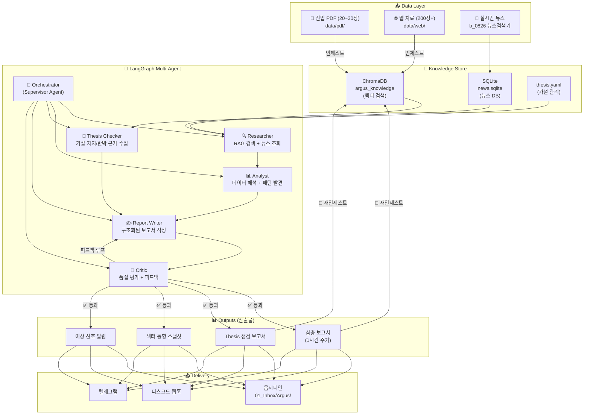
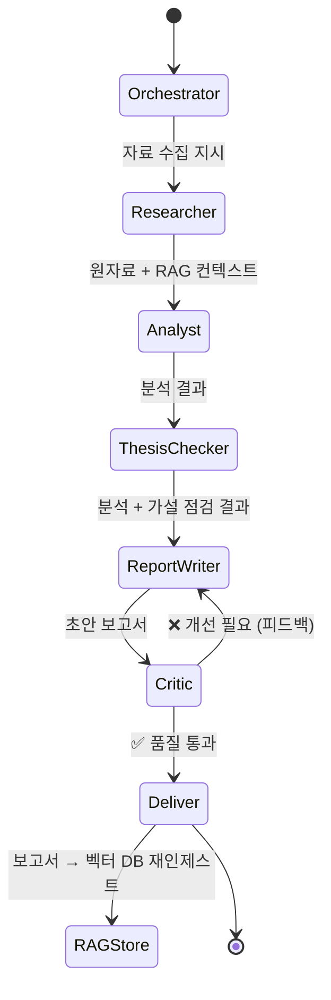

# Argus Pulse — LangGraph 멀티에이전트 시장 인텔리전스 엔진

## 프로젝트 목표

**산업 PDF + 웹 자료 + 실시간 뉴스**를 통합하고, LangGraph 멀티에이전트가 이를 분석하여 **산업 리포트를 자동 생성** → 생성된 리포트를 다시 **RAG 지식으로 축적**하는 순환 구조의 시장 인텔리전스 엔진.

---

## 1. 시스템 아키텍처



---

## 2. LangGraph 멀티에이전트 설계

### 2.1 패턴: Supervisor + Evaluator-Optimizer Loop

LangGraph의 **Supervisor 패턴**을 기본으로, **Critic 에이전트**가 품질을 평가하여 필요시 재작성하는 루프를 포함합니다.



### 2.2 에이전트별 역할

| 에이전트 | 역할 | 사용 모델 | 도구(Tools) |
|---|---|---|---|
| **Orchestrator** | 작업 분배, 흐름 제어, 보고서 유형 결정 | Gemini Flash (저비용) | 라우팅 로직 |
| **Researcher** | ChromaDB 벡터 검색 + SQLite 뉴스 조회 | Gemini Flash | `rag_search`, `news_query`, `web_search` |
| **Analyst** | 수집 자료 분석, 패턴 발견, 시장 맥락 해석 | Gemini Flash | 분석 프롬프트 |
| **Thesis Checker** | `thesis.yaml`의 활성 가설에 대해 지지/반박 근거 정리 | Gemini Flash | `rag_search`, `thesis_load` |
| **Report Writer** | 구조화된 마크다운 보고서 작성 | Gemini Flash | 보고서 템플릿 |
| **Critic** | 보고서 완성도·정확성·근거 충분성 평가, 개선 피드백 | Gemini Flash | 평가 기준표 |

### 2.3 LangGraph State 설계

```python
from typing import TypedDict, Annotated, Literal
from langgraph.graph.message import add_messages

class AgentState(TypedDict):
    messages: Annotated[list, add_messages]   # 대화 히스토리
    report_type: Literal["deep", "thesis", "sector", "anomaly"]
    
    # Researcher 산출물
    rag_context: str            # ChromaDB 검색 결과
    news_context: str           # 최신 뉴스 요약
    
    # Analyst 산출물
    analysis: str               # 분석 결과
    key_signals: list[str]      # 핵심 신호 목록
    
    # Thesis Checker 산출물
    thesis_results: list[dict]  # [{thesis_id, support, counter, confidence}]
    
    # Report Writer 산출물
    draft_report: str           # 보고서 초안
    
    # Critic 산출물
    critic_score: int           # 0~100
    critic_feedback: str        # 개선 피드백
    revision_count: int         # 수정 횟수 (최대 2회)
    
    # 최종
    final_report: str           # 확정 보고서
```

### 2.4 그래프 흐름 (조건부 엣지)

```python
from langgraph.graph import StateGraph, END

graph = StateGraph(AgentState)

graph.add_node("orchestrator", orchestrator_node)
graph.add_node("researcher", researcher_node)
graph.add_node("analyst", analyst_node)
graph.add_node("thesis_checker", thesis_checker_node)
graph.add_node("report_writer", report_writer_node)
graph.add_node("critic", critic_node)
graph.add_node("deliver", deliver_node)
graph.add_node("rag_store", rag_store_node)  # 보고서 → 벡터DB 재인제스트

graph.set_entry_point("orchestrator")

graph.add_edge("orchestrator", "researcher")
graph.add_edge("researcher", "analyst")
graph.add_edge("analyst", "thesis_checker")
graph.add_edge("thesis_checker", "report_writer")
graph.add_edge("report_writer", "critic")

# Critic → 조건부 분기
graph.add_conditional_edges(
    "critic",
    should_revise,   # score < 70 and revision_count < 2 → 재작성
    {
        "revise": "report_writer",
        "approve": "deliver",
    }
)

graph.add_edge("deliver", "rag_store")  # 산출물 → 벡터DB 재축적
graph.add_edge("rag_store", END)
```

---

## 3. 2단계 RAG — 지식 순환 구조

이 프로젝트의 핵심 차별점: **에이전트가 생성한 산업 리포트가 다시 RAG 지식으로 축적**됩니다.

```
┌─────────────────────────────────────────────────────┐
│                   지식 순환 루프                      │
│                                                     │
│  [산업 PDF + 웹 자료]                                │
│        ↓ 인제스트                                    │
│  [ChromaDB: argus_knowledge]                        │
│        ↓ RAG 검색                                    │
│  [멀티에이전트 분석]                                  │
│        ↓ 보고서 생성                                  │
│  [산업 리포트 산출물]                                 │
│        ↓ 재인제스트 ──────────┐                      │
│  [ChromaDB: argus_reports]   │ ← 축적됨              │
│        ↓ 다음 주기에 검색     │                      │
│  [더 풍부한 컨텍스트로 분석]  ←┘                      │
└─────────────────────────────────────────────────────┘
```

### ChromaDB 컬렉션 구분

| 컬렉션 | 용도 | 소스 |
|---|---|---|
| `argus_knowledge` | 기초 지식 | 산업 PDF, 웹 자료 (수동 투입) |
| `argus_reports` | 축적 지식 | 에이전트 생성 리포트 (자동 순환) |

검색 시 두 컬렉션을 **동시 검색**하여 결합. 시간이 지날수록 `argus_reports`가 풍부해지면서 분석 품질이 점진적으로 향상.

---

## 4. 산출물 4종

### 4.1 심층 보고서 (1시간 주기)

```markdown
# 📊 Argus Pulse 심층 보고서
> 2026-09-01 22:00 KST

## 🌡️ 시장 온도
전체 시장 분위기 1-2줄 요약

## 🔴 핵심 신호 (Top 3)
1. [종목] 이벤트 요약 — 영향도 평가
2. ...

## 📌 섹터별 동향
### 반도체
- ...
### AI / 클라우드
- ...

## 🔍 RAG 인사이트
산업 PDF/과거 보고서에서 끌어온 맥락 분석

## ⚠️ 리스크 모니터
주의가 필요한 역풍/리스크 요인
```

### 4.2 Thesis 점검 보고서 (4시간 주기)

```markdown
# 🔬 Thesis 점검 보고서
> 2026-09-01 20:00 KST

## 가설 #1: HBM 수요 2026 H2 급증
- **신뢰도**: 78% (↑3% from last)
- **지지 근거**: SK하이닉스 HBM4 양산 발표, NVIDIA GB300 수주 확대
- **반박 근거**: 중국 AI칩 자체 조달 가속
- **판단**: 가설 유지, 단 중국 리스크 모니터링 필요

## 가설 #2: 파운드리 2nm 전환 가속
- ...
```

### 4.3 섹터 동향 스냅샷 (가볍게, 디스코드 최적화)

```
📡 섹터 스냅샷 | 22:00

🟢 반도체: HBM 수주 호조, 메모리 가격 반등 신호
🟡 AI/클라우드: NVDA 실적 서프라이즈, 밸류에이션 논쟁
🔴 2차전지: 유럽 EV 보조금 축소 우려
🟢 자동차: 현대차 美공장 가동 확대
```

### 4.4 이상 신호 알림 (즉시 발송)

뉴스 점수 급등, 다중 매체 동시 보도, Thesis 관련 급변 감지 시 즉시 디스코드/텔레그램 발송.

---

## 5. 데이터 흐름 상세

### 5.1 입력 데이터 인제스트

| 소스 | 처리 방식 | 저장소 |
|---|---|---|
| 산업 PDF (20~30장) | `pypdf` 텍스트 추출 → 1000자 청킹 → ChromaDB | `argus_knowledge` |
| 웹 자료 (200장) | `.md`/`.txt`/`.html` 파싱 → 청킹 → ChromaDB | `argus_knowledge` |
| 실시간 뉴스 | b_0826 수집기 → SQLite | `news.sqlite` |
| 에이전트 리포트 | 보고서 텍스트 → 청킹 → ChromaDB | `argus_reports` |

### 5.2 산출물 배포

| 채널 | 형식 | 대상 보고서 |
|---|---|---|
| 옵시디언 `01_Inbox/Argus/` | MD 파일 (프론트매터 포함) | 심층, Thesis |
| 디스코드 웹훅 | 2000자 분할 전송 | 전체 4종 |
| 텔레그램 | 마크다운 메시지 | 전체 4종 |

---

## 6. 기존 자산 활용

### b_0826_news_research 연동

`sys.path`에 b_0826 경로를 추가하여 직접 임포트:

| 모듈 | 활용 내용 |
|---|---|
| `collector.py` + `sources/` | 뉴스 수집 파이프라인 전체 |
| `scorer.py` | 4축 스코어링 (매체신뢰도 + 커버리지 + 키워드 + 최신성) |
| `db/database.py` | SQLite 뉴스 조회 (`get_recent_top_news`, `get_top_news_by_company`) |
| `companies.csv` | 종목 레지스트리 (15개 종목) |
| `notifier.py` | 텔레그램/디스코드 전송 로직 |
| `.env` | API 키 (NAVER, GEMINI, TELEGRAM, DISCORD) |

### 로컬 환경 확인 (이미 설치됨)

| 패키지 | 버전 |
|---|---|
| `langgraph` | 1.0.6 ✅ |
| `langchain` | 1.2.6 ✅ |
| `langchain-google-genai` | 3.1.0 ✅ |
| `chromadb` | 1.5.5 ✅ |
| `pypdf` | 6.10.0 ✅ |
| `tiktoken` | 0.12.0 ✅ |

---

## 7. 파일 구조 (계획)

```
b_0901_Argus_pulse/
├── config.py                 ← 설정
├── .env                      ← 환경변수
├── requirements.txt
│
├── ingest.py                 ← PDF/웹 인제스트 → ChromaDB
├── rag.py                    ← 하이브리드 RAG 검색 (2개 컬렉션)
│
├── agents/                   ← LangGraph 멀티에이전트
│   ├── __init__.py
│   ├── graph.py              ← StateGraph 정의 + 컴파일
│   ├── state.py              ← AgentState TypedDict
│   ├── orchestrator.py       ← Supervisor 노드
│   ├── researcher.py         ← RAG 검색 노드
│   ├── analyst.py            ← 분석 노드
│   ├── thesis_checker.py     ← 가설 점검 노드
│   ├── report_writer.py      ← 보고서 작성 노드
│   └── critic.py             ← 품질 평가 노드
│
├── deliver.py                ← 산출물 배포 (옵시디언 + 디스코드 + 텔레그램)
├── pulse.py                  ← 메인 CLI + daemon 모드
├── thesis.yaml               ← 가설 관리
│
├── data/
│   ├── pdf/                  ← 산업 PDF 투입
│   └── web/                  ← 웹 자료 투입
├── db/
│   └── chroma/               ← ChromaDB 벡터 저장소
├── output/                   ← 로컬 보고서 아카이브
└── docs/
    └── human.md              ← 요구사항
```

---

## 8. 구현 순서 (Phase)

| Phase | 작업 | 설명 |
|---|---|---|
| **1** | 프로젝트 뼈대 | config, .env, requirements, 디렉토리 |
| **2** | `ingest.py` | PDF/웹 → ChromaDB 인제스트 |
| **3** | `rag.py` | 하이브리드 RAG (knowledge + reports 컬렉션) |
| **4** | `agents/` | LangGraph 그래프 + 6개 에이전트 노드 |
| **5** | `deliver.py` | 옵시디언 + 디스코드 + 텔레그램 배포 |
| **6** | `pulse.py` | CLI + 1시간 주기 daemon |
| **7** | 테스트 | thesis.yaml 예시 + 통합 테스트 |

---

## Open Questions

> [!IMPORTANT]
> ### 확인 사항
> 1. **산업 PDF 20~30장**은 어디에 있나요? 경로를 알려주시면 `data/pdf/`에 심볼릭 링크 또는 복사합니다.
> 2. **웹 자료 200장**은 어떤 형태(URL 목록? 저장된 파일?)로 보유하고 계신가요?
> 3. **Gemini API 키**가 현재 b_0826의 `.env`에 비어 있는데, 발급받으셨나요?
> 4. **다른 LLM 모델**도 사용하고 싶으신가요? (예: Anthropic Claude, OpenAI — 키가 있으시면 모델 티어링 적용 가능)
