# 🧭 Argus Pulse 투자 테제 Master MOC (Map of Content)

> **Argus Nexus 중앙 사령탑**  
> AI 및 첨단 기술 산업의 구조적 변화를 추적하는 38개 투자 가설(Theses)의 상호 인과관계 맵과 **6대 섹터 & 5대 교차 차원(다차원 대시보드)** 사령탑입니다.

---

## 🗺️ 전체 가설 생태계 가치사슬 구조도 (Macro Value Chain)

```mermaid
flowchart TB
    subgraph Macro["🏛️ 매크로 자본시장 & 밸류에이션 (S6)"]
        T05["[[T-05-금리와-데이터센터|T-05 금리와 DC ROI]]"]
        T08["[[T-08-엔비디아와-네오클라우드|T-08 네오클라우드]]"]
        T09["[[T-09-엔비디아와-GPU-금융|T-09 GPU 금융]]"]
        T37["[[T-37-AI-버블-가능성|T-37 AI 버블 붕괴 리스크]]"]
        T38["[[T-38-10년금리-5%-재진입-가능성|T-38 10년 금리 5%]]"]
    end

    subgraph PowerInfra["⚡ AI 인프라 & 전력·냉각 (S2)"]
        T01["[[T-01-데이터센터의-변화|T-01 데이터센터 병목]]"]
        T12["[[T-12-데이터센터-액체냉각의-표준화|T-12 액체냉각 표준화]]"]
        T13["[[T-13-SMR과-데이터센터-무탄소-전력-PPA|T-13 SMR·무탄소 PPA]]"]
        T22["[[T-22-AI-전력망용-대용량-ESS와-LFP-공급망|T-22 대용량 ESS/LFP]]"]
        T23["[[T-23-변압기·초고압-그리드-쇼티지-장기화|T-23 변압기·그리드]]"]
        T32["[[T-32-ESS와-한국배터리의-미국수혜|T-32 K-배터리 미국수혜]]"]
    end

    subgraph ComputeMemory["💾 AI 컴퓨트 & 차세대 반도체 (S1)"]
        T02["[[T-02-메모리-산업의-변화|T-02 HBM4 ASIC화]]"]
        T06["[[T-06-TPU-증가와-GPU-수요-둔화|T-06 TPU vs GPU]]"]
        T07["[[T-07-CXL-메모리의-확대|T-07 CXL 메모리 풀링]]"]
        T10["[[T-10-첨단-패키징과-CoWoS의-병목|T-10 CoWoS 패키징]]"]
        T11["[[T-11-유리기판의-차세대-패키징-침투|T-11 유리기판 인터포저]]"]
        T14["[[T-14-실리콘-포토닉스와-CPO의-상용화|T-14 CPO 광반도체]]"]
        T15["[[T-15-AI-추론-시장-폭발과-LPU-ASIC-분화|T-15 추론 LPU·ASIC]]"]
        T16["[[T-16-파운드리-2nm-공정과-GAA-격돌|T-16 파운드리 2nm GAA]]"]
        T24["[[T-24-빅테크-커스텀-ASIC-증가와-DSP-생태계|T-24 빅테크 ASIC/DSP]]"]
        T28["[[T-28-3D-DRAM-기술-전환과-400단-V-NAND|T-28 3D DRAM & V-NAND]]"]
        T29["[[T-29-초고속-AI-네트워킹-UEC-vs-인피니밴드|T-29 UEC vs 인피니밴드]]"]
        T33["[[T-33-반도체-소부장의-내재화|T-33 반도체 소부장]]"]
        T35["[[T-35-메모리-2028년-피크아웃|T-35 2028 메모리 피크아웃]]"]
    end

    subgraph SoftwareAgents["💻 AI 엔터프라이즈 SW & 에이전트 (S4)"]
        T25["[[T-25-오픈소스-모델-고도화와-온프레미스-사설-AI|T-25 사설 AI / 온프레미스]]"]
        T31["[[T-31-AI-소프트웨어-레이어의-과점화|T-31 AI SW 레이어 과점]]"]
        T34["[[T-34-바이오AI와-신약개발-가속|T-34 바이오 AI 신약]]"]
    end

    subgraph Geopolitics["🌐 지정학, 소버린 AI & 공급망 안보 (S5)"]
        T26["[[T-26-소버린-AI와-국가-단위-컴퓨트-인프라|T-26 소버린 AI]]"]
        T36["[[T-36-중국반도체의-HBM-생산가능성|T-36 중국 HBM 추격]]"]
    end

    subgraph EdgePhysical["🤖 피지컬 AI, 모빌리티 & 로보틱스 (S3)"]
        T03["[[T-03-전고체-배터리의-변화|T-03 전고체 배터리]]"]
        T04["[[T-04-온디바이스-AI의-변화|T-04 온디바이스 NPU]]"]
        T17["[[T-17-휴머노이드-로봇과-액추에이터-공급망|T-17 휴머노이드 로봇]]"]
        T18["[[T-18-End-to-End-AI-자율주행과-로보택시|T-18 E2E 자율주행]]"]
        T19["[[T-19-피지컬-AI와-공간지능-반도체|T-19 피지컬 AI 공간지능]]"]
        T20["[[T-20-행동형-AI-에이전트와-모바일-교체-슈퍼사이클|T-20 모바일 교체 사이클]]"]
        T21["[[T-21-AI-PC-보급-확대와-Arm-기반-윈도우-생태계|T-21 AI PC & Arm]]"]
        T27["[[T-27-AI-스마트-글래스와-경량-AR-광학계|T-27 AI 스마트 글래스]]"]
        T30["[[T-30-피지컬AI와-로봇의-상용화|T-30 로봇 상용화]]"]
    end

    Macro --> PowerInfra
    PowerInfra --> ComputeMemory
    ComputeMemory --> SoftwareAgents
    ComputeMemory --> EdgePhysical
    Geopolitics -. 규제/통제 .-> ComputeMemory
    Geopolitics -. 인프라투자 .-> PowerInfra
```



---

## 🔀 다차원 교차 분석 대시보드 (Multi-Dimensional Dashboards)

### 🛡️ 1. 컨센서스 vs 역발상/헷지 뷰 (Consensus vs Contrarian)
> 시장 과열 국면에서 리스크를 헷지하고 포트폴리오를 방어할 수 있는 **역발상(Contrarian) 가설 7종** 전용 모니터링 테이블입니다.

```dataview
TABLE hypothesis AS "핵심 가설", sector AS "섹터", confidence AS "신뢰도", momentum AS "모멘텀"
FROM "argus/Theses"
WHERE thesis_nature = "contrarian"
SORT momentum DESC
```

---

### 🧱 2. 6계층 밸류체인 수직 스택 뷰 (Value Chain Stack L0~L5)
> 원자재(L0) ➔ 칩(L1) ➔ 전력/인프라(L2) ➔ 클라우드(L3) ➔ 소프트웨어(L4) ➔ 디바이스(L5) 순으로 정렬된 수직 파이프라인 뷰입니다.

```dataview
TABLE stack_name AS "스택 레이어", title AS "가설 제목", related_companies AS "핵심 기업"
FROM "argus/Theses"
SORT stack_layer ASC, rank ASC
```

---

### 🗺️ 3. 한국(KR) 핵심 수혜 및 공급망 뷰 (Korea Alpha View)
```dataview
TABLE title AS "가설 제목", hypothesis AS "핵심 가설", momentum AS "모멘텀", rank AS "순위"
FROM "argus/Theses"
WHERE contains(geography, "KR")
SORT momentum DESC
LIMIT 10
```

---

## ⚔️ 핵심 기술 & 진영 대결 구도 (Versus Hubs)

- **[[Vs-GPU-vs-TPU-ASIC|⚔️ 범용 GPU (NVIDIA) vs 커스텀 ASIC (빅테크 자체 칩)]]**: `T-06`, `T-08`, `T-15`, `T-24`
- **[[Vs-TSMC동맹-vs-삼성턴키|⚔️ TSMC 동맹 (SK-TSMC) vs 삼성전자 턴키 (원팀)]]**: `T-02`, `T-10`, `T-16`
- **[[Vs-공랭-vs-액체냉각|⚔️ 레거시 공랭식 vs 직접액체냉각 (DLC & CDU)]]**: `T-01`, `T-12`
- **[[Vs-인피니밴드-vs-울트라이더넷|⚔️ 인피니밴드 (NVIDIA) vs 울트라 이더넷 (UEC 연합)]]**: `T-14`, `T-29`

---

## 📂 6대 섹터별 테제 인덱스

### 1. 💾 AI 컴퓨트 & 차세대 반도체 (Sector 1)
| ID | 가설 제목 | 스택 | 성격 | 핵심 기업 | 주요 연관 테제 |
|:---|:---|:---:|:---:|:---|:---|
| **[[T-02-메모리-산업의-변화\|T-02]]** | 메모리 산업의 변화 | `L1` | `🚀 주류` | `[[Company-SK하이닉스\|SK하이닉스]]`, `[[Company-삼성전자\|삼성전자]]` | `[[T-07-CXL-메모리의-확대\|T-07]]`, `[[T-10-첨단-패키징과-CoWoS의-병목\|T-10]]`, `[[T-35-메모리-2028년-피크아웃\|T-35]]` |
| **[[T-06-TPU-증가와-GPU-수요-둔화\|T-06]]** | TPU 증가와 GPU 수요 둔화 | `L1` | `🛡️ 헷지` | `[[Company-Alphabet\|Alphabet]]`, `[[Company-Broadcom\|Broadcom]]` | `[[T-08-엔비디아와-네오클라우드\|T-08]]`, `[[T-15-AI-추론-시장-폭발과-LPU-ASIC-분화\|T-15]]`, `[[T-24-빅테크-커스텀-ASIC-증가와-DSP-생태계\|T-24]]` |
| **[[T-07-CXL-메모리의-확대\|T-07]]** | CXL 메모리의 확대 | `L1` | `🚀 주류` | `[[Company-삼성전자\|삼성전자]]`, `[[Company-SK하이닉스\|SK하이닉스]]` | `[[T-02-메모리-산업의-변화\|T-02]]`, `[[T-28-3D-DRAM-기술-전환과-400단-V-NAND\|T-28]]` |
| **[[T-10-첨단-패키징과-CoWoS의-병목\|T-10]]** | 첨단 패키징과 CoWoS의 병목 | `L1` | `🚀 주류` | `[[Company-TSMC\|TSMC]]`, `[[Company-SK하이닉스\|SK하이닉스]]` | `[[T-01-데이터센터의-변화\|T-01]]`, `[[T-02-메모리-산업의-변화\|T-02]]`, `[[T-11-유리기판의-차세대-패키징-침투\|T-11]]` |
| **[[T-11-유리기판의-차세대-패키징-침투\|T-11]]** | 유리기판의 차세대 패키징 침투 | `L0` | `🚀 주류` | `[[Company-SKC\|SKC]]`, `[[Company-인텔\|인텔]]` | `[[T-10-첨단-패키징과-CoWoS의-병목\|T-10]]`, `[[T-02-메모리-산업의-변화\|T-02]]` |
| **[[T-14-실리콘-포토닉스와-CPO의-상용화\|T-14]]** | 실리콘 포토닉스와 CPO의 상용화 | `L3` | `🚀 주류` | `[[Company-Broadcom\|Broadcom]]`, `[[Company-TSMC\|TSMC]]` | `[[T-01-데이터센터의-변화\|T-01]]`, `[[T-29-초고속-AI-네트워킹-UEC-vs-인피니밴드\|T-29]]` |
| **[[T-15-AI-추론-시장-폭발과-LPU-ASIC-분화\|T-15]]** | AI 추론 시장 폭발과 LPU·ASIC | `L1` | `🚀 주류` | `[[Company-Groq\|Groq]]`, `[[Company-Qualcomm\|Qualcomm]]` | `[[T-06-TPU-증가와-GPU-수요-둔화\|T-06]]`, `[[T-24-빅테크-커스텀-ASIC-증가와-DSP-생태계\|T-24]]` |
| **[[T-16-파운드리-2nm-공정과-GAA-격돌\|T-16]]** | 파운드리 2nm 공정과 GAA 격돌 | `L1` | `🚀 주류` | `[[Company-TSMC\|TSMC]]`, `[[Company-삼성전자\|삼성전자]]` | `[[T-02-메모리-산업의-변화\|T-02]]`, `[[T-10-첨단-패키징과-CoWoS의-병목\|T-10]]` |
| **[[T-24-빅테크-커스텀-ASIC-증가와-DSP-생태계\|T-24]]** | 빅테크 커스텀 ASIC 증가와 DSP | `L1` | `🚀 주류` | `[[Company-Broadcom\|Broadcom]]`, `[[Company-TSMC\|TSMC]]` | `[[T-06-TPU-증가와-GPU-수요-둔화\|T-06]]`, `[[T-15-AI-추론-시장-폭발과-LPU-ASIC-분화\|T-15]]` |
| **[[T-28-3D-DRAM-기술-전환과-400단-V-NAND\|T-28]]** | 3D DRAM 기술 전환과 400단 V-NAND | `L1` | `🚀 주류` | `[[Company-SK하이닉스\|SK하이닉스]]`, `[[Company-삼성전자\|삼성전자]]` | `[[T-02-메모리-산업의-변화\|T-02]]`, `[[T-07-CXL-메모리의-확대\|T-07]]` |
| **[[T-29-초고속-AI-네트워킹-UEC-vs-인피니밴드\|T-29]]** | 초고속 AI 네트워킹 UEC vs 인피니밴드 | `L3` | `🚀 주류` | `[[Company-Arista\|Arista]]`, `[[Company-NVIDIA\|NVIDIA]]` | `[[T-01-데이터센터의-변화\|T-01]]`, `[[T-14-실리콘-포토닉스와-CPO의-상용화\|T-14]]` |
| **[[T-33-반도체-소부장의-내재화\|T-33]]** | 반도체 소부장의 내재화 | `L0` | `🚀 주류` | `[[Company-한미반도체\|한미반도체]]`, `[[Company-동진쎄미켐\|동진쎄미켐]]` | `[[T-01-데이터센터의-변화\|T-01]]`, `[[T-02-메모리-산업의-변화\|T-02]]` |
| **[[T-35-메모리-2028년-피크아웃\|T-35]]** | 메모리 2028년 피크아웃 논쟁 | `L1` | `🛡️ 헷지` | `[[Company-SK하이닉스\|SK하이닉스]]`, `[[Company-삼성전자\|삼성전자]]` | `[[T-02-메모리-산업의-변화\|T-02]]`, `[[T-06-TPU-증가와-GPU-수요-둔화\|T-06]]` |

### 2. ⚡ AI 데이터센터 & 전력·냉각 인프라 (Sector 2)
| ID | 가설 제목 | 스택 | 성격 | 핵심 기업 | 주요 연관 테제 |
|:---|:---|:---:|:---:|:---|:---|
| **[[T-01-데이터센터의-변화\|T-01]]** | 데이터센터의 변화 (전력·냉각 병목) | `L2` | `🚀 주류` | `[[Company-Vertiv\|Vertiv]]`, `[[Company-HD현대일렉트릭\|HD현대일렉트릭]]` | `[[T-05-금리와-데이터센터\|T-05]]`, `[[T-12-데이터센터-액체냉각의-표준화\|T-12]]`, `[[T-23-변압기·초고압-그리드-쇼티지-장기화\|T-23]]` |
| **[[T-12-데이터센터-액체냉각의-표준화\|T-12]]** | 데이터센터 액체냉각의 표준화 | `L2` | `🚀 주류` | `[[Company-Vertiv\|Vertiv]]`, `[[Company-Supermicro\|Supermicro]]` | `[[T-01-데이터센터의-변화\|T-01]]`, `[[T-05-금리와-데이터센터\|T-05]]` |
| **[[T-13-SMR과-데이터센터-무탄소-전력-PPA\|T-13]]** | SMR과 데이터센터 무탄소 전력 PPA | `L2` | `🚀 주류` | `[[Company-NuScale\|NuScale]]`, `[[Company-Constellation\|Constellation]]` | `[[T-01-데이터센터의-변화\|T-01]]`, `[[T-23-변압기·초고압-그리드-쇼티지-장기화\|T-23]]` |
| **[[T-22-AI-전력망용-대용량-ESS와-LFP-공급망\|T-22]]** | AI 전력망용 대용량 ESS와 LFP | `L2` | `🚀 주류` | `[[Company-LG에너지솔루션\|LG에너지솔루션]]`, `[[Company-Tesla\|Tesla]]` | `[[T-01-데이터센터의-변화\|T-01]]`, `[[T-23-변압기·초고압-그리드-쇼티지-장기화\|T-23]]`, `[[T-32-ESS와-한국배터리의-미국수혜\|T-32]]` |
| **[[T-23-변압기·초고압-그리드-쇼티지-장기화\|T-23]]** | 변압기·초고압 그리드 쇼티지 장기화 | `L2` | `🚀 주류` | `[[Company-HD현대일렉트릭\|HD현대일렉트릭]]`, `[[Company-Eaton\|Eaton]]` | `[[T-01-데이터센터의-변화\|T-01]]`, `[[T-13-SMR과-데이터센터-무탄소-전력-PPA\|T-13]]`, `[[T-22-AI-전력망용-대용량-ESS와-LFP-공급망\|T-22]]` |
| **[[T-32-ESS와-한국배터리의-미국수혜\|T-32]]** | ESS와 한국 배터리의 미국 수혜 | `L0` | `🚀 주류` | `[[Company-LG에너지솔루션\|LG에너지솔루션]]`, `[[Company-삼성SDI\|삼성SDI]]` | `[[T-03-전고체-배터리의-변화\|T-03]]`, `[[T-22-AI-전력망용-대용량-ESS와-LFP-공급망\|T-22]]` |

### 3. 🤖 피지컬 AI, 모빌리티 & 로보틱스 (Sector 3)
| ID | 가설 제목 | 스택 | 성격 | 핵심 기업 | 주요 연관 테제 |
|:---|:---|:---:|:---:|:---|:---|
| **[[T-03-전고체-배터리의-변화\|T-03]]** | 전고체 배터리의 변화 | `L0` | `🚀 주류` | `[[Company-삼성SDI\|삼성SDI]]`, `[[Company-현대차\|현대차]]` | `[[T-17-휴머노이드-로봇과-액추에이터-공급망\|T-17]]`, `[[T-32-ESS와-한국배터리의-미국수혜\|T-32]]` |
| **[[T-04-온디바이스-AI의-변화\|T-04]]** | 온디바이스 AI의 변화 | `L5` | `🚀 주류` | `[[Company-Apple\|Apple]]`, `[[Company-Qualcomm\|Qualcomm]]` | `[[T-20-행동형-AI-에이전트와-모바일-교체-슈퍼사이클\|T-20]]`, `[[T-21-AI-PC-보급-확대와-Arm-기반-윈도우-생태계\|T-21]]` |
| **[[T-17-휴머노이드-로봇과-액추에이터-공급망\|T-17]]** | 휴머노이드 로봇과 액추에이터 | `L5` | `🚀 주류` | `[[Company-Tesla\|Tesla]]`, `[[Company-BostonDynamics\|Boston Dynamics]]` | `[[T-19-피지컬-AI와-공간지능-반도체\|T-19]]`, `[[T-30-피지컬AI와-로봇의-상용화\|T-30]]` |
| **[[T-18-End-to-End-AI-자율주행과-로보택시\|T-18]]** | End-to-End AI 자율주행과 로보택시 | `L5` | `🚀 주류` | `[[Company-Tesla\|Tesla]]`, `[[Company-Alphabet\|Waymo]]` | `[[T-04-온디바이스-AI의-변화\|T-04]]`, `[[T-19-피지컬-AI와-공간지능-반도체\|T-19]]` |
| **[[T-19-피지컬-AI와-공간지능-반도체\|T-19]]** | 피지컬 AI와 공간지능 반도체 | `L1` | `🚀 주류` | `[[Company-NVIDIA\|NVIDIA]]`, `[[Company-Qualcomm\|Qualcomm]]` | `[[T-17-휴머노이드-로봇과-액추에이터-공급망\|T-17]]`, `[[T-18-End-to-End-AI-자율주행과-로보택시\|T-18]]` |
| **[[T-20-행동형-AI-에이전트와-모바일-교체-슈퍼사이클\|T-20]]** | 행동형 AI 에이전트와 모바일 교체 | `L5` | `🚀 주류` | `[[Company-Apple\|Apple]]`, `[[Company-삼성전자\|삼성전자]]` | `[[T-04-온디바이스-AI의-변화\|T-04]]`, `[[T-21-AI-PC-보급-확대와-Arm-기반-윈도우-생태계\|T-21]]` |
| **[[T-21-AI-PC-보급-확대와-Arm-기반-윈도우-생태계\|T-21]]** | AI PC 보급 확대와 Arm 기반 윈도우 | `L5` | `🚀 주류` | `[[Company-Qualcomm\|Qualcomm]]`, `[[Company-Microsoft\|Microsoft]]` | `[[T-04-온디바이스-AI의-변화\|T-04]]`, `[[T-20-행동형-AI-에이전트와-모바일-교체-슈퍼사이클\|T-20]]` |
| **[[T-27-AI-스마트-글래스와-경량-AR-광학계\|T-27]]** | AI 스마트 글래스와 경량 AR 광학계 | `L5` | `🚀 주류` | `[[Company-Meta\|Meta]]`, `[[Company-Apple\|Apple]]` | `[[T-04-온디바이스-AI의-변화\|T-04]]`, `[[T-19-피지컬-AI와-공간지능-반도체\|T-19]]` |
| **[[T-30-피지컬AI와-로봇의-상용화\|T-30]]** | 피지컬 AI와 로봇의 상용화 | `L5` | `🚀 주류` | `[[Company-현대차\|현대차]]`, `[[Company-두산로보틱스\|두산로보틱스]]` | `[[T-03-전고체-배터리의-변화\|T-03]]`, `[[T-17-휴머노이드-로봇과-액추에이터-공급망\|T-17]]` |

### 4. 💻 AI 엔터프라이즈 SW & 버티컬 에이전트 (Sector 4)
| ID | 가설 제목 | 스택 | 성격 | 핵심 기업 | 주요 연관 테제 |
|:---|:---|:---:|:---:|:---|:---|
| **[[T-25-오픈소스-모델-고도화와-온프레미스-사설-AI\|T-25]]** | 오픈소스 모델 고도화와 온프레미스 | `L4` | `🚀 주류` | `[[Company-Meta\|Meta]]`, `[[Company-Dell\|Dell]]` | `[[T-04-온디바이스-AI의-변화\|T-04]]`, `[[T-26-소버린-AI와-국가-단위-컴퓨트-인프라\|T-26]]` |
| **[[T-31-AI-소프트웨어-레이어의-과점화\|T-31]]** | AI 소프트웨어 레이어의 과점화 | `L4` | `🚀 주류` | `[[Company-Microsoft\|Microsoft]]`, `[[Company-Alphabet\|Alphabet]]` | `[[T-06-TPU-증가와-GPU-수요-둔화\|T-06]]`, `[[T-08-엔비디아와-네오클라우드\|T-08]]` |
| **[[T-34-바이오AI와-신약개발-가속\|T-34]]** | 바이오 AI와 신약 개발 가속 | `L4` | `🚀 주류` | `[[Company-Recursion\|Recursion]]`, `[[Company-Schrodinger\|Schrodinger]]` | `[[T-04-온디바이스-AI의-변화\|T-04]]`, `[[T-15-AI-추론-시장-폭발과-LPU-ASIC-분화\|T-15]]` |

### 5. 🌐 지정학, 소버린 AI & 공급망 안보 (Sector 5)
| ID | 가설 제목 | 스택 | 성격 | 핵심 기업 | 주요 연관 테제 |
|:---|:---|:---:|:---:|:---|:---|
| **[[T-26-소버린-AI와-국가-단위-컴퓨트-인프라\|T-26]]** | 소버린 AI와 국가 단위 컴퓨트 | `L3` | `🚀 주류` | `[[Company-NVIDIA\|NVIDIA]]`, `[[Company-네이버\|네이버]]` | `[[T-01-데이터센터의-변화\|T-01]]`, `[[T-25-오픈소스-모델-고도화와-온프레미스-사설-AI\|T-25]]` |
| **[[T-36-중국반도체의-HBM-생산가능성\|T-36]]** | 중국 반도체의 HBM 생산 가능성 | `L1` | `🛡️ 헷지` | `[[Company-CXMT\|CXMT]]`, `[[Company-SMIC\|SMIC]]` | `[[T-02-메모리-산업의-변화\|T-02]]`, `[[T-15-AI-추론-시장-폭발과-LPU-ASIC-분화\|T-15]]` |

### 6. 🏛️ 매크로 자본시장, 금리 & 밸류에이션 (Sector 6)
| ID | 가설 제목 | 스택 | 성격 | 핵심 기업 | 주요 연관 테제 |
|:---|:---|:---:|:---:|:---|:---|
| **[[T-05-금리와-데이터센터\|T-05]]** | 금리와 데이터센터 (CAPEX ROI) | `L3` | `🛡️ 헷지` | `[[Company-Microsoft\|Microsoft]]`, `[[Company-Amazon\|Amazon]]` | `[[T-01-데이터센터의-변화\|T-01]]`, `[[T-08-엔비디아와-네오클라우드\|T-08]]`, `[[T-37-AI-버블-가능성\|T-37]]` |
| **[[T-08-엔비디아와-네오클라우드\|T-08]]** | 엔비디아와 네오클라우드 | `L3` | `🚀 주류` | `[[Company-CoreWeave\|CoreWeave]]`, `[[Company-NVIDIA\|NVIDIA]]` | `[[T-01-데이터센터의-변화\|T-01]]`, `[[T-05-금리와-데이터센터\|T-05]]`, `[[T-09-엔비디아와-GPU-금융\|T-09]]` |
| **[[T-09-엔비디아와-GPU-금융\|T-09]]** | 엔비디아와 GPU 금융 | `L3` | `🛡️ 헷지` | `[[Company-Blackstone\|Blackstone]]`, `[[Company-CoreWeave\|CoreWeave]]` | `[[T-08-엔비디아와-네오클라우드\|T-08]]`, `[[T-37-AI-버블-가능성\|T-37]]` |
| **[[T-37-AI-버블-가능성\|T-37]]** | AI 버블 가능성 (CAPEX ROI 불일치) | `L3` | `🛡️ 헷지` | `[[Company-NVIDIA\|NVIDIA]]`, `[[Company-BigTech\|빅테크]]` | `[[T-05-금리와-데이터센터\|T-05]]`, `[[T-08-엔비디아와-네오클라우드\|T-08]]`, `[[T-09-엔비디아와-GPU-금융\|T-09]]` |
| **[[T-38-10년금리-5%-재진입-가능성\|T-38]]** | 10년 금리 5% 재진입 가능성 | `L6` | `🛡️ 헷지` | `[[Company-US_Treasury\|미국채]]`, `[[Company-Fed\|연준]]` | `[[T-05-금리와-데이터센터\|T-05]]`, `[[T-37-AI-버블-가능성\|T-37]]` |
