# 🧭 Argus Pulse 투자 테제 Master MOC (Map of Content)

> **Argus Nexus 중앙 사령탑**  
> AI 및 첨단 기술 산업의 구조적 변화를 추적하는 **총 48개 투자 가설(Theses)**의 상호 인과관계 맵과 **6대 섹터 & 5대 교차 차원(다차원 대시보드)** 사령탑입니다.  
> 🚦 **배치 시스템 관제**: **[[00-Argus-Pipeline-Dashboard|📊 24시간 자동화 파이프라인 관제 대시보드]]** | **[[00-Argus-Batch-Pipeline.canvas|🎨 배치 파이프라인 캔버스]]**

---

## 🗺️ 전체 가설 생태계 가치사슬 구조도 (Macro Value Chain)

```mermaid
flowchart TB
    subgraph Macro["🏛️ 매크로 자본시장 & 밸류에이션 (T6)"]
        T6_01["[[T6-01-금리와-데이터센터|T6-01 금리와 DC ROI]]"]
        T6_09["[[T6-09-엔비디아와-네오클라우드|T6-09 네오클라우드]]"]
        T6_02["[[T6-02-엔비디아와-GPU-금융|T6-02 GPU 금융]]"]
        T6_03["[[T6-03-AI-버블-가능성|T6-03 AI 버블 붕괴 리스크]]"]
        T6_04["[[T6-04-10년금리-5%-재진입-가능성|T6-04 10년 금리 5%]]"]
        T6_05["[[T6-05-오픈AI·앤트로픽의-5000억달러-매출-갭과-데이터센터-ROI-딜레마|T6-05 5000억$ 매출 갭]]"]
        T6_10["[[T6-10-앤트로픽-메가-IPO와-순수-AI-파운데이션-밸류에이션-리레이팅|T6-10 앤트로픽 메가 IPO]]"]
    end

    subgraph PowerInfra["⚡ AI 데이터센터 & 전력·냉각 인프라 (T1)"]
        T1_01["[[T1-01-데이터센터의-변화|T1-01 데이터센터 병목]]"]
        T1_02["[[T1-02-데이터센터-액체냉각의-표준화|T1-02 액체냉각 표준화]]"]
        T1_03["[[T1-03-SMR과-데이터센터-무탄소-전력-PPA|T1-03 SMR·무탄소 PPA]]"]
        T1_04["[[T1-04-AI-전력망용-대용량-ESS와-LFP-공급망|T1-04 대용량 ESS/LFP]]"]
        T1_05["[[T1-05-변압기-초고압-그리드-쇼티지-장기화|T1-05 변압기·그리드]]"]
        T1_06["[[T1-06-ESS와-한국배터리의-미국수혜|T1-06 K-배터리 미국수혜]]"]
        T1_07["[[T1-07-800V-48V-HVDC-전력-아키텍처-혁신|T1-07 800V/HVDC 혁신]]"]
        T1_08["[[T1-08-온사이트-가스터빈과-연료전지-자체발전|T1-08 온사이트 자체발전]]"]
    end

    subgraph ComputeMemory["💾 AI 컴퓨트 & 차세대 반도체 (T2)"]
        T2_01["[[T2-01-메모리-산업의-변화|T2-01 메모리 HBM]]"]
        T2_02["[[T2-02-첨단-패키징과-CoWoS의-병목|T2-02 CoWoS 패키징]]"]
        T2_03["[[T2-03-유리기판의-차세대-패키징-침투|T2-03 유리기판]]"]
        T2_04["[[T2-04-파운드리-2nm-공정과-GAA-격돌|T2-04 2nm GAA]]"]
        T2_05["[[T2-05-3D-DRAM-기술-전환과-400단-V-NAND|T2-05 3D DRAM·400단]]"]
        T2_06["[[T2-06-CXL-메모리의-확대|T2-06 CXL 메모리 풀링]]"]
        T2_07["[[T2-07-AI-추론-시장-폭발과-LPU-ASIC-분화|T2-07 추론 LPU·ASIC]]"]
        T2_08["[[T2-08-빅테크-커스텀-ASIC-증가와-DSP-생태계|T2-08 빅테크 ASIC/DSP]]"]
        T2_09["[[T2-09-반도체-소부장의-내재화|T2-09 반도체 소부장]]"]
        T2_10["[[T2-10-메모리-2028년-피크아웃|T2-10 2028 메모리 피크아웃]]"]
        T2_11["[[T2-11-TPU-증가와-GPU-수요-둔화|T2-11 TPU vs GPU]]"]
    end

    subgraph NetworkPlatform["🌐 초고속 네트워킹 & 시스템 플랫폼 (T3)"]
        T3_01["[[T3-01-실리콘-포토닉스와-CPO의-상용화|T3-01 CPO 광반도체]]"]
        T3_02["[[T3-02-초고속-AI-네트워킹-UEC-vs-인피니밴드|T3-02 UEC vs 인피니밴드]]"]
        T3_03["[[T3-03-전력-포화와-분산형-AI-데이터센터-코로케이션|T3-03 분산형 코로케이션]]"]
        T3_04["[[T3-04-엔비디아와-네오클라우드|T3-04 네오클라우드]]"]
        T3_05["[[T3-05-AI-올플래시-스토리지와-QLC-eSSD-공급망|T3-05 AI AFA 스토리지 & eSSD]]"]
        T3_06["[[T3-06-초고다층-기판-MLB와-초저손실-CCL-병목|T3-06 초고다층 MLB & CCL]]"]
        T3_07["[[T3-07-데이터센터-간-초장거리-인터커넥트-DCI|T3-07 메트로 DCI 광전송]]"]
        T3_08["[[T3-08-AI-클러스터-OS와-MFU-가동률-최적화-SW|T3-08 클러스터 OS & MFU]]"]
    end

    subgraph SoftwareAgents["💻 AI 엔터프라이즈 SW & 파운데이션 모델 (T4)"]
        T4_01["[[T4-01-오픈소스-모델-고도화와-온프레미스-사설-AI|T4-01 사설 AI / 온프레미스]]"]
        T4_02["[[T4-02-AI-소프트웨어-레이어의-과점화|T4-02 AI SW 레이어 과점]]"]
        T4_03["[[T4-03-추론-시간-연산과-시스템2-추론-모델의-부상|T4-03 o1/o3 추론 연산]]"]
        T4_04["[[T4-04-자율형-에이전트와-컴퓨터-제어-엔터프라이즈-침투|T4-04 Computer Use 에이전트]]"]
        T4_05["[[T4-05-프론티어-LLM-멀티모달-네이티브화와-실시간-옴니-인텔리전스|T4-05 옴니 네이티브 음성/비전]]"]
        T4_06["[[T4-06-GPT-6-아스트라와-자율형-AGI-엔지니어링-에이전트|T4-06 GPT-6 아스트라]]"]
        T4_07["[[T4-07-xAI-그록과-실시간-데이터-파이어호스-인텔리전스|T4-07 xAI Grok 파이어호스]]"]
    end

    subgraph Geopolitics["🌐 지정학, 소버린 AI & 공급망 안보 (T6-안보)"]
        T6_06["[[T6-06-소버린-AI와-국가-단위-컴퓨트-인프라|T6-06 소버린 AI]]"]
        T6_07["[[T6-07-중국반도체의-HBM-생산가능성|T6-07 중국 HBM 추격]]"]
        T6_08["[[T6-08-중국반도체의-NAND-점유율-증가|T6-08 YMTC 낸드 점유율]]"]
    end

    subgraph EdgePhysical["🤖 피지컬 AI, 모빌리티 & 로보틱스 (T5)"]
        T5_01["[[T5-01-온디바이스-AI의-변화|T5-01 온디바이스 NPU]]"]
        T5_02["[[T5-02-행동형-AI-에이전트와-모바일-교체-슈퍼사이클|T5-02 모바일 교체 사이클]]"]
        T5_03["[[T5-03-AI-PC-보급-확대와-Arm-기반-윈도우-생태계|T5-03 AI PC & Arm]]"]
        T5_04["[[T5-04-AI-스마트-글래스와-경량-AR-광학계|T5-04 AI 스마트 글래스]]"]
        T5_05["[[T5-05-End-to-End-AI-자율주행과-로보택시|T5-05 E2E 자율주행]]"]
        T5_06["[[T5-06-휴머노이드-로봇과-액추에이터-공급망|T5-06 휴머노이드 로봇]]"]
        T5_07["[[T5-07-피지컬-AI와-공간지능-반도체|T5-07 피지컬 AI 공간지능]]"]
        T5_08["[[T5-08-피지컬AI와-로봇의-상용화|T5-08 로봇 상용화]]"]
        T5_09["[[T5-09-전고체-배터리의-변화|T5-09 전고체 배터리]]"]
    end

    Macro --> PowerInfra
    PowerInfra --> ComputeMemory
    ComputeMemory --> NetworkPlatform
    NetworkPlatform --> SoftwareAgents
    SoftwareAgents --> EdgePhysical
    Geopolitics -. 수출통제/국산화 .-> ComputeMemory
    Geopolitics -. 국가인프라투자 .-> PowerInfra
```



---

## 🎨 6대 섹터 인터랙티브 캔버스 (Interactive Canvas Boards)

> 💡 **옵시디언 캔버스(Canvas) 뷰어**: 각 섹터별 가설 노드, 연관 토픽, 핵심 기업 및 수혜/피해 밸류체인이 시각적으로 배치된 2차원 화이트보드입니다. 클릭 시 해당 섹터의 캔버스로 바로 이동합니다.

| 섹터 번호 및 명칭 | 캔버스 보드 바로가기 | 주요 노드 구성 |
|:---|:---:|:---|
| **🎂 통합 마스터 (젠슨 황 5-Layer Stack)** | **[[00-Argus-5Layer-ValueChain.canvas|🎂 5-Layer 통합 밸류체인 캔버스]]** | Layer 1(에너지) ➔ Layer 2(반도체) ➔ Layer 3(네트워킹) ➔ Layer 4(SW) ➔ Layer 5(로봇) + Macro(T6) |
| **Sector 1 (⚡ 에너지·전력·냉각 인프라)** | **[[01-에너지-전력-냉각-인프라.canvas|⚡ Sector 1 캔버스]]** | 데이터센터 전력, 액체냉각, SMR, 대용량 ESS, HVDC, Vertiv, HD현대일렉 |
| **Sector 2 (💾 AI 컴퓨트·메모리·선단반도체)** | **[[02-AI컴퓨트-메모리-선단반도체.canvas|💾 Sector 2 캔버스]]** | HBM, CoWoS 패키징, 유리기판, 2nm GAA, CXL, TPU/ASIC, SK하이닉스, TSMC, 삼성전자 |
| **Sector 3 (🌐 초고속 네트워킹·시스템 플랫폼)** | **[[03-초고속네트워킹-시스템플랫폼.canvas|🌐 Sector 3 캔버스]]** | 실리콘 포토닉스, CPO, UEC vs 인피니밴드, 네오클라우드, Broadcom, CoreWeave |
| **Sector 4 (💻 파운데이션 모델·엔터프라이즈 SW)** | **[[04-파운데이션모델-엔터프라이즈SW.canvas|💻 Sector 4 캔버스]]** | xAI Grok, GPT-6 아스트라, DeepSeek/Qwen 중국 모델 위협, o1/o3 추론 연산, OpenAI, Anthropic |
| **Sector 5 (🤖 피지컬 AI·자율주행·로보틱스)** | **[[05-피지컬AI-자율주행-로보틱스.canvas|🤖 Sector 5 캔버스]]** | E2E 자율주행, 휴머노이드 액추에이터, 온디바이스 NPU, 공간지능, Tesla, Apple |
| **Sector 6 (🏛️ 매크로 자본시장·밸류·지정학)** | **[[06-매크로-밸류에이션-지정학안보.canvas|🏛️ Sector 6 캔버스]]** | 앤트로픽 메가 IPO, $500B 매출 갭, GPU 금융, AI 버블, 소버린 AI, OpenAI, Anthropic |

---

## 🔀 다차원 교차 분석 대시보드 (Multi-Dimensional Dashboards)

### 🛡️ 1. 컨센서스 vs 역발상/헷지 뷰 (Consensus vs Contrarian)
```dataview
TABLE hypothesis AS "핵심 가설", sector AS "섹터", confidence AS "신뢰도", momentum AS "모멘텀"
FROM "argus/Theses" OR "Theses" OR "thesis"
WHERE thesis_nature = "contrarian"
SORT momentum DESC
```

---

### 🧱 2. 6계층 밸류체인 수직 스택 뷰 (Value Chain Stack L0~L5)
```dataview
TABLE stack_name AS "스택 레이어", title AS "가설 제목", related_companies AS "핵심 기업"
FROM "argus/Theses" OR "Theses" OR "thesis"
SORT stack_layer ASC, rank ASC
```

---

### 🗺️ 3. 한국(KR) 핵심 수혜 및 공급망 뷰 (Korea Alpha View)
```dataview
TABLE title AS "가설 제목", hypothesis AS "핵심 가설", momentum AS "모멘텀", rank AS "순위"
FROM "argus/Theses" OR "Theses" OR "thesis"
WHERE contains(geography, "KR")
SORT momentum DESC
LIMIT 12
```

---

### 🧭 4. 신규 부상 테마 인큐베이션 레이더 (Emerging Incubator Radar)
> 48개 정식 테제 밖에서 새롭게 감지되어 검증·보육 중인 **차세대 후보 가설(`TC-XX`)** 목록입니다.

```dataview
TABLE incubation_score AS "인큐베이션 점수", sector_candidate AS "예상 섹터", observation_days AS "관찰 일수", candidate_companies AS "핵심 후보 기업"
FROM "argus/Incubator" OR "Incubator" OR "thesis/Incubator"
WHERE stage = "candidate"
SORT incubation_score DESC
```

---

### 📜 5. 과거 연대기 및 역사적 유추 매트릭스 (Chronicle & Analogy Matrix)
> 과거 기술 전환기(HBM2/3, CXL 등)의 역사적 사건과 현재 테제를 1:1로 비교 분석하여 **미래 시나리오를 유추하는 딥인사이트 매트릭스**입니다.

```dataview
TABLE current_thesis AS "현재 적용 테제", rhyme_score AS "유사도(각운)", key_takeaway AS "핵심 투자 시사점"
FROM "argus/Analogies" OR "Analogies" OR "thesis/Analogies"
SORT rhyme_score DESC
```

---

## ⚔️ 핵심 기술 & 진영 대결 구도 (Versus Hubs)

- **[[Vs-GPU-vs-TPU-ASIC|⚔️ 범용 GPU (NVIDIA) vs 커스텀 ASIC (빅테크 자체 칩)]]**: `T2-11`, `T4-02`, `T2-07`, `T2-08`
- **[[Vs-TSMC동맹-vs-삼성턴키|⚔️ TSMC 동맹 (SK-TSMC) vs 삼성전자 턴키 (원팀)]]**: `T2-01`, `T2-02`, `T2-04`
- **[[Vs-공랭-vs-액체냉각|⚔️ 레거시 공랭식 vs 직접액체냉각 (DLC & CDU)]]**: `T1-01`, `T1-02`, `T1-05`
- **[[Vs-인피니밴드-vs-울트라이더넷|⚔️ 인피니밴드 (NVIDIA) vs 울트라 이더넷 (UEC 연합)]]**: `T3-01`, `T3-02`

---

## 📂 6대 섹터별 테제 인덱스 (총 54개)

### 1. ⚡ AI 데이터센터 & 전력·냉각 인프라 (Sector 1: T1, 8개)
| ID | 가설 제목 | 스택 | 성격 | 핵심 기업 | 주요 연관 테제 |
|:---|:---|:---:|:---:|:---|:---|
| **[[T1-01-데이터센터의-변화|T1-01]]** | 데이터센터의 변화 (전력·냉각 병목) | `L2` | `🚀 주류` | `[[Company-Vertiv|Vertiv]]`, `[[Company-HD현대일렉트릭|HD현대일렉트릭]]` | `[[T6-01-금리와-데이터센터|T6-01]]`, `[[T1-02-데이터센터-액체냉각의-표준화|T1-02]]`, `[[T1-05-변압기-초고압-그리드-쇼티지-장기화|T1-05]]` |
| **[[T1-02-데이터센터-액체냉각의-표준화|T1-02]]** | 데이터센터 액체냉각의 표준화 | `L2` | `🚀 주류` | `[[Company-Vertiv|Vertiv]]`, `[[Company-Supermicro|Supermicro]]` | `[[T1-01-데이터센터의-변화|T1-01]]`, `[[T6-01-금리와-데이터센터|T6-01]]` |
| **[[T1-03-SMR과-데이터센터-무탄소-전력-PPA|T1-03]]** | SMR과 데이터센터 무탄소 전력 PPA | `L2` | `🚀 주류` | `[[Company-NuScale|NuScale]]`, `[[Company-Constellation|Constellation]]` | `[[T1-01-데이터센터의-변화|T1-01]]`, `[[T1-05-변압기-초고압-그리드-쇼티지-장기화|T1-05]]` |
| **[[T1-04-AI-전력망용-대용량-ESS와-LFP-공급망|T1-04]]** | AI 전력망용 대용량 ESS와 LFP | `L2` | `🚀 주류` | `[[Company-LG에너지솔루션|LG에너지솔루션]]`, `[[Company-Tesla|Tesla]]` | `[[T1-01-데이터센터의-변화|T1-01]]`, `[[T1-05-변압기-초고압-그리드-쇼티지-장기화|T1-05]]`, `[[T1-06-ESS와-한국배터리의-미국수혜|T1-06]]` |
| **[[T1-05-변압기-초고압-그리드-쇼티지-장기화|T1-05]]** | 변압기·초고압 그리드 쇼티지 장기화 | `L2` | `🚀 주류` | `[[Company-HD현대일렉트릭|HD현대일렉트릭]]`, `[[Company-Eaton|Eaton]]` | `[[T1-01-데이터센터의-변화|T1-01]]`, `[[T1-03-SMR과-데이터센터-무탄소-전력-PPA|T1-03]]`, `[[T1-04-AI-전력망용-대용량-ESS와-LFP-공급망|T1-04]]` |
| **[[T1-06-ESS와-한국배터리의-미국수혜|T1-06]]** | ESS와 한국 배터리의 미국 수혜 | `L0` | `🚀 주류` | `[[Company-LG에너지솔루션|LG에너지솔루션]]`, `[[Company-삼성SDI|삼성SDI]]` | `[[T5-09-전고체-배터리의-변화|T5-09]]`, `[[T1-04-AI-전력망용-대용량-ESS와-LFP-공급망|T1-04]]` |
| **[[T1-07-800V-48V-HVDC-전력-아키텍처-혁신|T1-07]]** | 800V·48V HVDC 전력 아키텍처 혁신 | `L2` | `🚀 주류` | `[[Company-Vicor|Vicor]]`, `[[Company-LS-ELECTRIC|LS ELECTRIC]]` | `[[T1-01-데이터센터의-변화|T1-01]]`, `[[T1-05-변압기-초고압-그리드-쇼티지-장기화|T1-05]]` |
| **[[T1-08-온사이트-가스터빈과-연료전지-자체발전|T1-08]]** | 온사이트 가스터빈과 연료전지 자체발전 | `L2` | `🚀 주류` | `[[Company-GE-Vernova|GE Vernova]]`, `[[Company-Bloom-Energy|Bloom Energy]]` | `[[T1-01-데이터센터의-변화|T1-01]]`, `[[T1-03-SMR과-데이터센터-무탄소-전력-PPA|T1-03]]` |

### 2. 💾 AI 컴퓨트 & 차세대 반도체 (Sector 2: T2, 11개)
| ID | 가설 제목 | 스택 | 성격 | 핵심 기업 | 주요 연관 테제 |
|:---|:---|:---:|:---:|:---|:---|
| **[[T2-01-메모리-산업의-변화|T2-01]]** | 메모리 산업의 변화 | `L1` | `🚀 주류` | `[[Company-SK하이닉스|SK하이닉스]]`, `[[Company-삼성전자|삼성전자]]` | `[[T2-06-CXL-메모리의-확대|T2-06]]`, `[[T2-02-첨단-패키징과-CoWoS의-병목|T2-02]]`, `[[T2-10-메모리-2028년-피크아웃|T2-10]]` |
| **[[T2-02-첨단-패키징과-CoWoS의-병목|T2-02]]** | 첨단 패키징과 CoWoS의 병목 | `L1` | `🚀 주류` | `[[Company-TSMC|TSMC]]`, `[[Company-SK하이닉스|SK하이닉스]]` | `[[T1-01-데이터센터의-변화|T1-01]]`, `[[T2-01-메모리-산업의-변화|T2-01]]`, `[[T2-03-유리기판의-차세대-패키징-침투|T2-03]]` |
| **[[T2-03-유리기판의-차세대-패키징-침투|T2-03]]** | 유리기판의 차세대 패키징 침투 | `L0` | `🚀 주류` | `[[Company-SKC|SKC]]`, `[[Company-인텔|인텔]]` | `[[T2-02-첨단-패키징과-CoWoS의-병목|T2-02]]`, `[[T2-01-메모리-산업의-변화|T2-01]]` |
| **[[T2-04-파운드리-2nm-공정과-GAA-격돌|T2-04]]** | 파운드리 2nm 공정과 GAA 격돌 | `L1` | `🚀 주류` | `[[Company-TSMC|TSMC]]`, `[[Company-삼성전자|삼성전자]]` | `[[T2-01-메모리-산업의-변화|T2-01]]`, `[[T2-02-첨단-패키징과-CoWoS의-병목|T2-02]]` |
| **[[T2-05-3D-DRAM-기술-전환과-400단-V-NAND|T2-05]]** | 3D DRAM 기술 전환과 400단 V-NAND | `L1` | `🚀 주류` | `[[Company-SK하이닉스|SK하이닉스]]`, `[[Company-삼성전자|삼성전자]]` | `[[T2-01-메모리-산업의-변화|T2-01]]`, `[[T2-06-CXL-메모리의-확대|T2-06]]` |
| **[[T2-06-CXL-메모리의-확대|T2-06]]** | CXL 메모리의 확대 | `L1` | `🚀 주류` | `[[Company-삼성전자|삼성전자]]`, `[[Company-SK하이닉스|SK하이닉스]]` | `[[T2-01-메모리-산업의-변화|T2-01]]`, `[[T2-05-3D-DRAM-기술-전환과-400단-V-NAND|T2-05]]` |
| **[[T2-07-AI-추론-시장-폭발과-LPU-ASIC-분화|T2-07]]** | AI 추론 시장 폭발과 LPU·ASIC | `L1` | `🚀 주류` | `[[Company-Groq|Groq]]`, `[[Company-Qualcomm|Qualcomm]]` | `[[T2-11-TPU-증가와-GPU-수요-둔화|T2-11]]`, `[[T2-08-빅테크-커스텀-ASIC-증가와-DSP-생태계|T2-08]]` |
| **[[T2-08-빅테크-커스텀-ASIC-증가와-DSP-생태계|T2-08]]** | 빅테크 커스텀 ASIC 증가와 DSP | `L1` | `🚀 주류` | `[[Company-Broadcom|Broadcom]]`, `[[Company-TSMC|TSMC]]` | `[[T2-11-TPU-증가와-GPU-수요-둔화|T2-11]]`, `[[T2-07-AI-추론-시장-폭발과-LPU-ASIC-분화|T2-07]]` |
| **[[T2-09-반도체-소부장의-내재화|T2-09]]** | 반도체 소부장의 내재화 | `L0` | `🚀 주류` | `[[Company-한미반도체|한미반도체]]`, `[[Company-동진쎄미켐|동진쎄미켐]]` | `[[T1-01-데이터센터의-변화|T1-01]]`, `[[T2-01-메모리-산업의-변화|T2-01]]` |
| **[[T2-10-메모리-2028년-피크아웃|T2-10]]** | 메모리 2028년 피크아웃 논쟁 | `L1` | `🛡️ 헷지` | `[[Company-SK하이닉스|SK하이닉스]]`, `[[Company-삼성전자|삼성전자]]` | `[[T2-01-메모리-산업의-변화|T2-01]]`, `[[T2-11-TPU-증가와-GPU-수요-둔화|T2-11]]` |
| **[[T2-11-TPU-증가와-GPU-수요-둔화|T2-11]]** | TPU 증가와 GPU 수요 둔화 | `L1` | `🛡️ 헷지` | `[[Company-Alphabet|Alphabet]]`, `[[Company-Broadcom|Broadcom]]` | `[[T6-09-엔비디아와-네오클라우드|T6-09]]`, `[[T2-07-AI-추론-시장-폭발과-LPU-ASIC-분화|T2-07]]`, `[[T2-08-빅테크-커스텀-ASIC-증가와-DSP-생태계|T2-08]]` |

### 3. 🌐 초고속 네트워킹 & 시스템 플랫폼 (Sector 3: T3, 8개)
| ID | 가설 제목 | 스택 | 성격 | 핵심 기업 | 주요 연관 테제 |
|:---|:---|:---:|:---:|:---|:---|
| **[[T3-01-실리콘-포토닉스와-CPO의-상용화|T3-01]]** | 실리콘 포토닉스와 CPO의 상용화 | `L3` | `🚀 주류` | `[[Company-Broadcom|Broadcom]]`, `[[Company-TSMC|TSMC]]` | `[[T1-01-데이터센터의-변화|T1-01]]`, `[[T3-02-초고속-AI-네트워킹-UEC-vs-인피니밴드|T3-02]]` |
| **[[T3-02-초고속-AI-네트워킹-UEC-vs-인피니밴드|T3-02]]** | 초고속 AI 네트워킹 UEC vs 인피니밴드 | `L3` | `🚀 주류` | `[[Company-Arista|Arista]]`, `[[Company-NVIDIA|NVIDIA]]` | `[[T1-01-데이터센터의-변화|T1-01]]`, `[[T3-01-실리콘-포토닉스와-CPO의-상용화|T3-01]]` |
| **[[T3-03-전력-포화와-분산형-AI-데이터센터-코로케이션|T3-03]]** | 전력 포화와 분산형 AI 데이터센터 코로케이션 | `L2` | `🚀 주류` | `[[Company-Equinix|Equinix]]`, `[[Company-DigitalRealty|Digital Realty]]` | `[[T1-01-데이터센터의-변화|T1-01]]`, `[[T6-01-금리와-데이터센터|T6-01]]` |
| **[[T3-04-엔비디아와-네오클라우드|T3-04]]** | 엔비디아와 네오클라우드 파트너십 | `L3` | `🚀 주류` | `[[Company-CoreWeave|CoreWeave]]`, `[[Company-NVIDIA|NVIDIA]]` | `[[T1-01-데이터센터의-변화|T1-01]]`, `[[T6-02-엔비디아와-GPU-금융|T6-02]]` |
| **[[T3-05-AI-올플래시-스토리지와-QLC-eSSD-공급망|T3-05]]** | AI 올플래시 스토리지와 QLC eSSD 공급망 | `L3` | `🚀 주류` | `Pure Storage`, `[[Company-SK하이닉스|SK하이닉스]]` | `[[T2-01-메모리-산업의-변화|T2-01]]`, `[[T2-05-3D-DRAM-기술-전환과-400단-V-NAND|T2-05]]` |
| **[[T3-06-초고다층-기판-MLB와-초저손실-CCL-병목|T3-06]]** | 초고다층 기판 MLB와 초저손실 CCL 병목 | `L3` | `🚀 주류` | `[[Company-이수페타시스|이수페타시스]]`, `두산(전자)` | `[[T3-01-실리콘-포토닉스와-CPO의-상용화|T3-01]]`, `[[T3-02-초고속-AI-네트워킹-UEC-vs-인피니밴드|T3-02]]` |
| **[[T3-07-데이터센터-간-초장거리-인터커넥트-DCI|T3-07]]** | 데이터센터 간 초장거리 인터커넥트 DCI | `L3` | `🚀 주류` | `Coherent`, `Lumentum`, `Ciena` | `[[T3-01-실리콘-포토닉스와-CPO의-상용화|T3-01]]`, `[[T3-03-전력-포화와-분산형-AI-데이터센터-코로케이션|T3-03]]` |
| **[[T3-08-AI-클러스터-OS와-MFU-가동률-최적화-SW|T3-08]]** | AI 클러스터 OS와 MFU 가동률 최적화 SW | `L3` | `🚀 주류` | `[[Company-NVIDIA|NVIDIA]]`, `CoreWeave`, `Anyscale` | `[[T3-04-엔비디아와-네오클라우드|T3-04]]`, `[[T6-05-오픈AI·앤트로픽의-5000억달러-매출-갭과-데이터센터-ROI-딜레마|T6-05]]` |

### 4. 💻 AI 엔터프라이즈 SW & 파운데이션 모델 (Sector 4: T4, 8개)
| ID | 가설 제목 | 스택 | 성격 | 핵심 기업 | 주요 연관 테제 |
|:---|:---|:---:|:---:|:---|:---|
| **[[T4-01-오픈소스-모델-고도화와-온프레미스-사설-AI|T4-01]]** | 오픈소스 모델 고도화와 온프레미스 | `L4` | `🚀 주류` | `[[Company-Meta|Meta]]`, `[[Company-Dell|Dell]]` | `[[T5-01-온디바이스-AI의-변화|T5-01]]`, `[[T6-06-소버린-AI와-국가-단위-컴퓨트-인프라|T6-06]]` |
| **[[T4-02-AI-소프트웨어-레이어의-과점화|T4-02]]** | AI 소프트웨어 레이어의 과점화 | `L4` | `🚀 주류` | `[[Company-Microsoft|Microsoft]]`, `[[Company-Alphabet|Alphabet]]` | `[[T4-03-추론-시간-연산과-시스템2-추론-모델의-부상|T4-03]]`, `[[T4-06-GPT-6-아스트라와-자율형-AGI-엔지니어링-에이전트|T4-06]]` |
| **[[T4-03-추론-시간-연산과-시스템2-추론-모델의-부상|T4-03]]** | 추론 시간 연산과 시스템 2 추론 모델의 부상 | `L4` | `🚀 주류` | `[[Company-OpenAI|OpenAI]]`, `[[Company-Anthropic|Anthropic]]` | `[[T2-07-AI-추론-시장-폭발과-LPU-ASIC-분화|T2-07]]`, `[[T4-06-GPT-6-아스트라와-자율형-AGI-엔지니어링-에이전트|T4-06]]` |
| **[[T4-04-자율형-에이전트와-컴퓨터-제어-엔터프라이즈-침투|T4-04]]** | 자율형 에이전트와 컴퓨터 제어의 침투 | `L4` | `🚀 주류` | `[[Company-Anthropic|Anthropic]]`, `[[Company-OpenAI|OpenAI]]` | `[[T4-02-AI-소프트웨어-레이어의-과점화|T4-02]]`, `[[T4-06-GPT-6-아스트라와-자율형-AGI-엔지니어링-에이전트|T4-06]]` |
| **[[T4-05-프론티어-LLM-멀티모달-네이티브화와-실시간-옴니-인텔리전스|T4-05]]** | 프론티어 LLM 멀티모달 네이티브화와 옴니 | `L4` | `🚀 주류` | `[[Company-OpenAI|OpenAI]]`, `[[Company-Anthropic|Anthropic]]` | `[[T5-01-온디바이스-AI의-변화|T5-01]]`, `[[T5-04-AI-스마트-글래스와-경량-AR-광학계|T5-04]]` |
| **[[T4-06-GPT-6-아스트라와-자율형-AGI-엔지니어링-에이전트|T4-06]]** | GPT-6 아스트라와 자율형 AGI 엔지니어링 에이전트 | `L4` | `🚀 주류` | `[[Company-OpenAI|OpenAI]]`, `[[Company-Microsoft|Microsoft]]` | `[[T4-03-추론-시간-연산과-시스템2-추론-모델의-부상|T4-03]]`, `[[T6-05-오픈AI·앤트로픽의-5000억달러-매출-갭과-데이터센터-ROI-딜레마|T6-05]]` |
| **[[T4-07-xAI-그록과-실시간-데이터-파이어호스-인텔리전스|T4-07]]** | xAI 그록과 실시간 데이터 파이어호스 인텔리전스 | `L4` | `🚀 주류` | `[[Company-xAI|xAI]]`, `[[Company-Tesla|Tesla]]` | `[[T5-05-End-to-End-AI-자율주행과-로보택시|T5-05]]`, `[[T5-06-휴머노이드-로봇과-액추에이터-공급망|T5-06]]` |
| **[[T4-08-중국-AI-모델-급부상과-오픈AI·앤트로픽-과점-위협|T4-08]]** | 중국 AI 모델 급부상과 오픈AI·앤트로픽 과점 위협 | `L4` | `🛡️ 헷지` | `[[Company-DeepSeek|DeepSeek]]`, `[[Company-Alibaba|Alibaba]]` | `[[T4-01-오픈소스-모델-고도화와-온프레미스-사설-AI|T4-01]]`, `[[T6-05-오픈AI·앤트로픽의-5000억달러-매출-갭과-데이터센터-ROI-딜레마|T6-05]]` |

### 5. 🤖 피지컬 AI, 모빌리티 & 로보틱스 (Sector 5: T5, 9개)
| ID | 가설 제목 | 스택 | 성격 | 핵심 기업 | 주요 연관 테제 |
|:---|:---|:---:|:---:|:---|:---|
| **[[T5-01-온디바이스-AI의-변화|T5-01]]** | 온디바이스 AI의 변화 | `L5` | `🚀 주류` | `[[Company-Apple|Apple]]`, `[[Company-Qualcomm|Qualcomm]]` | `[[T5-02-행동형-AI-에이전트와-모바일-교체-슈퍼사이클|T5-02]]`, `[[T5-03-AI-PC-보급-확대와-Arm-기반-윈도우-생태계|T5-03]]` |
| **[[T5-02-행동형-AI-에이전트와-모바일-교체-슈퍼사이클|T5-02]]** | 행동형 AI 에이전트와 모바일 교체 | `L5` | `🚀 주류` | `[[Company-Apple|Apple]]`, `[[Company-삼성전자|삼성전자]]` | `[[T5-01-온디바이스-AI의-변화|T5-01]]`, `[[T5-03-AI-PC-보급-확대와-Arm-기반-윈도우-생태계|T5-03]]` |
| **[[T5-03-AI-PC-보급-확대와-Arm-기반-윈도우-생태계|T5-03]]** | AI PC 보급 확대와 Arm 기반 윈도우 | `L5` | `🚀 주류` | `[[Company-Qualcomm|Qualcomm]]`, `[[Company-Microsoft|Microsoft]]` | `[[T5-01-온디바이스-AI의-변화|T5-01]]`, `[[T5-02-행동형-AI-에이전트와-모바일-교체-슈퍼사이클|T5-02]]` |
| **[[T5-04-AI-스마트-글래스와-경량-AR-광학계|T5-04]]** | AI 스마트 글래스와 경량 AR 광학계 | `L5` | `🚀 주류` | `[[Company-Meta|Meta]]`, `[[Company-Apple|Apple]]` | `[[T5-01-온디바이스-AI의-변화|T5-01]]`, `[[T5-07-피지컬-AI와-공간지능-반도체|T5-07]]` |
| **[[T5-05-End-to-End-AI-자율주행과-로보택시|T5-05]]** | End-to-End AI 자율주행과 로보택시 | `L5` | `🚀 주류` | `[[Company-Tesla|Tesla]]`, `[[Company-Alphabet|Waymo]]` | `[[T5-01-온디바이스-AI의-변화|T5-01]]`, `[[T5-07-피지컬-AI와-공간지능-반도체|T5-07]]` |
| **[[T5-06-휴머노이드-로봇과-액추에이터-공급망|T5-06]]** | 휴머노이드 로봇과 액추에이터 | `L5` | `🚀 주류` | `[[Company-Tesla|Tesla]]`, `[[Company-BostonDynamics|Boston Dynamics]]` | `[[T5-07-피지컬-AI와-공간지능-반도체|T5-07]]`, `[[T5-08-피지컬AI와-로봇의-상용화|T5-08]]` |
| **[[T5-07-피지컬-AI와-공간지능-반도체|T5-07]]** | 피지컬 AI와 공간지능 반도체 | `L1` | `🚀 주류` | `[[Company-NVIDIA|NVIDIA]]`, `[[Company-Qualcomm|Qualcomm]]` | `[[T5-06-휴머노이드-로봇과-액추에이터-공급망|T5-06]]`, `[[T5-05-End-to-End-AI-자율주행과-로보택시|T5-05]]` |
| **[[T5-08-피지컬AI와-로봇의-상용화|T5-08]]** | 피지컬 AI와 로봇의 상용화 | `L5` | `🚀 주류` | `[[Company-현대차|현대차]]`, `[[Company-두산로보틱스|두산로보틱스]]` | `[[T5-09-전고체-배터리의-변화|T5-09]]`, `[[T5-06-휴머노이드-로봇과-액추에이터-공급망|T5-06]]` |
| **[[T5-09-전고체-배터리의-변화|T5-09]]** | 전고체 배터리의 변화 | `L0` | `🚀 주류` | `[[Company-삼성SDI|삼성SDI]]`, `[[Company-현대차|현대차]]` | `[[T5-06-휴머노이드-로봇과-액추에이터-공급망|T5-06]]`, `[[T1-06-ESS와-한국배터리의-미국수혜|T1-06]]` |

### 6. 🏛️ 매크로 자본시장, 금리 & 지정학 안보 (Sector 6: T6, 10개)
| ID | 가설 제목 | 스택 | 성격 | 핵심 기업 | 주요 연관 테제 |
|:---|:---|:---:|:---:|:---|:---|
| **[[T6-01-금리와-데이터센터|T6-01]]** | 금리와 데이터센터 (CAPEX ROI) | `L3` | `🛡️ 헷지` | `[[Company-Microsoft|Microsoft]]`, `[[Company-Amazon|Amazon]]` | `[[T1-01-데이터센터의-변화|T1-01]]`, `[[T6-09-엔비디아와-네오클라우드|T6-09]]`, `[[T6-03-AI-버블-가능성|T6-03]]` |
| **[[T6-02-엔비디아와-GPU-금융|T6-02]]** | 엔비디아와 GPU 금융 | `L3` | `🛡️ 헷지` | `[[Company-Blackstone|Blackstone]]`, `[[Company-CoreWeave|CoreWeave]]` | `[[T6-09-엔비디아와-네오클라우드|T6-09]]`, `[[T6-03-AI-버블-가능성|T6-03]]` |
| **[[T6-03-AI-버블-가능성|T6-03]]** | AI 버블 가능성 (CAPEX ROI 불일치) | `L3` | `🛡️ 헷지` | `[[Company-NVIDIA|NVIDIA]]`, `[[Company-BigTech|빅테크]]` | `[[T6-01-금리와-데이터센터|T6-01]]`, `[[T6-09-엔비디아와-네오클라우드|T6-09]]`, `[[T6-10-앤트로픽-메가-IPO와-순수-AI-파운데이션-밸류에이션-리레이팅|T6-10]]` |
| **[[T6-04-10년금리-5%-재진입-가능성|T6-04]]** | 10년 금리 5% 재진입 가능성 | `L6` | `🛡️ 헷지` | `[[Company-US_Treasury|미국채]]`, `[[Company-Fed|연준]]` | `[[T6-01-금리와-데이터센터|T6-01]]`, `[[T6-03-AI-버블-가능성|T6-03]]` |
| **[[T6-05-오픈AI·앤트로픽의-5000억달러-매출-갭과-데이터센터-ROI-딜레마|T6-05]]** | 오픈AI·앤트로픽의 5000억$ 매출 갭 | `L3` | `🛡️ 헷지` | `[[Company-OpenAI|OpenAI]]`, `[[Company-Anthropic|Anthropic]]` | `[[T6-03-AI-버블-가능성|T6-03]]`, `[[T6-10-앤트로픽-메가-IPO와-순수-AI-파운데이션-밸류에이션-리레이팅|T6-10]]`, `[[T2-11-TPU-증가와-GPU-수요-둔화|T2-11]]` |
| **[[T6-06-소버린-AI와-국가-단위-컴퓨트-인프라|T6-06]]** | 소버린 AI와 국가 단위 컴퓨트 | `L3` | `🚀 주류` | `[[Company-NVIDIA|NVIDIA]]`, `[[Company-네이버|네이버]]` | `[[T1-01-데이터센터의-변화|T1-01]]`, `[[T4-01-오픈소스-모델-고도화와-온프레미스-사설-AI|T4-01]]` |
| **[[T6-07-중국반도체의-HBM-생산가능성|T6-07]]** | 중국 반도체의 HBM 생산 가능성 | `L1` | `🛡️ 헷지` | `[[Company-CXMT|CXMT]]`, `[[Company-SMIC|SMIC]]` | `[[T2-01-메모리-산업의-변화|T2-01]]`, `[[T2-07-AI-추론-시장-폭발과-LPU-ASIC-분화|T2-07]]` |
| **[[T6-08-중국반도체의-NAND-점유율-증가|T6-08]]** | 중국 반도체의 NAND 점유율 증가 | `L1` | `🛡️ 헷지` | `[[Company-YMTC|YMTC]]`, `[[Company-삼성전자|삼성전자]]` | `[[T2-01-메모리-산업의-변화|T2-01]]`, `[[T2-10-메모리-2028년-피크아웃|T2-10]]` |
| **[[T6-09-엔비디아와-네오클라우드|T6-09]]** | 엔비디아와 네오클라우드 | `L3` | `🚀 주류` | `[[Company-CoreWeave|CoreWeave]]`, `[[Company-NVIDIA|NVIDIA]]` | `[[T1-01-데이터센터의-변화|T1-01]]`, `[[T6-01-금리와-데이터센터|T6-01]]`, `[[T6-02-엔비디아와-GPU-금융|T6-02]]` |
| **[[T6-10-앤트로픽-메가-IPO와-순수-AI-파운데이션-밸류에이션-리레이팅|T6-10]]** | 앤트로픽 메가 IPO와 순수 AI 파운데이션 밸류에이션 | `L3` | `🚀 주류` | `[[Company-Anthropic|Anthropic]]`, `[[Company-Amazon|Amazon]]` | `[[T6-05-오픈AI·앤트로픽의-5000억달러-매출-갭과-데이터센터-ROI-딜레마|T6-05]]`, `[[T4-04-자율형-에이전트와-컴퓨터-제어-엔터프라이즈-침투|T4-04]]` |
