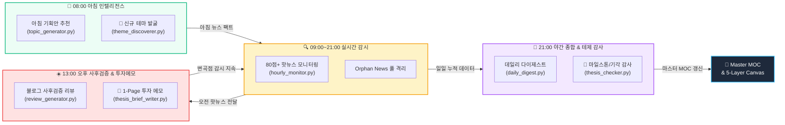

# 🦅 Argus Pulse 24시간 자동화 파이프라인 관제 대시보드

> **시스템 상태**: `🟢 ALL SYSTEMS OPERATIONAL`  
> **최근 점검 시각**: `2026-09-07 18:27:44` | **옵시디언 볼트**: `obs_argus`

---

## 🗺️ 24시간 인터랙티브 파이프라인 가치사슬 맵



> 💡 **캔버스 뷰어**: **[[00-Argus-Batch-Pipeline.canvas|🎨 24시간 파이프라인 전용 캔버스 보드 열기]]**

---

## 🚦 배치 실행 현황 모니터링 (Live Health Check)

| 스케줄 | 파이프라인 단계 | 실행 모듈 | 상태 | 최근 실행 시각 | 최종 로그 요약 | 산출물 위치 |
|:---:|:---|:---|:---:|:---:|:---|:---:|
| **`08:00`** | **아침 주제 추천 & 기획안 생성** | `topic_generator.py --auto` | 🟢 성공 | `2026-09-07 13:05:01` | → 리뷰 모드를 사용하려면: python review_generator.py | `[[argus/Outline|📂 바로가기]]` |
| **`08:05`** | **미매칭 뉴스 기반 신규 테마 발굴** | `theme_discoverer.py` | 🔴 미기록 | `-` | 로그 파일 없음 | `[[argus/Incubator|📂 바로가기]]` |
| **`09:00~21:00`** | **실시간 뉴스 감시 (매 정각)** | `hourly_monitor.py --once` | 🟢 성공 | `2026-09-07 18:00:01` | ✓ 고득점(80점+) 뉴스 없음 | `[[argus|📂 바로가기]]` |
| **`13:00`** | **오후 블로그 사후 검증 리뷰 (RAG)** | `review_generator.py --rag` | 🟢 성공 | `2026-09-07 13:00:24` | 📓 [Obsidian 동기화] REVIEW -> argus/Review/2026-09-07-review-50-vs-33-함정-HBM-왕좌는-이미 | `[[argus/Review|📂 바로가기]]` |
| **`13:05`** | **변곡점 1-Page 투자 메모 작성** | `thesis_brief_writer.py --inflection-only` | 🔴 미기록 | `-` | 로그 파일 없음 | `[[argus/Review|📂 바로가기]]` |
| **`21:00`** | **데일리 다이제스트 종합 요약 (RAG)** | `daily_digest.py --rag` | ⚪ 과거 기록 | `2026-09-06 21:00:17` | 📝 [Thesis Frontmatter 갱신] 총 43개 Thesis MD 파일에 rank & momentum 저장 완료 | `[[argus/Digest|📂 바로가기]]` |
| **`21:05`** | **테제 마일스톤/기각 감사 & 모멘텀 랭킹** | `thesis_checker.py --smart` | ⚪ 과거 기록 | `2026-09-06 21:17:02` | 📝 [Thesis Frontmatter 갱신] 총 43개 Thesis MD 파일에 rank & momentum 저장 완료 | `[[argus/Theses|📂 바로가기]]` |

---

## 📦 금일 생성된 주요 인텔리전스 산출물 (2026-09-07)

- **BRIEFS (1건)**: `[[2026-09-07-brief-T2-01-데이터센터의-변화.md]]`
- **REVIEWS (1건)**: `[[2026-09-07-review-50-vs-33-함정-HBM-왕좌는-이미-끝난-게임이다.md]]`

---

## 📊 Dataview 실시간 인텔리전스 허브

### 🎯 1. 최근 생성된 1-Page 투자 메모 (Thesis Briefs)
```dataview
TABLE file.mtime AS "작성시각", thesis_id AS "테제 ID", confidence AS "신뢰도", status AS "상태"
FROM "argus/Review" OR "Review"
WHERE contains(file.name, "brief")
SORT file.mtime DESC
LIMIT 5
```

### 🌱 2. 인큐베이션 중인 신규 테마 후보 (Emerging Theses)
```dataview
TABLE first_detected AS "발굴일자", sector_candidate AS "추천섹터", news_count AS "근거뉴스", stage AS "단계"
FROM "argus/Incubator" OR "Incubator"
SORT file.mtime DESC
LIMIT 5
```

### 🚨 3. 최근 변곡점/마일스톤 경보 테제
```dataview
TABLE confidence AS "신뢰도", milestone_status AS "마일스톤 상태", falsification_triggered AS "기각 여부", last_checked AS "점검시각"
FROM "argus/Theses" OR "Theses"
WHERE milestone_status != "NONE" OR falsification_triggered = true
SORT last_checked DESC
LIMIT 5
```

---

## 🛠️ 터미널 빠른 수동 실행 명령어 (CLI Shortcuts)

```bash
# 1. 24시간 배치 상태 즉시 새로고침
python batch_visualizer.py

# 2. 미매칭 뉴스 기반 신규 테마 발굴 실행
python theme_discoverer.py

# 3. 1-Page 투자 메모 즉시 작성 (특정 테제)
python thesis_brief_writer.py --id T2-01

# 4. 전체 테제 신뢰도 및 마일스톤 스마트 감사
python thesis_checker.py --smart
```
