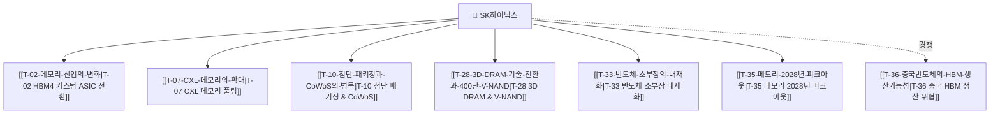

---
aliases:
  - SK하이닉스
  - Hynix
  - SK Hynix
  - 000660
type: company
ticker: "000660.KS"
sector: 반도체
sub_sector: AI 메모리 / HBM
created: 2026-09-06
---

# 🏢 SK하이닉스 (SK Hynix | 000660.KS)

> 🧭 **상위 인덱스**: [[00-Argus-Master-MOC|Master MOC]] ➔ [[00-Argus-Master-MOC#🏢-핵심-기업company-hubs--개념concept-hubs-허브-목록|기업 허브]]

---

## 📌 기업 개요 및 AI 생태계 내 포지션
SK하이닉스는 글로벌 [[Topic-HBM|HBM(High Bandwidth Memory)]] 시장 점유율 1위 기업으로, [[Company-NVIDIA|엔비디아]]-**[[Company-TSMC|TSMC]]**-**SK하이닉스**로 이어지는 'AI 하드웨어 골든 트라이앵글(삼각편대)'의 핵심 축입니다. MR-MUF 공정 기술력을 기반으로 HBM3 및 HBM3E 시장을 선점하였으며, 2026~2027년 HBM4 전환기에는 TSMC 파운드리를 통한 베이스 다이 제작으로 커스텀 ASIC 시장 지배력을 유지하고 있습니다.

---

## 🔗 연관 투자 가설 (Thesis Mapping)



1. **[[T-02-메모리-산업의-변화|T-02 메모리 산업의 변화 (핵심 수혜)]]**:
   - HBM4 커스텀 ASIC화에 따른 1~2년 LTA(장기공급계약) 체결로 분기별 단가 인하 사이클 탈피.
2. **[[T-10-첨단-패키징과-CoWoS의-병목|T-10 첨단 패키징과 CoWoS의 병목]]**:
   - TSMC의 CoWoS 캐파 우선 배정을 통해 패키징 병목 국면에서도 안정적 출하 유지.
3. **[[T-07-CXL-메모리의-확대|T-07 CXL 메모리의 확대]]**:
   - HBM 중심에서 CXL 2.0/3.0 기반 CMM-D(DRAM 풀링) 제품군 라인업 확장.
4. **[[T-28-3D-DRAM-기술-전환과-400단-V-NAND|T-28 3D DRAM 기술 전환]]**:
   - 1c/1d nm 미세화 한계 극복을 위한 3D D램 및 하이브리드 본딩 R&D 선도.
5. **[[T-35-메모리-2028년-피크아웃|T-35 메모리 2028년 피크아웃]]**:
   - 2027년 고점 이후 설비투자 과잉에 따른 2028년 다운사이클 방어 여부 모니터링 대상.

---

## 🤝 밸류체인 관계망 (Partners & Competitors)

- **동맹 및 고객사 (Allies & Customers)**:
  - [[Company-NVIDIA|NVIDIA]]: 최대 고객사. 차세대 플랫폼용 NVHBM 공급 락인.
  - [[Company-TSMC|TSMC]]: HBM4 베이스 다이 파운드리 및 CoWoS 어드밴스드 패키징 파트너.
  - [[Company-한미반도체|한미반도체]]: TC 본더(Dual TC Bonder) 핵심 공급망 파트너.
- **경쟁사 (Competitors)**:
  - [[Company-삼성전자|삼성전자]]: 턴키(Turnkey) 일괄 공급 체제를 앞세운 최대 추격자.
  - [[Company-Micron|Micron]]: HBM3E 8단/12단 미국 현지 공급망 중심 추격.
  - [[Company-CXMT|CXMT (중국)]]: 중저가 및 레거시 HBM3E 진입 시도 중.

---

## 📑 SK하이닉스 관련 리포트 & 블로그 (Dataview)

```dataview
TABLE file.mtime AS "작성일", tags AS "태그", type AS "유형"
FROM "argus" OR "output"
WHERE contains(file.outlinks, this.file.link) OR contains(file.text, "SK하이닉스")
SORT file.mtime DESC
LIMIT 10
```
