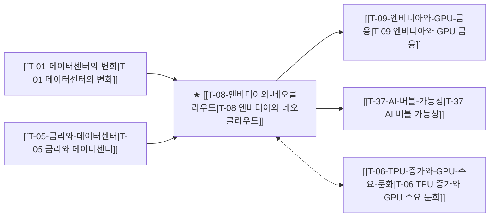

# T-08 엔비디아와 네오클라우드

> 🧭 **상위 인덱스**: [[00-Argus-Master-MOC|Master MOC]] ➔ [[00-Argus-Master-MOC#4-🏛️-매크로-클라우드-금융--소프트웨어-과점-macro--ecosystem|매크로 & 빅테크 생태계]]

> 🏷️ **교차 분석 메타데이터**:
> - **성격**: `🚀 주류 성장 (Consensus)` | **스택**: `L3 (클라우드)` | **시계**: `2026~2027`
> - **공급망 권역**: `US` | **핵심 대결 구도**: [[Vs-GPU-vs-TPU-ASIC|GPU-vs-TPU-ASIC]]

---

## 🎯 핵심 가설
엔비디아가 네오클라우드(CoreWeave 등)를 통해 GPU 수요를 인위적으로 유지하는 혈맹 구조가 형성되었다

---

## 🔗 테제 네트워크 (상호 연관 가설)



- 🔼 **선행 가설 (배경 요인 & 상위 인프라)**:
  - [[T-01-데이터센터의-변화|T-01 데이터센터의 변화]] — GPU 쇼티지 구간 네오클라우드 부상
  - [[T-05-금리와-데이터센터|T-05 금리와 데이터센터]] — 이자비용 상승 위험
- ➡️ **동반 및 대체·경쟁 가설**:
  - [[T-06-TPU-증가와-GPU-수요-둔화|T-06 TPU 증가와 GPU 수요 둔화]] — 빅테크 자체 칩 전환
- 🔽 **파생 및 후행 병목 가설**:
  - [[T-09-엔비디아와-GPU-금융|T-09 엔비디아와 GPU 금융]] — GPU 담보 차입금 확대
  - [[T-37-AI-버블-가능성|T-37 AI 버블 가능성]] — 네오클라우드 부실 위험

---

## 🏢 연관 기업 & 핵심 기술 허브
- **핵심 기업**: [[Company-NVIDIA|NVIDIA]], [[Company-CoreWeave|CoreWeave]], [[Company-Lambda|Lambda]], [[Company-Together.ai|Together.ai]], [[Company-Crusoe|Crusoe]]
- **핵심 기술/토픽**: [[Topic-ASIC|ASIC]], [[Topic-액체냉각|액체냉각]]

---

## 📈 지지 근거


---

## 📉 반박 근거
- 2026-09-04: 데이터센터 구축비 최대 병목이 GPU/CPU가 아닌 메모리로 지목되고 고금리 환경 속 빅테크 ROIC 압박이 언급되어 GPU 중심 인위적 수요 유지 서사의 설득력이 간접적으로 약화됨

---

## 📑 관련 산출물 (자동 집계)

### 🤖 Dataview 실시간 역방향 링크
```dataview
TABLE file.mtime AS "작성일", angle AS "관점", tags AS "태그"
FROM "argus" OR "output"
WHERE contains(thesis, "T-08") OR contains(file.outlinks, this.file.link)
SORT file.mtime DESC
LIMIT 7
```

### 📌 수동 링크 아카이브


---

## 📝 분석가 메모

