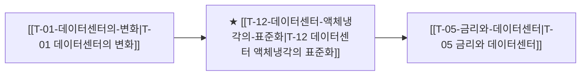

# T-12 데이터센터 액체냉각의 표준화

> 🧭 **상위 인덱스**: [[00-Argus-Master-MOC|Master MOC]] ➔ [[00-Argus-Master-MOC#2-⚡-ai-데이터센터--전력냉각-인프라-power--infrastructure|AI 인프라 & 전력·냉각]]

> 🏷️ **교차 분석 메타데이터**:
> - **성격**: `🚀 주류 성장 (Consensus)` | **스택**: `L2 (물리인프라)` | **시계**: `2026~2027`
> - **공급망 권역**: `US`, `KR` | **핵심 대결 구도**: [[Vs-공랭-vs-액체냉각|공랭-vs-액체냉각]]

---

## 🎯 핵심 가설
랙당 100kW+ GPU 발열로 인해 공랭식은 완전히 도태되고 DLC(Direct-to-Chip) 및 침전 냉각이 필수 표준으로 자리잡는다

---

## 🔗 테제 네트워크 (상호 연관 가설)



- 🔼 **선행 가설 (배경 요인 & 상위 인프라)**:
  - [[T-01-데이터센터의-변화|T-01 데이터센터의 변화]] — 랙당 100kW+ 발열 폭증
- ➡️ **동반 및 대체·경쟁 가설**:
  - (해당 없음)
- 🔽 **파생 및 후행 병목 가설**:
  - [[T-05-금리와-데이터센터|T-05 금리와 데이터센터]] — 냉각 CAPEX 효율화로 PUE 1.1 달성

---

## 🏢 연관 기업 & 핵심 기술 허브
- **핵심 기업**: [[Company-Vertiv|Vertiv]], [[Company-Supermicro|Supermicro]], [[Company-CoolIT|CoolIT]], [[Company-GST|GST]], [[Company-케이엔솔|케이엔솔]], [[Company-슈나이더일렉트릭|슈나이더일렉트릭]]
- **핵심 기술/토픽**: [[Topic-액체냉각|액체냉각]], [[Topic-전력그리드|전력그리드]]

---

## 📈 지지 근거


---

## 📉 반박 근거


---

## 📑 관련 산출물 (자동 집계)

### 🤖 Dataview 실시간 역방향 링크
```dataview
TABLE file.mtime AS "작성일", angle AS "관점", tags AS "태그"
FROM "argus" OR "output"
WHERE contains(thesis, "T-12") OR contains(file.outlinks, this.file.link)
SORT file.mtime DESC
LIMIT 7
```

### 📌 수동 링크 아카이브


---

## 📝 분석가 메모

