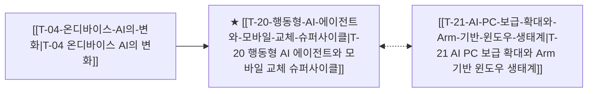

# T-20 행동형 AI 에이전트와 모바일 교체 슈퍼사이클

> 🧭 **상위 인덱스**: [[00-Argus-Master-MOC|Master MOC]] ➔ [[00-Argus-Master-MOC#3-🤖-피지컬-ai-로보틱스--엣지-디바이스-physical-ai--edge|피지컬 AI & 엣지 디바이스]]

> 🏷️ **교차 분석 메타데이터**:
> - **성격**: `🚀 주류 성장 (Consensus)` | **스택**: `L5 (디바이스)` | **시계**: `2026~2027`
> - **공급망 권역**: `US`, `KR` | **핵심 대결 구도**: 해당 없음

---

## 🎯 핵심 가설
단순 질의응답을 넘어 앱 제어 및 다중 작업을 자동 수행하는 온디바이스 에이전트가 4년 만의 스마트폰 대규모 교체 수요를 촉발한다

---

## 🔗 테제 네트워크 (상호 연관 가설)



- 🔼 **선행 가설 (배경 요인 & 상위 인프라)**:
  - [[T-04-온디바이스-AI의-변화|T-04 온디바이스 AI의 변화]] — NPU 탑재 스마트폰 출시
- ➡️ **동반 및 대체·경쟁 가설**:
  - [[T-21-AI-PC-보급-확대와-Arm-기반-윈도우-생태계|T-21 AI PC 보급 확대와 Arm 기반 윈도우 생태계]] — PC 및 모바일 동반 교체
- 🔽 **파생 및 후행 병목 가설**:
  - (해당 없음)

---

## 🏢 연관 기업 & 핵심 기술 허브
- **핵심 기업**: [[Company-Apple|Apple]], [[Company-삼성전자|삼성전자]], [[Company-구글|구글]], [[Company-Qualcomm|Qualcomm]], [[Company-미디어텍|미디어텍]]
- **핵심 기술/토픽**: [[Topic-온디바이스AI|온디바이스AI]]

---

## 📈 지지 근거


---

## 📉 반박 근거
- 2026-09-05: AI 설비 투자 회수 기간의 실체성과 AI 매출 전환 속도에 대한 시장의 의구심이 확대되며 기술주 전반의 변동성이 심화되고 있다.
- 2026-09-04: 모건스탠리 모멘텀 TMT 지수가 한 달간 53.5% 급락하고 매수한 AI 설비 종목 하락 등 기술 모멘텀 붕괴가 관측되어 교체 수요 기반의 강세 기대와 괴리됨

---

## 📑 관련 산출물 (자동 집계)

### 🤖 Dataview 실시간 역방향 링크
```dataview
TABLE file.mtime AS "작성일", angle AS "관점", tags AS "태그"
FROM "argus" OR "output"
WHERE contains(thesis, "T-20") OR contains(file.outlinks, this.file.link)
SORT file.mtime DESC
LIMIT 7
```

### 📌 수동 링크 아카이브


---

## 📝 분석가 메모

