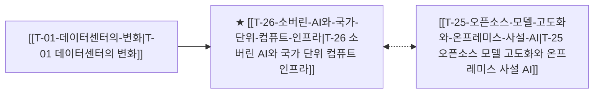

# T-26 소버린 AI와 국가 단위 컴퓨트 인프라

> 🧭 **상위 인덱스**: [[00-Argus-Master-MOC|Master MOC]] ➔ [[00-Argus-Master-MOC#2-⚡-ai-데이터센터--전력냉각-인프라-power--infrastructure|AI 인프라 & 전력·냉각]]

> 🏷️ **교차 분석 메타데이터**:
> - **성격**: `🚀 주류 성장 (Consensus)` | **스택**: `L3 (클라우드)` | **시계**: `2026~2028`
> - **공급망 권역**: `Global`, `KR`, `US` | **핵심 대결 구도**: 해당 없음

---

## 🎯 핵심 가설
데이터 주권과 안보를 위한 각국 정부 주도의 소버린 AI 인프라 구축이 새로운 GPU/데이터센터 수요처로 급부상한다

---

## 🔗 테제 네트워크 (상호 연관 가설)



- 🔼 **선행 가설 (배경 요인 & 상위 인프라)**:
  - [[T-01-데이터센터의-변화|T-01 데이터센터의 변화]] — 글로벌 컴퓨트 인프라 주권 경쟁
- ➡️ **동반 및 대체·경쟁 가설**:
  - [[T-25-오픈소스-모델-고도화와-온프레미스-사설-AI|T-25 오픈소스 모델 고도화와 온프레미스 사설 AI]] — 자체 LLM 배포
- 🔽 **파생 및 후행 병목 가설**:
  - (해당 없음)

---

## 🏢 연관 기업 & 핵심 기술 허브
- **핵심 기업**: [[Company-NVIDIA|NVIDIA]], [[Company-네이버|네이버]], [[Company-프랑스 Mistral|프랑스 Mistral]], [[Company-중동 G42|중동 G42]], [[Company-SK텔레콤|SK텔레콤]], [[Company-KT|KT]]
- **핵심 기술/토픽**: [[Topic-ASIC|ASIC]], [[Topic-전력그리드|전력그리드]]

---

## 📈 지지 근거


---

## 📉 반박 근거
- 2026-09-04: HBM 등 메모리 병목이 AI 데이터센터 예산을 잠식하고 고금리 환경에서 빅테크의 자본비용·ROIC 압박이 심화된다는 분석이 제시되어 대규모 신규 인프라 투자의 비용·수익성 리스크가 부각됨
- 2026-09-04: 증권사 리포트가 GPU/HBM·기판 등 범용 AI 인프라 수요만 언급할 뿐 소버린 AI 관련 신규 수치는 없고 오히려 고금리 자본비용 압박과 메모리 병목으로 인한 AI 인프라 ROIC 악화를 지적해 국가 단위 대규모 컴퓨트 증설의 경제성 리스크를 간접 시사함

---

## 📑 관련 산출물 (자동 집계)

### 🤖 Dataview 실시간 역방향 링크
```dataview
TABLE file.mtime AS "작성일", angle AS "관점", tags AS "태그"
FROM "argus" OR "output"
WHERE contains(thesis, "T-26") OR contains(file.outlinks, this.file.link)
SORT file.mtime DESC
LIMIT 7
```

### 📌 수동 링크 아카이브


---

## 📝 분석가 메모

