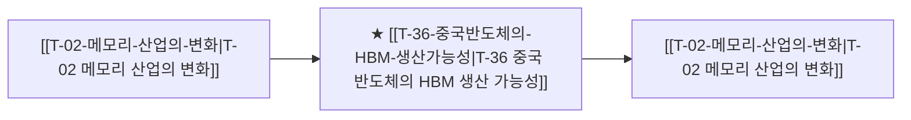

# T-36 중국 반도체의 HBM 생산 가능성

> 🧭 **상위 인덱스**: [[00-Argus-Master-MOC|Master MOC]] ➔ [[00-Argus-Master-MOC#1-💾-ai-컴퓨트--차세대-반도체-compute--silicon|AI 컴퓨트 & 반도체]]

> 🏷️ **교차 분석 메타데이터**:
> - **성격**: `🛡️ 역발상/헷지 (Contrarian)` | **스택**: `L1 (칩/패키징)` | **시계**: `2026~2027`
> - **공급망 권역**: `CN`, `KR` | **핵심 대결 구도**: 해당 없음

---

## 🎯 핵심 가설
수출통제 우회와 자체 기술 개발을 통해 중국이 2027~2028년 내 HBM3E 수준의 양산 능력을 확보하며, 이는 SK하이닉스·삼성의 점유율과 ASP에 하방 압력을 가한다

---

## 🔗 테제 네트워크 (상호 연관 가설)



- 🔼 **선행 가설 (배경 요인 & 상위 인프라)**:
  - [[T-02-메모리-산업의-변화|T-02 메모리 산업의 변화]] — HBM3E 기술 성숙
- ➡️ **동반 및 대체·경쟁 가설**:
  - (해당 없음)
- 🔽 **파생 및 후행 병목 가설**:
  - [[T-02-메모리-산업의-변화|T-02 메모리 산업의 변화]] — 글로벌 HBM3E 마진 하방 압력

---

## 🏢 연관 기업 & 핵심 기술 허브
- **핵심 기업**: [[Company-SK하이닉스|SK하이닉스]], [[Company-삼성전자|삼성전자]], [[Company-CXMT|CXMT]], [[Company-화웨이|화웨이]], [[Company-YMTC|YMTC]]
- **핵심 기술/토픽**: [[Topic-HBM|HBM]], [[Topic-2nm-GAA|2nm-GAA]]

---

## 📈 지지 근거
<!-- 시스템이 자동으로 채워주거나 사용자가 직접 메모 -->

---

## 📉 반박 근거
<!-- 가설에 반하는 뉴스/데이터 -->

---

## 📑 관련 산출물 (자동 집계)

### 🤖 Dataview 실시간 역방향 링크
```dataview
TABLE file.mtime AS "작성일", angle AS "관점", tags AS "태그"
FROM "argus" OR "output"
WHERE contains(thesis, "T-36") OR contains(file.outlinks, this.file.link)
SORT file.mtime DESC
LIMIT 7
```

### 📌 수동 링크 아카이브
<!-- [[블로그 파일명]] 형식으로 링크 -->

---

## 📝 분석가 메모
- Bearish Thesis — T-02(메모리 bullish)의 리스크 시나리오
- 중국 HBM 실현 시 T-15(피크아웃) 가속 요인
- CXMT 관련 뉴스를 고득점으로 모니터링 필요
