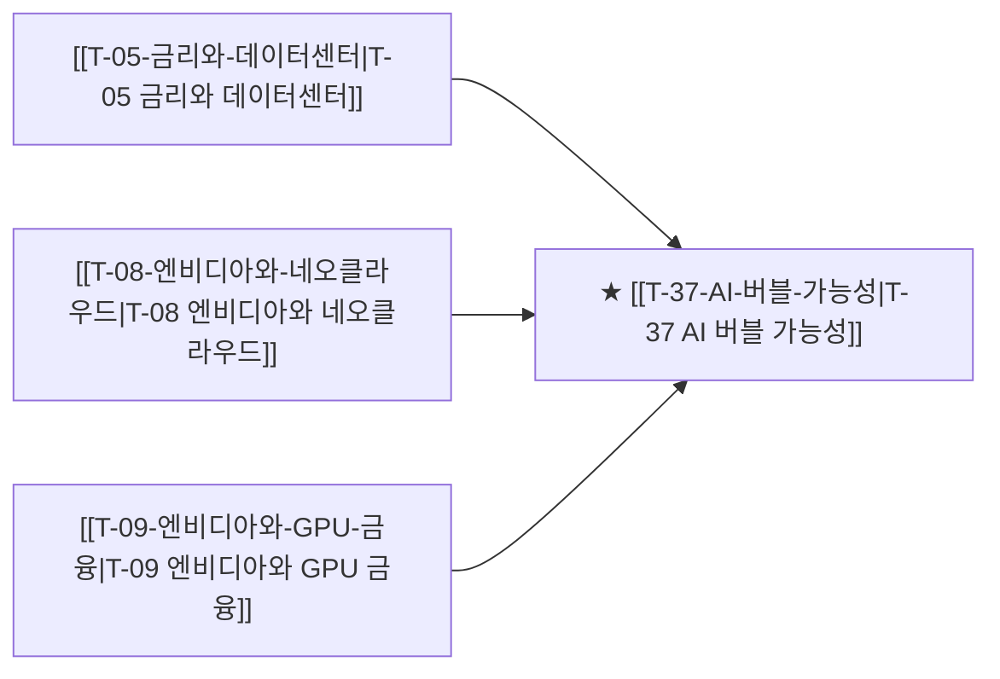

# T-37 AI 버블 가능성

> 🧭 **상위 인덱스**: [[00-Argus-Master-MOC|Master MOC]] ➔ [[00-Argus-Master-MOC#4-🏛️-매크로-클라우드-금융--소프트웨어-과점-macro--ecosystem|매크로 & 빅테크 생태계]]

> 🏷️ **교차 분석 메타데이터**:
> - **성격**: `🛡️ 역발상/헷지 (Contrarian)` | **스택**: `L3 (클라우드)` | **시계**: `2026~2027`
> - **공급망 권역**: `US` | **핵심 대결 구도**: 해당 없음

---

## 🎯 핵심 가설
빅테크의 AI CAPEX가 실제 수익화 속도를 초과하고 있으며, ROI 검증 실패 시 2026~2027년 AI 인프라 투자 급감과 반도체 주가 급락이 발생할 수 있다

---

## 🔗 테제 네트워크 (상호 연관 가설)



- 🔼 **선행 가설 (배경 요인 & 상위 인프라)**:
  - [[T-05-금리와-데이터센터|T-05 금리와 데이터센터]] — CAPEX ROI 불일치
  - [[T-08-엔비디아와-네오클라우드|T-08 엔비디아와 네오클라우드]] — GPU 부채 리스크
  - [[T-09-엔비디아와-GPU-금융|T-09 엔비디아와 GPU 금융]] — 금융 레버리지 청산
- ➡️ **동반 및 대체·경쟁 가설**:
  - (해당 없음)
- 🔽 **파생 및 후행 병목 가설**:
  - (해당 없음)

---

## 🏢 연관 기업 & 핵심 기술 허브
- **핵심 기업**: [[Company-NVIDIA|NVIDIA]], [[Company-Microsoft|Microsoft]], [[Company-Amazon|Amazon]], [[Company-Alphabet|Alphabet]], [[Company-Meta|Meta]]
- **핵심 기술/토픽**: [[Topic-ASIC|ASIC]], [[Topic-전력그리드|전력그리드]]

---

## 📈 지지 근거
- 2026-09-05: AI 데이터센터 전력망 부담에 따른 인허가 규제 리스크 대두 및 모건스탠리 모멘텀 TMT 지수 한 달 53.5% 급락 등 AI 인프라 변동성 확대 언급
- 2026-09-04: 모건스탠리 모멘텀 TMT 지수 한 달 53.5% 급락과 AI 설비 롱/소프트웨어 숏 포지션 동시 손실로 고레버리지 기반 AI 버블 청산 압력이 현실화됨
- 2026-09-04: 모건스탠리 모멘텀 TMT 지수 한 달간 53.5% 급락 및 AI 설비주 하락·레버리지 청산 언급과 AI 데이터센터 전력망 부담에 따른 규제 리스크 부상은 AI 인프라 과열 조정 신호로 작용
- 2026-09-04: AI 데이터센터 전력망 부담에 따른 인허가 규제 리스크 부상과 수익성 위주 CAPEX 선별 집행 전환, 모건스탠리 모멘텀 TMT 지수 한 달 53.5% 급락에 따른 레버리지 청산 취약성이 인프라 투자 둔화 우려를 부분적으로 뒷받침함.
<!-- 시스템이 자동으로 채워주거나 사용자가 직접 메모 -->

---

## 📉 반박 근거
- 2026-09-05: 빅테크 CAPEX가 무차별 증설이 아닌 수익성 위주 선별 집행으로 전환 중이며 AI 서버 기판 등 생산능력 확대가 지속된다는 분석은 ROI 없는 과잉투자 가설을 약화
- 2026-09-04: 생산능력 확대 지속과 수익성 위주 선별 CAPEX 집행, AI 서버 기판 수혜기업 수요 지속론으로 AI 인프라 투자 급감 및 반도체 급락의 단기 임박성은 약화됨
- 2026-09-04: 애널리스트 뷰에서 무차별 증설이 아닌 수익성 위주 선별적 CAPEX 집행이 진행 중이며 국내 기판 3사의 생산능력 확대가 지속된다고 명시해 무차별 과잉투자 후 급감 시나리오를 약화
- 2026-09-04: 생산능력 확대가 지속되고 이수페타시스·삼성전기·대덕전자 등 AI 서버 기판 기업이 대표 수혜주로 여전히 제시되며 무차별 증설이 아닌 선별 집행으로 급격한 투자 절벽·반도체 급락 시나리오의 직접 증거는 없음.
<!-- 가설에 반하는 뉴스/데이터 -->

---

## 📑 관련 산출물 (자동 집계)

### 🤖 Dataview 실시간 역방향 링크
```dataview
TABLE file.mtime AS "작성일", angle AS "관점", tags AS "태그"
FROM "argus" OR "output"
WHERE contains(thesis, "T-37") OR contains(file.outlinks, this.file.link)
SORT file.mtime DESC
LIMIT 7
```

### 📌 수동 링크 아카이브
<!-- [[블로그 파일명]] 형식으로 링크 -->

---

## 📝 분석가 메모
- Bearish Thesis — T-01, T-08의 반대 시나리오
- T-09(GPU 금융)와 연결: 버블 붕괴 시 GPU 담보 대출 부실화
- 분기 실적 발표마다 CAPEX 가이던스를 핵심 지표로 추적
