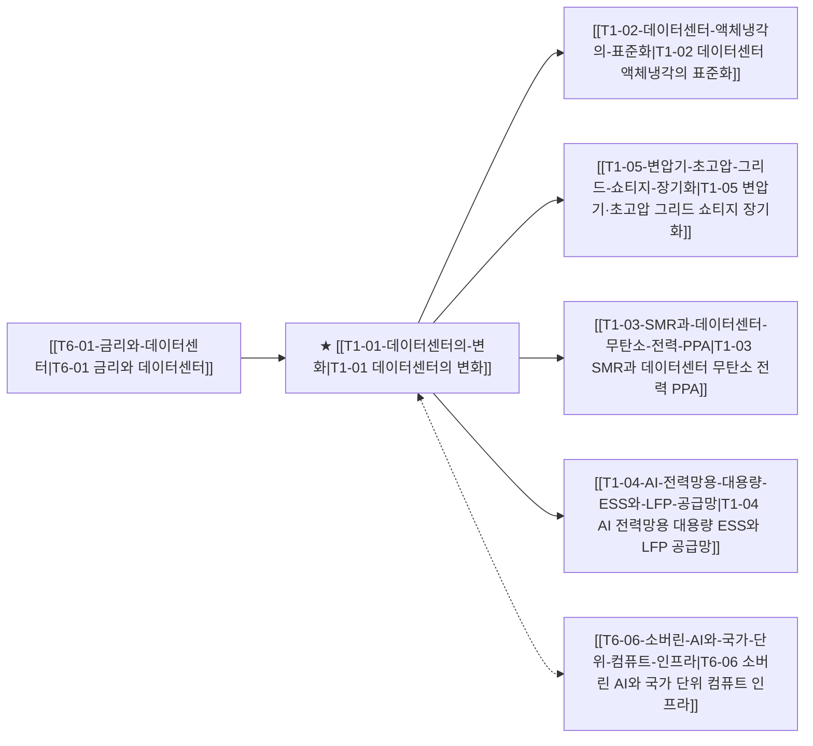

# T1-01 데이터센터의 변화

> 🧭 **상위 인덱스**: [[00-Argus-Master-MOC|Master MOC]] ➔ [[00-Argus-Master-MOC#2-⚡-ai-데이터센터--전력냉각-인프라-power--infrastructure|AI 인프라 & 전력·냉각]]

> 🏷️ **교차 분석 메타데이터**:
> - **성격**: `🚀 주류 성장 (Consensus)` | **스택**: `L2 (물리인프라)` | **시계**: `2026~2027`
> - **공급망 권역**: `US`, `KR` | **핵심 대결 구도**: [[Vs-공랭-vs-액체냉각|공랭-vs-액체냉각]]

---

## 🎯 핵심 가설
AI 데이터센터의 병목이 GPU에서 전력·냉각 인프라로 이동한다

---

## 🔗 테제 네트워크 (상호 연관 가설)



- 🔼 **선행 가설 (배경 요인 & 상위 인프라)**:
  - [[T6-01-금리와-데이터센터|T6-01 금리와 데이터센터]] — 고금리 및 CAPEX ROI 압박
- ➡️ **동반 및 대체·경쟁 가설**:
  - [[T6-06-소버린-AI와-국가-단위-컴퓨트-인프라|T6-06 소버린 AI와 국가 단위 컴퓨트 인프라]] — 국가별 자체 DC 구축
- 🔽 **파생 및 후행 병목 가설**:
  - [[T1-02-데이터센터-액체냉각의-표준화|T1-02 데이터센터 액체냉각의 표준화]] — 고발열 해소
  - [[T1-05-변압기-초고압-그리드-쇼티지-장기화|T1-05 변압기·초고압 그리드 쇼티지 장기화]] — 전력망 병목
  - [[T1-03-SMR과-데이터센터-무탄소-전력-PPA|T1-03 SMR과 데이터센터 무탄소 전력 PPA]] — 무탄소 전력원 확보
  - [[T1-04-AI-전력망용-대용량-ESS와-LFP-공급망|T1-04 AI 전력망용 대용량 ESS와 LFP 공급망]] — 피크컷 전력망

---

## 🏢 연관 기업 & 핵심 기술 허브
- **핵심 기업**: [[Company-NVIDIA|NVIDIA]], [[Company-TSMC|TSMC]], [[Company-SK하이닉스|SK하이닉스]], [[Company-Eaton|Eaton]], [[Company-Vertiv|Vertiv]]
- **핵심 기술/토픽**: [[Topic-액체냉각|액체냉각]], [[Topic-전력그리드|전력그리드]], [[Topic-SMR|SMR]], [[Topic-ESS|ESS]]

---

## 📈 지지 근거
<!-- 시스템이 자동으로 채워주거나 사용자가 직접 메모 -->

---

## 📉 반박 근거
- 2026-09-05: 증권사 리포트에서는 여전히 AI 인프라 예산의 최대 병목이자 핵심 요소로 전력·냉각이 아닌 HBM 메모리와 GPU 등 연산 칩을 지목하고 있습니다.
- 2026-09-04: 증권사 리포트에서 AI 인프라 예산과 최대 병목 요인을 전력·냉각이 아닌 HBM 등 메모리 반도체와 패키징으로 여전히 지목하고 있습니다.
- 2026-09-04: 증권사 리포트가 데이터센터 구축 비용의 최대 병목을 전력·냉각이 아닌 HBM 등 메모리와 FC-BGA 패키지 기판으로 지목하고, 최근 7일 뉴스 8건 전체가 HBM 점유율 경쟁에만 집중됨
- 2026-09-03: 증권사 리포트에서는 AI 인프라 구축의 최대 병목이자 비용 포식자로 전력·냉각 인프라가 아닌 메모리(HBM)와 연산 칩을 여전히 지목하고 있습니다.
- 2026-09-03: 증권사 리포트에서 AI 인프라의 최대 병목이자 예산 포식자로 전력·냉각 인프라가 아닌 메모리(HBM)와 고부가 패키지 기판을 지목하고 있다.
<!-- 가설에 반하는 뉴스/데이터 -->

---

## 📑 관련 산출물 (자동 집계)

### 🤖 Dataview 실시간 역방향 링크
```dataview
TABLE file.mtime AS "작성일", angle AS "관점", tags AS "태그"
FROM "argus" OR "output" OR ""
WHERE contains(thesis, "T3-01") OR contains(thesis, "T3-01") OR contains(file.outlinks, this.file.link)
SORT file.mtime DESC
LIMIT 7
```

### 📌 수동 링크 아카이브
<!-- `블로그 파일명` 형식으로 링크 -->

---

## 📝 분석가 메모


## 반박 근거
- 2026-09-07: 증권사 분석 데이터는 여전히 AI 데이터센터 인프라 예산의 최대 병목으로 전력/냉각이 아닌 메모리(HBM) 및 연산 칩을 지목하고 있습니다.
- 2026-09-06: 증권사 리포트가 데이터센터 구축비의 최대 병목이자 포식자를 GPU가 아닌 HBM 메모리로 규정하고 최근 7일 뉴스도 HBM 점유율 경쟁에만 집중되어 전력·냉각 인프라로의 병목 이동 근거가 부재함