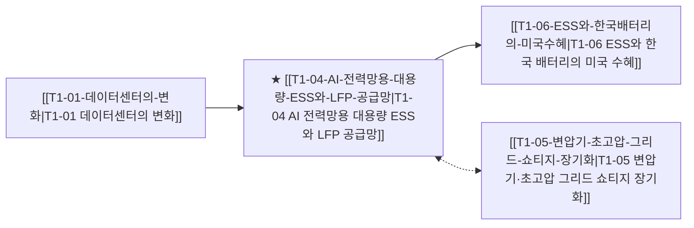

# T1-04 AI 전력망용 대용량 ESS와 LFP 공급망

> 🧭 **상위 인덱스**: [[00-Argus-Master-MOC|Master MOC]] ➔ [[00-Argus-Master-MOC#2-⚡-ai-데이터센터--전력냉각-인프라-power--infrastructure|AI 인프라 & 전력·냉각]]

> 🏷️ **교차 분석 메타데이터**:
> - **성격**: `🚀 주류 성장 (Consensus)` | **스택**: `L2 (물리인프라)` | **시계**: `2026~2027`
> - **공급망 권역**: `KR`, `US`, `CN` | **핵심 대결 구도**: 해당 없음

---

## 🎯 핵심 가설
데이터센터의 신재생에너지 간헐성 극복을 위해 대용량 BESS 투자가 폭증하며 LFP 배터리와 미국 현지 공장이 최대 수혜를 입는다

---

## 🔗 테제 네트워크 (상호 연관 가설)



- 🔼 **선행 가설 (배경 요인 & 상위 인프라)**:
  - [[T1-01-데이터센터의-변화|T1-01 데이터센터의 변화]] — 데이터센터 전력 피크 및 간헐성 문제
- ➡️ **동반 및 대체·경쟁 가설**:
  - [[T1-05-변압기-초고압-그리드-쇼티지-장기화|T1-05 변압기·초고압 그리드 쇼티지 장기화]] — 그리드 안정화 보완
- 🔽 **파생 및 후행 병목 가설**:
  - [[T1-06-ESS와-한국배터리의-미국수혜|T1-06 ESS와 한국 배터리의 미국 수혜]] — 북미 LFP/NCM ESS 수혜

---

## 🏢 연관 기업 & 핵심 기술 허브
- **핵심 기업**: [[Company-Tesla|Tesla]], [[Company-LG에너지솔루션|LG에너지솔루션]], [[Company-삼성SDI|삼성SDI]], [[Company-Fluence Energy|Fluence Energy]], [[Company-CATL|CATL]]
- **핵심 기술/토픽**: [[Topic-ESS|ESS]], [[Topic-전력그리드|전력그리드]]

---

## 📈 지지 근거


---

## 📉 반박 근거
- 2026-09-05: AI 설비 관련 종목 모멘텀 지수 급락과 함께 에너지 솔루션 부문의 판가 하락 및 시장 불확실성이 지속되고 있습니다.
- 2026-09-04: AI 설비 관련 종목의 단기 조정과 AI DC 투자 비용 증가에 따른 단기 수익성 둔화 우려가 언급되었으나 BESS/LFP에 특화된 직접적 반박은 없습니다.
- 2026-09-04: 모건스탠리 모멘텀 TMT 지수 한 달 53.5% 급락으로 AI 설비 모멘텀 붕괴가 관측되고 LG전자 ES사업부는 판가 하락·전년비 역성장·시장 불확실성 지속을 보고해 ESS 수요 폭증 가설에 역풍
- 2026-09-04: LG전자 ES부문 전년비 역성장·판가 하락·수익성 악화로 BESS 투자 폭증 가설 미입증, 모건스탠리 모멘텀 TMT지수 한 달 53.5% 급락으로 AI 인프라 투자 심리 위축

---

## 📑 관련 산출물 (자동 집계)

### 🤖 Dataview 실시간 역방향 링크
```dataview
TABLE file.mtime AS "작성일", angle AS "관점", tags AS "태그"
FROM "argus" OR "output" OR ""
WHERE contains(thesis, "T3-04") OR contains(thesis, "T3-04") OR contains(file.outlinks, this.file.link)
SORT file.mtime DESC
LIMIT 7
```

### 📌 수동 링크 아카이브


---

## 📝 분석가 메모


## 지지 근거
- 2026-09-06: 북미 ESS 수요 확대로 국내 배터리 3사의 LFP 양산 경쟁이 본격화되고 국내 3차 ESS 수주전 규모가 2조원대로 확대되고 있습니다.

## 반박 근거
- 2026-09-06: 최근 AI 설비 관련 기술주 급락 등 시장 변동성 확대와 전방 투자 불확실성 리스크가 존재합니다.