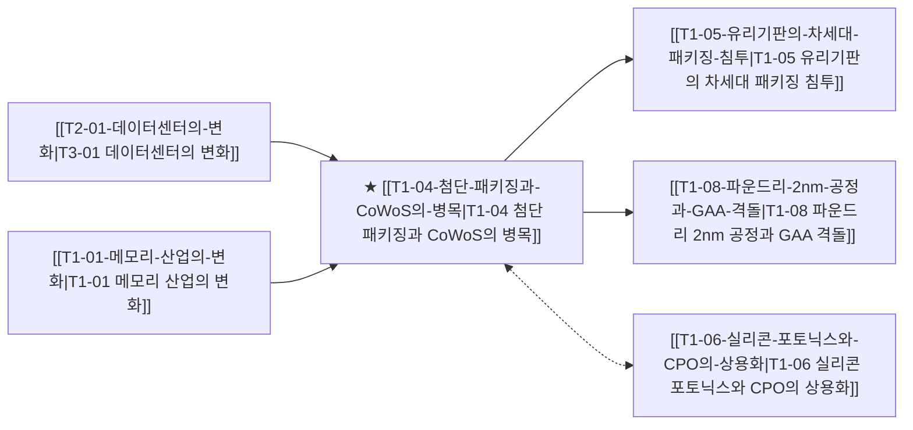

# T1-04 첨단 패키징과 CoWoS의 병목

> 🧭 **상위 인덱스**: [[00-Argus-Master-MOC|Master MOC]] ➔ [[00-Argus-Master-MOC#1-💾-ai-컴퓨트--차세대-반도체-compute--silicon|AI 컴퓨트 & 반도체]]

> 🏷️ **교차 분석 메타데이터**:
> - **성격**: `🚀 주류 성장 (Consensus)` | **스택**: `L1 (칩/패키징)` | **시계**: `2026~2027`
> - **공급망 권역**: `TW`, `KR`, `US` | **핵심 대결 구도**: [[Vs-TSMC동맹-vs-삼성턴키|TSMC동맹-vs-삼성턴키]]

---

## 🎯 핵심 가설
차세대 AI 가속기의 출하량 한계는 웨이퍼 팹이 아닌 CoWoS 및 2.5D/3D 첨단 패키징 캐파가 결정한다

---

## 🔗 테제 네트워크 (상호 연관 가설)



- 🔼 **선행 가설 (배경 요인 & 상위 인프라)**:
  - [[T2-01-데이터센터의-변화|T3-01 데이터센터의 변화]] — AI 가속기 칩 패키징 대형화
  - [[T1-01-메모리-산업의-변화|T1-01 메모리 산업의 변화]] — HBM 적층 및 인터포저 결합
- ➡️ **동반 및 대체·경쟁 가설**:
  - [[T1-06-실리콘-포토닉스와-CPO의-상용화|T1-06 실리콘 포토닉스와 CPO의 상용화]] — 광학 인터커넥트 결합
- 🔽 **파생 및 후행 병목 가설**:
  - [[T1-05-유리기판의-차세대-패키징-침투|T1-05 유리기판의 차세대 패키징 침투]] — 기판 휨 한계 극복
  - [[T1-08-파운드리-2nm-공정과-GAA-격돌|T1-08 파운드리 2nm 공정과 GAA 격돌]] — 선단 파운드리-패키징 연계

---

## 🏢 연관 기업 & 핵심 기술 허브
- **핵심 기업**: [[Company-TSMC|TSMC]], [[Company-ASE|ASE]], [[Company-Amkor|Amkor]], [[Company-삼성전자|삼성전자]], [[Company-SK하이닉스|SK하이닉스]], [[Company-SKC|SKC]], [[Company-인텔|인텔]]
- **핵심 기술/토픽**: [[Topic-CoWoS|CoWoS]], [[Topic-HBM|HBM]], [[Topic-유리기판|유리기판]]

---

## 📈 지지 근거
<!-- 시스템이 자동으로 채워주거나 사용자가 직접 메모 -->

---

## 📉 반박 근거
<!-- 가설에 반하는 뉴스/데이터 -->

---

## 📑 관련 산출물 (자동 집계)

### 🤖 Dataview 실시간 역방향 링크
```dataview
TABLE file.mtime AS "작성일", angle AS "관점", tags AS "태그"
FROM "argus" OR "output" OR ""
WHERE contains(thesis, "T1-04") OR contains(thesis, "T1-04") OR contains(file.outlinks, this.file.link)
SORT file.mtime DESC
LIMIT 7
```

### 📌 수동 링크 아카이브
<!-- [[블로그 파일명]] 형식으로 링크 -->

---

## 📝 분석가 메모

