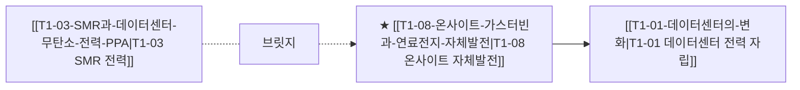

# T1-08 온사이트 가스터빈과 연료전지 자체발전

## 핵심 논리 및 배경
1. **그리드 의존 탈피(Behind-the-Meter)**: 공공 유틸리티 전력망 인입에 수년이 걸리자, 데이터센터 사업자가 부지 내에 직접 천연가스 터빈 또는 고체산화물 연료전지(SOFC)를 구축하여 자가 발전 시작.
2. **연료전지(SOFC)의 고효율 무소음 장점**: 블룸에너지를 필두로 데이터센터 전용 전력원 공급 계약 급증, 탄소 배출 규제 대응용 수소 혼소 터빈 도입.
3. **SMR 가동 전(2026~2029) 브릿지 전력원**: 4세대 원전 SMR이 본격 상용화되기 전까지 가스터빈과 연료전지가 데이터센터 기저부하의 핵심 가교 역할 수행.

## 밸류체인 및 인과관계 맵


## 핵심 수혜 기업 및 공급망
- **가스터빈 / 복합화력**: GE Vernova (GEV), Siemens Energy, 두산에너빌리티
- **데이터센터 SOFC 연료전지**: Bloom Energy (BE), 두산퓨얼셀, SK이터닉스

## 관련 최근 분석 리포트 & 블로그
```dataview
TABLE file.mtime AS "수정일", tags AS "태그"
FROM "argus" OR "outputs" OR "blog"
WHERE contains(thesis, "T2-09") OR contains(file.outlinks, this.file.link)
SORT file.mtime DESC
LIMIT 5
```
