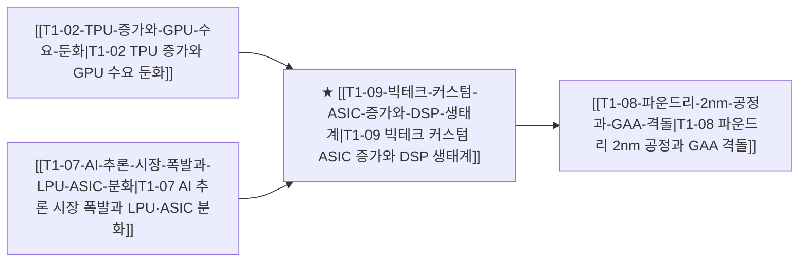

# T1-09 빅테크 커스텀 ASIC 증가와 DSP 생태계

> 🧭 **상위 인덱스**: [[00-Argus-Master-MOC|Master MOC]] ➔ [[00-Argus-Master-MOC#1-💾-ai-컴퓨트--차세대-반도체-compute--silicon|AI 컴퓨트 & 반도체]]

> 🏷️ **교차 분석 메타데이터**:
> - **성격**: `🚀 주류 성장 (Consensus)` | **스택**: `L1 (칩/패키징)` | **시계**: `2026~2027`
> - **공급망 권역**: `US`, `KR`, `TW` | **핵심 대결 구도**: [[Vs-GPU-vs-TPU-ASIC|GPU-vs-TPU-ASIC]]

---

## 🎯 핵심 가설
빅테크의 자체 칩(TPU, Trainium, Maia 등) 개발 가속화로 파운드리와 팹리스를 잇는 디자인하우스(DSP)의 역할과 가치가 급상승한다

---

## 🔗 테제 네트워크 (상호 연관 가설)



- 🔼 **선행 가설 (배경 요인 & 상위 인프라)**:
  - [[T1-02-TPU-증가와-GPU-수요-둔화|T1-02 TPU 증가와 GPU 수요 둔화]] — 빅테크 자체 ASIC 전환
  - [[T1-07-AI-추론-시장-폭발과-LPU-ASIC-분화|T1-07 AI 추론 시장 폭발과 LPU·ASIC 분화]] — 추론 ASIC 수요 폭증
- ➡️ **동반 및 대체·경쟁 가설**:
  - (해당 없음)
- 🔽 **파생 및 후행 병목 가설**:
  - [[T1-08-파운드리-2nm-공정과-GAA-격돌|T1-08 파운드리 2nm 공정과 GAA 격돌]] — 디자인하우스 선단 공정 수주

---

## 🏢 연관 기업 & 핵심 기술 허브
- **핵심 기업**: [[Company-에이직랜드|에이직랜드]], [[Company-가온칩스|가온칩스]], [[Company-에이디테크놀로지|에이디테크놀로지]], [[Company-Alchip|Alchip]], [[Company-GUC|GUC]], [[Company-TSMC|TSMC]]
- **핵심 기술/토픽**: [[Topic-ASIC|ASIC]], [[Topic-2nm-GAA|2nm-GAA]]

---

## 📈 지지 근거


---

## 📉 반박 근거


---

## 📑 관련 산출물 (자동 집계)

### 🤖 Dataview 실시간 역방향 링크
```dataview
TABLE file.mtime AS "작성일", angle AS "관점", tags AS "태그"
FROM "argus" OR "output" OR ""
WHERE contains(thesis, "T1-09") OR contains(thesis, "T1-09") OR contains(file.outlinks, this.file.link)
SORT file.mtime DESC
LIMIT 7
```

### 📌 수동 링크 아카이브


---

## 📝 분석가 메모

