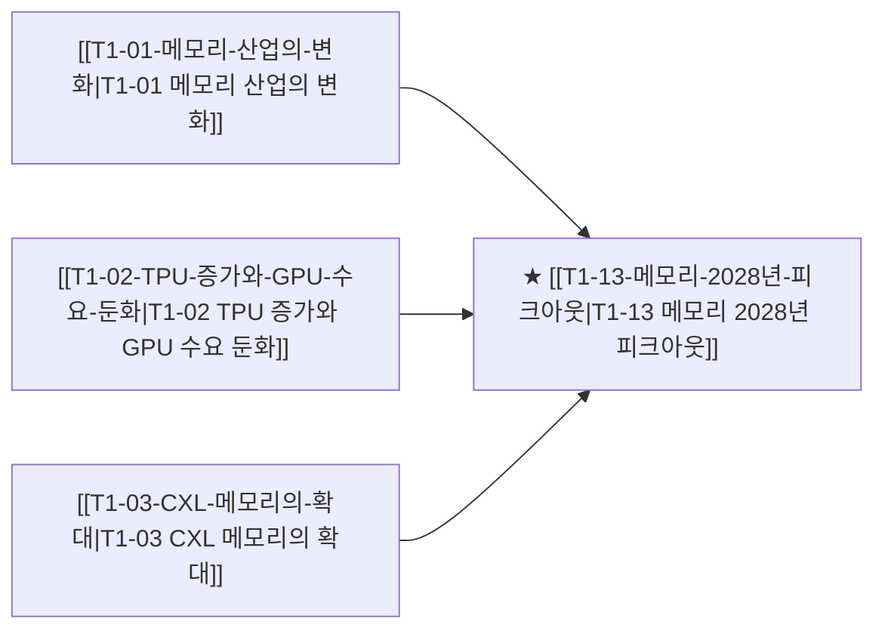

# T1-13 메모리 2028년 피크아웃

> 🧭 **상위 인덱스**: [[00-Argus-Master-MOC|Master MOC]] ➔ [[00-Argus-Master-MOC#1-💾-ai-컴퓨트--차세대-반도체-compute--silicon|AI 컴퓨트 & 반도체]]

> 🏷️ **교차 분석 메타데이터**:
> - **성격**: `🛡️ 역발상/헷지 (Contrarian)` | **스택**: `L1 (칩/패키징)` | **시계**: `2027H2~2028`
> - **공급망 권역**: `KR`, `US` | **핵심 대결 구도**: 해당 없음

---

## 🎯 핵심 가설
HBM 수요가 2028년을 전후로 정점에 달한 후 둔화되며, 이는 AI 가속기의 아키텍처 변화(메모리 내장형 칩, CXL 확대)와 고객사 자체 설계 확대로 인해 발생한다

---

## 🔗 테제 네트워크 (상호 연관 가설)



- 🔼 **선행 가설 (배경 요인 & 상위 인프라)**:
  - [[T1-01-메모리-산업의-변화|T1-01 메모리 산업의 변화]] — HBM4 양산 공급 확대
  - [[T1-02-TPU-증가와-GPU-수요-둔화|T1-02 TPU 증가와 GPU 수요 둔화]] — 빅테크 CAPEX 사이클
  - [[T1-03-CXL-메모리의-확대|T1-03 CXL 메모리의 확대]] — 메모리 대체제 출현
- ➡️ **동반 및 대체·경쟁 가설**:
  - (해당 없음)
- 🔽 **파생 및 후행 병목 가설**:
  - (해당 없음)

---

## 🏢 연관 기업 & 핵심 기술 허브
- **핵심 기업**: [[Company-SK하이닉스|SK하이닉스]], [[Company-삼성전자|삼성전자]], [[Company-Micron|Micron]], [[Company-NVIDIA|NVIDIA]]
- **핵심 기술/토픽**: [[Topic-HBM|HBM]], [[Topic-CXL|CXL]]

---

## 📈 지지 근거
<!-- 시스템이 자동으로 채워주거나 사용자가 직접 메모 -->

---

## 📉 반박 근거
- 2026-09-04: 2분기 글로벌 HBM 점유율 SK하이닉스 50%·삼성 33% 과점 유지 및 낸드 매출 70% 급증으로 수요 둔화 신호가 없고, 中 창신 HBM도 1세대 격차로 즉각적 위협 제한적이며 CXL/메모리 내장형 칩발 수요 정점 근거 미제시
<!-- 가설에 반하는 뉴스/데이터 -->

---

## 📑 관련 산출물 (자동 집계)

### 🤖 Dataview 실시간 역방향 링크
```dataview
TABLE file.mtime AS "작성일", angle AS "관점", tags AS "태그"
FROM "argus" OR "output" OR ""
WHERE contains(thesis, "T1-13") OR contains(thesis, "T1-13") OR contains(file.outlinks, this.file.link)
SORT file.mtime DESC
LIMIT 7
```

### 📌 수동 링크 아카이브
- [[2026-09-04-blog-삼성의-33-맹추격-착시일-뿐-진짜-HBM-왕좌는-HBM4-커스텀에서-갈]]

---

## 📝 분석가 메모
- Bearish Thesis — T-02(메모리 bullish)의 반대 시나리오
- 피크아웃 타이밍이 투자 exit 시점과 직결
- 2027년 실적 시즌이 첫 번째 확인 시점
