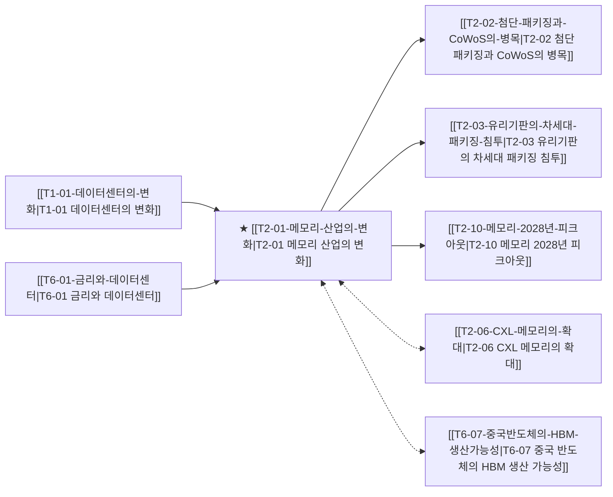

---
aliases:
- T2-01
- T2-01 메모리 산업의 변화
- T-02
- T-02 메모리 산업의 변화
- 메모리 산업의 변화
confidence: 80
direction: bullish
hypothesis: HBM4 전환으로 메모리가 범용 원자재에서 커스텀 ASIC으로 성격이 바뀐다
id: T2-01
keywords:
- HBM
- HBM3E
- HBM4
- DRAM
- NAND
- AI메모리
- TSV
- CoWoS
- LTA
- 커스텀HBM
- zHBM
- NVHBM
last_checked: 2026-09-06T21:05
last_ranked: 2026-09-07T19:47
milestone: 삼성전자 HBM4 엔비디아 공급 퀄 테스트 통과
momentum: 6355.0
news_count: 76
priority: 5
rank: 3
related_companies:
- SK하이닉스
- 삼성전자
- Micron
- NVIDIA
- TSMC
related_theses:
- T5-09
- T2-06
- T2-02
- T2-03
- T2-10
- T6-07
status: active
time_horizon: 2026~2027
title: 메모리 산업의 변화
sector: AI 컴퓨트·메모리·선단반도체
sector_id: T2
thesis_nature: consensus
stack_layer: L1
stack_name: L1 (칩/패키징)
geography:
- KR
- US
- TW
related_vs:
- Vs-TSMC동맹-vs-삼성턴키
old_id: T-02
previous_id: SC-01
---

# T2-01 메모리 산업의 변화

> 🧭 **상위 인덱스**: [[00-Argus-Master-MOC|Master MOC]] ➔ [[00-Argus-Master-MOC#1-💾-ai-컴퓨트--차세대-반도체-compute--silicon|AI 컴퓨트 & 반도체]]

> 🏷️ **교차 분석 메타데이터**:
> - **성격**: `🚀 주류 성장 (Consensus)` | **스택**: `L1 (칩/패키징)` | **시계**: `2026~2027`
> - **공급망 권역**: `KR`, `US`, `TW` | **핵심 대결 구도**: [[Vs-TSMC동맹-vs-삼성턴키|TSMC동맹-vs-삼성턴키]]

---

## 🎯 핵심 가설
HBM4 전환으로 메모리가 범용 원자재에서 커스텀 ASIC으로 성격이 바뀐다

---

## 🔗 테제 네트워크 (상호 연관 가설)



- 🔼 **선행 가설 (배경 요인 & 상위 인프라)**:
  - [[T1-01-데이터센터의-변화|T1-01 데이터센터의 변화]] — 연산 병목의 메모리 대역폭 전이
  - [[T6-01-금리와-데이터센터|T6-01 금리와 데이터센터]] — CSP 메모리 예산 비중 68% 도달
- ➡️ **동반 및 대체·경쟁 가설**:
  - [[T2-06-CXL-메모리의-확대|T2-06 CXL 메모리의 확대]] — CXL 메모리 풀링 병행
  - [[T6-07-중국반도체의-HBM-생산가능성|T6-07 중국 반도체의 HBM 생산 가능성]] — 후발주자 레거시 추격
- 🔽 **파생 및 후행 병목 가설**:
  - [[T2-02-첨단-패키징과-CoWoS의-병목|T2-02 첨단 패키징과 CoWoS의 병목]] — 16단 적층 & CoWoS 병목
  - [[T2-03-유리기판의-차세대-패키징-침투|T2-03 유리기판의 차세대 패키징 침투]] — 대면적 기판 혁신
  - [[T2-10-메모리-2028년-피크아웃|T2-10 메모리 2028년 피크아웃]] — 2028 사이클 논쟁

---

## 🏢 연관 기업 & 핵심 기술 허브
- **핵심 기업**: [[Company-SK하이닉스|SK하이닉스]], [[Company-삼성전자|삼성전자]], [[Company-Micron|Micron]], [[Company-NVIDIA|NVIDIA]], [[Company-TSMC|TSMC]]
- **핵심 기술/토픽**: [[Topic-HBM|HBM]], [[Topic-CoWoS|CoWoS]], [[Topic-CXL|CXL]]

---

## 📈 지지 근거


---

## 📉 반박 근거


---

## 📑 관련 산출물 (자동 집계)

### 🤖 Dataview 실시간 역방향 링크
```dataview
TABLE file.mtime AS "작성일", angle AS "관점", tags AS "태그"
FROM "argus" OR "output" OR ""
WHERE contains(thesis, "T1-01") OR contains(thesis, "T1-01") OR contains(file.outlinks, this.file.link)
SORT file.mtime DESC
LIMIT 7
```

### 📌 수동 링크 아카이브


---

## 📝 분석가 메모


## 지지 근거
- 2026-09-06: 증권사 리포트에서 파운드리 선단 공정이 필수적인 '커스텀 HBM4 베이스 다이'로의 전환이 한국 메모리사의 해자와 프리미엄을 유지하는 핵심 방어기제로 분석되었습니다.

## 반박 근거
- 2026-09-06: 중국 CXMT가 5세대 HBM3E 소량 생산을 추진하는 등 기존 HBM 영역에 대한 후발주자의 진입 및 범용화 압박이 관측됩니다.