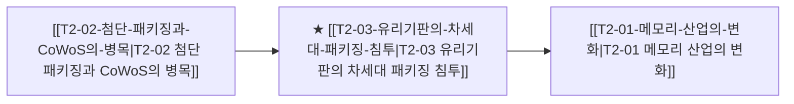

# T1-05 유리기판의 차세대 패키징 침투

> 🧭 **상위 인덱스**: [[00-Argus-Master-MOC|Master MOC]] ➔ [[00-Argus-Master-MOC#1-💾-ai-컴퓨트--차세대-반도체-compute--silicon|AI 컴퓨트 & 반도체]]

> 🏷️ **교차 분석 메타데이터**:
> - **성격**: `🚀 주류 성장 (Consensus)` | **스택**: `L0 (소부장/기판)` | **시계**: `2027~2028`
> - **공급망 권역**: `KR`, `US` | **핵심 대결 구도**: 해당 없음

---

## 🎯 핵심 가설
2026년 하반기부터 대면적 유기 기판(FC-BGA)의 물리적 한계로 유리기판이 초고성능 AI 가속기에 상용화된다

---

## 🔗 테제 네트워크 (상호 연관 가설)



- 🔼 **선행 가설 (배경 요인 & 상위 인프라)**:
  - [[T2-02-첨단-패키징과-CoWoS의-병목|T2-02 첨단 패키징과 CoWoS의 병목]] — 실리콘/유기 기판 대면적화 한계
- ➡️ **동반 및 대체·경쟁 가설**:
  - (해당 없음)
- 🔽 **파생 및 후행 병목 가설**:
  - [[T2-01-메모리-산업의-변화|T2-01 메모리 산업의 변화]] — HBM4/5 초고단수 패키징 안정화

---

## 🏢 연관 기업 & 핵심 기술 허브
- **핵심 기업**: [[Company-SKC|SKC]], [[Company-앱솔릭스|앱솔릭스]], [[Company-삼성전기|삼성전기]], [[Company-LG이노텍|LG이노텍]], [[Company-Intel|인텔]], [[Company-코닝|코닝]]
- **핵심 기술/토픽**: [[Topic-유리기판|유리기판]], [[Topic-CoWoS|CoWoS]]

---

## 📈 지지 근거
- 2026-09-05: PCB 산업 트렌드로서 AI 서버용 첨단 패키징 수요 확대와 함께 차세대 기술로 유리기판이 언급되고 있습니다.

---

## 📉 반박 근거
- 2026-09-05: 2026년에도 기존 FC-BGA 기판의 수요 타이트와 가격 상승이 전망되는 등 유기 기판 중심의 시장 지배력이 여전히 견고합니다.
- 2026-09-04: 대신증권 및 한국IR협의회 리포트가 2026년 FC-BGA 가격 상승과 고부가 패키지 기판 수요 확대 및 공급 타이트함을 전망하여 유기 기판의 물리적 한계로 인한 즉각적 교체 논리를 약화시킴
- 2026-09-04: 대신증권(2026년 FC-BGA 가격 상승 전망)과 한국IR협의회 리포트가 FC-BGA 수급 타이트 지속 및 필수화를 강조해 대면적 유기 기판의 한계로 인한 유리기판 대체 시급성을 약화시킴
- 2026-09-04: 대신증권·한국IR협의회 리포트가 2026년 FC-BGA 가격 상승 및 AI 서버/자율주행용 고부가 패키지 기판 수요/공급 타이트 지속을 전망해 유기 기판이 여전히 주력임을 시사

---

## 📑 관련 산출물 (자동 집계)

### 🤖 Dataview 실시간 역방향 링크
```dataview
TABLE file.mtime AS "작성일", angle AS "관점", tags AS "태그"
FROM "argus" OR "output" OR ""
WHERE contains(thesis, "T1-05") OR contains(thesis, "T1-05") OR contains(file.outlinks, this.file.link)
SORT file.mtime DESC
LIMIT 7
```

### 📌 수동 링크 아카이브


---

## 📝 분석가 메모


## 반박 근거
- 2026-09-06: 2026년에도 FC-BGA 가격 상승 및 첨단 패키지 수요 지속이 전망되어 기존 유기 기판 중심의 시장 구도가 견고하게 유지될 가능성이 큽니다.