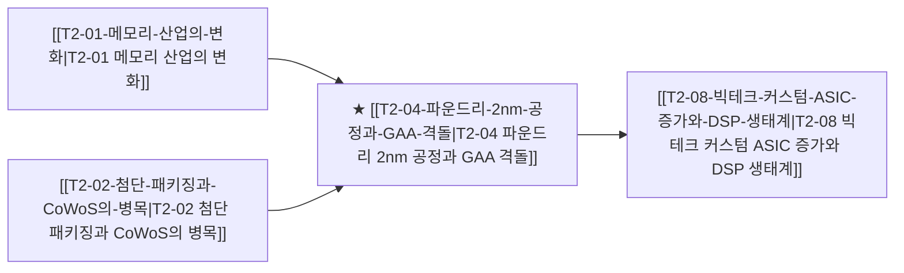

# T2-04 파운드리 2nm 공정과 GAA 격돌

> 🧭 **상위 인덱스**: [[00-Argus-Master-MOC|Master MOC]] ➔ [[00-Argus-Master-MOC#1-💾-ai-컴퓨트--차세대-반도체-compute--silicon|AI 컴퓨트 & 반도체]]

> 🏷️ **교차 분석 메타데이터**:
> - **성격**: `🚀 주류 성장 (Consensus)` | **스택**: `L1 (칩/패키징)` | **시계**: `2026H2~2027`
> - **공급망 권역**: `TW`, `KR`, `US` | **핵심 대결 구도**: [[Vs-TSMC동맹-vs-삼성턴키|TSMC동맹-vs-삼성턴키]]

---

## 🎯 핵심 가설
2nm 공정 진입과 함께 후면전력공급(BSPDN) 및 GAA 수율이 파운드리 시장 점유율의 지각변동을 일으킨다

---

## 🔗 테제 네트워크 (상호 연관 가설)



- 🔼 **선행 가설 (배경 요인 & 상위 인프라)**:
  - [[T2-01-메모리-산업의-변화|T2-01 메모리 산업의 변화]] — HBM4 베이스 다이 선단 파운드리 요구
  - [[T2-02-첨단-패키징과-CoWoS의-병목|T2-02 첨단 패키징과 CoWoS의 병목]] — 파운드리-패키징 턴키 수주
- ➡️ **동반 및 대체·경쟁 가설**:
  - (해당 없음)
- 🔽 **파생 및 후행 병목 가설**:
  - [[T2-08-빅테크-커스텀-ASIC-증가와-DSP-생태계|T2-08 빅테크 커스텀 ASIC 증가와 DSP 생태계]] — 빅테크 2nm 공정 선점 경쟁

---

## 🏢 연관 기업 & 핵심 기술 허브
- **핵심 기업**: [[Company-TSMC|TSMC]], [[Company-삼성전자|삼성전자]], [[Company-Intel|인텔]], [[Company-Apple|Apple]], [[Company-Qualcomm|Qualcomm]]
- **핵심 기술/토픽**: [[Topic-2nm-GAA|2nm-GAA]], [[Topic-CoWoS|CoWoS]]

---

## 📈 지지 근거


---

## 📉 반박 근거


---

## 📑 관련 산출물 (자동 집계)

### 🤖 Dataview 실시간 역방향 링크
```dataview
TABLE file.mtime AS "작성일", angle AS "관점", tags AS "태그"
FROM "argus" OR "output" OR ""
WHERE contains(thesis, "T1-08") OR contains(thesis, "T1-08") OR contains(file.outlinks, this.file.link)
SORT file.mtime DESC
LIMIT 7
```

### 📌 수동 링크 아카이브


---

## 📝 분석가 메모

