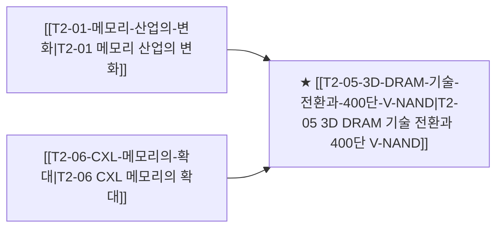

# T2-05 3D DRAM 기술 전환과 400단 V-NAND

> 🧭 **상위 인덱스**: [[00-Argus-Master-MOC|Master MOC]] ➔ [[00-Argus-Master-MOC#1-💾-ai-컴퓨트--차세대-반도체-compute--silicon|AI 컴퓨트 & 반도체]]

> 🏷️ **교차 분석 메타데이터**:
> - **성격**: `🚀 주류 성장 (Consensus)` | **스택**: `L1 (칩/패키징)` | **시계**: `2027~2029`
> - **공급망 권역**: `KR`, `US` | **핵심 대결 구도**: 해당 없음

---

## 🎯 핵심 가설
미세화 한계에 도달한 2D 평면 DRAM이 3D 적층 DRAM으로 전환을 시작하며 신소재 및 ALD 원자층 증착 장비 수요가 폭발한다

---

## 🔗 테제 네트워크 (상호 연관 가설)



- 🔼 **선행 가설 (배경 요인 & 상위 인프라)**:
  - [[T2-01-메모리-산업의-변화|T2-01 메모리 산업의 변화]] — 1c/1d nm D램 미세화 한계
  - [[T2-06-CXL-메모리의-확대|T2-06 CXL 메모리의 확대]] — 초고용량 메모리 적층 요구
- ➡️ **동반 및 대체·경쟁 가설**:
  - (해당 없음)
- 🔽 **파생 및 후행 병목 가설**:
  - (해당 없음)

---

## 🏢 연관 기업 & 핵심 기술 허브
- **핵심 기업**: [[Company-삼성전자|삼성전자]], [[Company-SK하이닉스|SK하이닉스]], [[Company-원익IPS|원익IPS]], [[Company-주성엔지니어링|주성엔지니어링]], [[Company-유진테크|유진테크]], [[Company-Applied Materials|Applied Materials]]
- **핵심 기술/토픽**: [[Topic-3D-DRAM|3D-DRAM]], [[Topic-HBM|HBM]]

---

## 📈 지지 근거


---

## 📉 반박 근거


---

## 📑 관련 산출물 (자동 집계)

### 🤖 Dataview 실시간 역방향 링크
```dataview
TABLE file.mtime AS "작성일", angle AS "관점", tags AS "태그"
FROM "argus" OR "output" OR ""
WHERE contains(thesis, "T1-10") OR contains(thesis, "T1-10") OR contains(file.outlinks, this.file.link)
SORT file.mtime DESC
LIMIT 7
```

### 📌 수동 링크 아카이브


---

## 📝 분석가 메모

