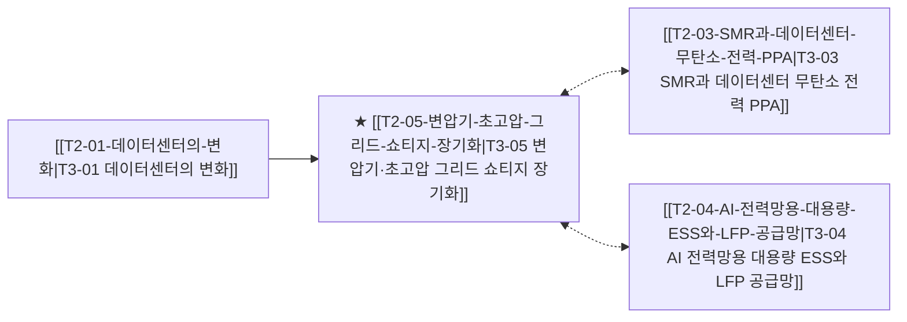

# T3-05 변압기·초고압 그리드 쇼티지 장기화

> 🧭 **상위 인덱스**: [[00-Argus-Master-MOC|Master MOC]] ➔ [[00-Argus-Master-MOC#2-⚡-ai-데이터센터--전력냉각-인프라-power--infrastructure|AI 인프라 & 전력·냉각]]

> 🏷️ **교차 분석 메타데이터**:
> - **성격**: `🚀 주류 성장 (Consensus)` | **스택**: `L2 (물리인프라)` | **시계**: `2026~2028`
> - **공급망 권역**: `KR`, `US`, `EU` | **핵심 대결 구도**: 해당 없음

---

## 🎯 핵심 가설
전력망 현대화와 데이터센터 전력 수요 폭증으로 초고압 변압기 및 HVDC 전력기기 리드타임이 4년 이상 유지되며 슈퍼사이클이 지속된다

---

## 🔗 테제 네트워크 (상호 연관 가설)



- 🔼 **선행 가설 (배경 요인 & 상위 인프라)**:
  - [[T2-01-데이터센터의-변화|T3-01 데이터센터의 변화]] — 전력 그리드 접속 지연(인터커넥션 큐)
- ➡️ **동반 및 대체·경쟁 가설**:
  - [[T2-03-SMR과-데이터센터-무탄소-전력-PPA|T3-03 SMR과 데이터센터 무탄소 전력 PPA]] — 현장 분산 발전
  - [[T2-04-AI-전력망용-대용량-ESS와-LFP-공급망|T3-04 AI 전력망용 대용량 ESS와 LFP 공급망]] — 피크 완화
- 🔽 **파생 및 후행 병목 가설**:
  - (해당 없음)

---

## 🏢 연관 기업 & 핵심 기술 허브
- **핵심 기업**: [[Company-HD현대일렉트릭|HD현대일렉트릭]], [[Company-효성중공업|효성중공업]], [[Company-LS일렉트릭|LS일렉트릭]], [[Company-Eaton|Eaton]], [[Company-Schneider Electric|Schneider Electric]], [[Company-Siemens Energy|Siemens Energy]]
- **핵심 기술/토픽**: [[Topic-전력그리드|전력그리드]]

---

## 📈 지지 근거


---

## 📉 반박 근거


---

## 📑 관련 산출물 (자동 집계)

### 🤖 Dataview 실시간 역방향 링크
```dataview
TABLE file.mtime AS "작성일", angle AS "관점", tags AS "태그"
FROM "argus" OR "output" OR ""
WHERE contains(thesis, "T3-05") OR contains(thesis, "T3-05") OR contains(file.outlinks, this.file.link)
SORT file.mtime DESC
LIMIT 7
```

### 📌 수동 링크 아카이브


---

## 📝 분석가 메모

