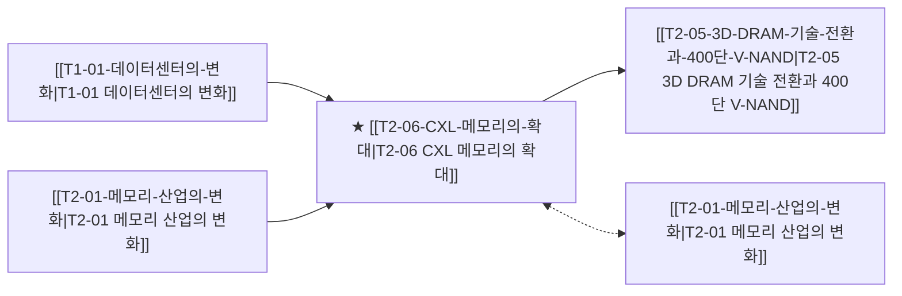

# T1-03 CXL 메모리의 확대

> 🧭 **상위 인덱스**: [[00-Argus-Master-MOC|Master MOC]] ➔ [[00-Argus-Master-MOC#1-💾-ai-컴퓨트--차세대-반도체-compute--silicon|AI 컴퓨트 & 반도체]]

> 🏷️ **교차 분석 메타데이터**:
> - **성격**: `🚀 주류 성장 (Consensus)` | **스택**: `L1 (칩/패키징)` | **시계**: `2026H2~2027`
> - **공급망 권역**: `KR`, `US` | **핵심 대결 구도**: 해당 없음

---

## 🎯 핵심 가설
CXL 3.0이 제3 메모리 계층으로 자리잡으며 메모리 풀링이 AI 인프라 표준이 된다

---

## 🔗 테제 네트워크 (상호 연관 가설)



- 🔼 **선행 가설 (배경 요인 & 상위 인프라)**:
  - [[T1-01-데이터센터의-변화|T1-01 데이터센터의 변화]] — 서버 메모리 용량 병목
  - [[T2-01-메모리-산업의-변화|T2-01 메모리 산업의 변화]] — HBM 고가격 보완 필요
- ➡️ **동반 및 대체·경쟁 가설**:
  - [[T2-01-메모리-산업의-변화|T2-01 메모리 산업의 변화]] — HBM vs CXL 보완 관계
- 🔽 **파생 및 후행 병목 가설**:
  - [[T2-05-3D-DRAM-기술-전환과-400단-V-NAND|T2-05 3D DRAM 기술 전환과 400단 V-NAND]] — DRAM 풀링 아키텍처

---

## 🏢 연관 기업 & 핵심 기술 허브
- **핵심 기업**: [[Company-삼성전자|삼성전자]], [[Company-SK하이닉스|SK하이닉스]], [[Company-Micron|Micron]], [[Company-Intel|Intel]], [[Company-Microsoft|Microsoft]], [[Company-Meta|Meta]]
- **핵심 기술/토픽**: [[Topic-CXL|CXL]], [[Topic-HBM|HBM]]

---

## 📈 지지 근거


---

## 📉 반박 근거
- 2026-09-04: 증권사 리포트가 AI 인프라 메모리 해법을 HBM/HBM4·커스텀 HBM 및 FC-BGA/유리기판 등 첨단 패키지 중심으로만 서술하고 CXL 3.0 메모리 풀링의 표준화나 채택 관련 언급·수치가 전무함
- 2026-09-04: 증권사 리포트 3건 모두 AI 인프라 핵심을 HBM/HBM4·Custom HBM과 GPU·고부가 PCB로 한정하고 CXL 3.0 및 메모리 풀링에 대한 언급이 전무하여 기술·투자 집중도가 HBM에 쏠려 있음

---

## 📑 관련 산출물 (자동 집계)

### 🤖 Dataview 실시간 역방향 링크
```dataview
TABLE file.mtime AS "작성일", angle AS "관점", tags AS "태그"
FROM "argus" OR "output" OR ""
WHERE contains(thesis, "T1-03") OR contains(thesis, "T1-03") OR contains(file.outlinks, this.file.link)
SORT file.mtime DESC
LIMIT 7
```

### 📌 수동 링크 아카이브


---

## 📝 분석가 메모

