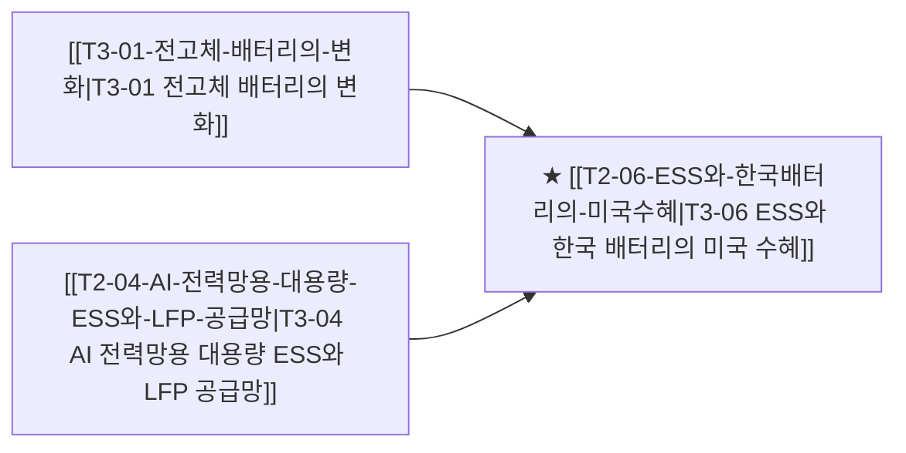

# T3-06 ESS와 한국 배터리의 미국 수혜

> 🧭 **상위 인덱스**: [[00-Argus-Master-MOC|Master MOC]] ➔ [[00-Argus-Master-MOC#2-⚡-ai-데이터센터--전력냉각-인프라-power--infrastructure|AI 인프라 & 전력·냉각]]

> 🏷️ **교차 분석 메타데이터**:
> - **성격**: `🚀 주류 성장 (Consensus)` | **스택**: `L0 (소재/배터리)` | **시계**: `2026~2027`
> - **공급망 권역**: `KR`, `US` | **핵심 대결 구도**: 해당 없음

---

## 🎯 핵심 가설
저장용 배터리(ESS) 시장이 전기차를 추월하는 속도가 예상보다 빠르고, 미국의 중국 배제 정책(관세 58% + 국가비상사태)이 한국 배터리 3사에 2032년까지 한정된 구조적 기회를 만든다

---

## 🔗 테제 네트워크 (상호 연관 가설)



- 🔼 **선행 가설 (배경 요인 & 상위 인프라)**:
  - [[T3-01-전고체-배터리의-변화|T3-01 전고체 배터리의 변화]] — 중장기 로드맵
  - [[T2-04-AI-전력망용-대용량-ESS와-LFP-공급망|T3-04 AI 전력망용 대용량 ESS와 LFP 공급망]] — 북미 ESS 시장 폭발
- ➡️ **동반 및 대체·경쟁 가설**:
  - (해당 없음)
- 🔽 **파생 및 후행 병목 가설**:
  - (해당 없음)

---

## 🏢 연관 기업 & 핵심 기술 허브
- **핵심 기업**: [[Company-LG에너지솔루션|LG에너지솔루션]], [[Company-삼성SDI|삼성SDI]], [[Company-SK온|SK온]], [[Company-에코프로|에코프로]], [[Company-엘앤에프|엘앤에프]], [[Company-서진시스템|서진시스템]]
- **핵심 기술/토픽**: [[Topic-ESS|ESS]], [[Topic-전력그리드|전력그리드]]

---

## 📈 지지 근거
- 2026-09-05: iM증권, 미국 시장 주력 한국 배터리 업체 ESS 수요 견조 지속 및 미국 내 ESS 생산능력 증설에 따른 실적 추정치 상향 조정 가능성 제시
- 2026-09-04: iM증권 LG에너지솔루션 리포트에서 미국 시장 중심 ESS 수요의 견조한 흐름 지속과 미국 내 ESS 생산능력 추가 증설에 따른 중장기 실적 추정치 상향 가능성을 제시함
- 2026-09-04: iM증권이 미국 시장 주력 한국 배터리 업체의 ESS 수요 견조 지속과 미국 내 ESS 생산능력 증설에 따른 실적 추정치 상향 가능성을 제시
- 2026-09-04: iM증권이 미국 ESS 수요 견조 지속 및 미국 내 ESS 생산능력 추가 증설에 따른 실적 추정치 재상향 가능성을 전망해 중국 배제 수혜 서사를 정성적으로 재확인
<!-- 시스템이 자동으로 채워주거나 사용자가 직접 메모 -->

---

## 📉 반박 근거
- 2026-09-04: 중국의 레거시/준선단 HBM 캐치업 격차가 기존 전제인 2~3세대에서 1세대 수준으로 좁혀졌다는 분석은 2032년까지 한국 배터리 3사의 구조적 우위라는 시간적 해자 가정의 내구성을 약화시킴
- 2026-09-04: HBM 분석에서 중국 캐치업 격차가 기존 전제인 2~3세대가 아닌 1세대 수준으로 좁혀졌다는 점은 배터리 분야의 장기 기술격차·2032년까지 한정된 기회 전제에 대한 간접적 훼손 리스크
<!-- 가설에 반하는 뉴스/데이터 -->

---

## 📑 관련 산출물 (자동 집계)

### 🤖 Dataview 실시간 역방향 링크
```dataview
TABLE file.mtime AS "작성일", angle AS "관점", tags AS "태그"
FROM "argus" OR "output" OR ""
WHERE contains(thesis, "T3-06") OR contains(thesis, "T3-06") OR contains(file.outlinks, this.file.link)
SORT file.mtime DESC
LIMIT 7
```

### 📌 수동 링크 아카이브
<!-- [[블로그 파일명]] 형식으로 링크 -->

---

## 📝 분석가 메모
- askask.md (2026-09-02) 내용이 이 Thesis의 핵심 분석
- 앞으로 볼 것: 10월 LFP 양산 개시, 연내 에너지부 품목 확정, 3Q 양극재 판가 반등


## 지지 근거
- 2026-09-06: 북미 ESS 수요 강세에 맞춘 K-배터리 3사의 LFP 전환 및 양산 경쟁 본격화와 함께 미국 내 ESS 증설에 따른 실적 추정치 상향 전망이 확인되었다.