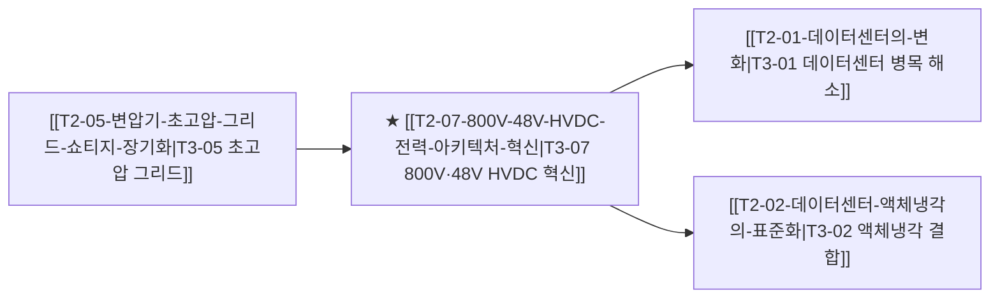

# T3-07 800V·48V HVDC 전력 아키텍처 혁신

## 핵심 논리 및 배경
1. **랙당 전력 밀도 폭증**: 차세대 엔비디아 루빈(Rubin) 및 블랙웰 울트라 서버 랙당 전력이 120kW~250kW로 급증함에 따라 기존 480V AC 전력선으로는 구리 두께와 발열(I²R 손실) 한계 봉착.
2. **800V DC ➔ 48V 파워 모듈화**: 전력 손실을 30% 이상 줄이기 위해 데이터센터 메인 버스바를 800V 직류로 공급하고 랙 내부에서 고효율 파워 모듈(Vicor/MPS)로 48V/1V 직변환.
3. **HVDC 송전망 직결**: 대규모 데이터센터 캠퍼스와 원전/신재생 발전소 간 초고압 직류 송전망(HVDC) 연계가 전력망 안정성의 필수재로 부상.

## 밸류체인 및 인과관계 맵


## 핵심 수혜 기업 및 공급망
- **전력 변환 칩/모듈**: Vicor, Monolithic Power Systems (MPS), Delta Electronics
- **초고압 직류 송전(HVDC)**: LS ELECTRIC, HD현대일렉트릭, Siemens Energy, Schneider Electric

## 관련 최근 분석 리포트 & 블로그
```dataview
TABLE file.mtime AS "수정일", tags AS "태그"
FROM "argus" OR "outputs" OR "blog"
WHERE contains(thesis, "T2-07") OR contains(file.outlinks, this.file.link)
SORT file.mtime DESC
LIMIT 5
```
