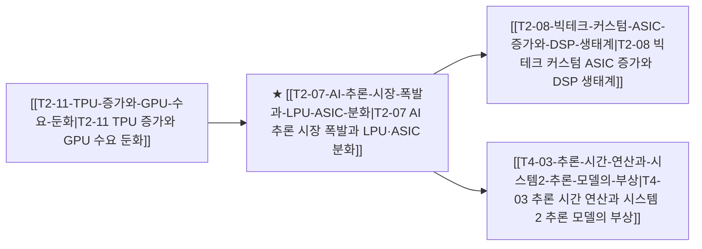

# T2-07 AI 추론 시장 폭발과 LPU·ASIC 분화

> 🧭 **상위 인덱스**: [[00-Argus-Master-MOC|Master MOC]] ➔ [[00-Argus-Master-MOC#1-💾-ai-컴퓨트--차세대-반도체-compute--silicon|AI 컴퓨트 & 반도체]]

> 🏷️ **교차 분석 메타데이터**:
> - **성격**: `🚀 주류 성장 (Consensus)` | **스택**: `L1 (칩/패키징)` | **시계**: `2026~2027`
> - **공급망 권역**: `US`, `KR` | **핵심 대결 구도**: [[Vs-GPU-vs-TPU-ASIC|GPU-vs-TPU-ASIC]]

---

## 🎯 핵심 가설
학습 중심에서 실시간 추론 시대로 전환되며 초저지연·고효율의 LPU 및 전용 추론 ASIC이 GPU의 자리를 잠식한다

---

## 🔗 테제 네트워크 (상호 연관 가설)



- 🔼 **선행 가설 (배경 요인 & 상위 인프라)**:
  - [[T2-11-TPU-증가와-GPU-수요-둔화|T2-11 TPU 증가와 GPU 수요 둔화]] — 학습에서 추론으로의 패러다임 이동
- ➡️ **동반 및 대체·경쟁 가설**:
  - (해당 없음)
- 🔽 **파생 및 후행 병목 가설**:
  - [[T2-08-빅테크-커스텀-ASIC-증가와-DSP-생태계|T2-08 빅테크 커스텀 ASIC 증가와 DSP 생태계]] — 추론 전용 ASIC 설계 수요 폭증
  - [[T4-03-추론-시간-연산과-시스템2-추론-모델의-부상|T4-03 추론 시간 연산과 시스템 2 추론 모델의 부상]] — 테스트 타임 연산 및 CoT 추론 가속

---

## 🏢 연관 기업 & 핵심 기술 허브
- **핵심 기업**: [[Company-Groq|Groq]], [[Company-리벨리온|리벨리온]], [[Company-퓨리오사AI|퓨리오사AI]], [[Company-SambaNova|SambaNova]], [[Company-Qualcomm|Qualcomm]], [[Company-Broadcom|브로드컴]]
- **핵심 기술/토픽**: [[Topic-ASIC|ASIC]], [[Topic-온디바이스AI|온디바이스AI]]

---

## 📈 지지 근거


---

## 📉 반박 근거
- 2026-09-05: 생성형 AI 인프라의 핵심 가속기로 여전히 GPU와 HBM 중심의 고부가 기판 수요가 강조되고 있습니다.
- 2026-09-04: 증권사 리포트들이 AI 가속기 핵심 요소를 GPU·HBM으로 규정하고 데이터센터 구축 비용의 대부분이 GPU·CPU에 집중되며 메모리가 최대 병목으로 부상했다고 지적해 LPU·전용 추론 ASIC의 GPU 잠식 근거가 전혀 제시되지 않음
- 2026-09-04: 증권사 리포트들이 AI 가속기의 핵심을 GPU·HBM으로 규정하고 데이터센터 예산의 최대 병목·포식자를 메모리로 지목하며 CPU/GPU용 FC-BGA 수급 타이트를 강조해 LPU·추론 ASIC의 GPU 잠식 서사를 입증하지 못함
- 2026-09-04: 증권사 리포트들이 AI 가속기의 핵심을 여전히 GPU·HBM으로 규정하고 서버용 CPU/GPU용 FC-BGA 수급 타이트 및 데이터센터 예산의 GPU/CPU·HBM 병목 지속을 강조해 LPU·추론 ASIC의 GPU 잠식을 입증할 신규 근거를 제시하지 않음

---

## 📑 관련 산출물 (자동 집계)

### 🤖 Dataview 실시간 역방향 링크
```dataview
TABLE file.mtime AS "작성일", angle AS "관점", tags AS "태그"
FROM "argus" OR "output" OR ""
WHERE contains(thesis, "T1-07") OR contains(thesis, "T1-07") OR contains(file.outlinks, this.file.link)
SORT file.mtime DESC
LIMIT 7
```

### 📌 수동 링크 아카이브


---

## 📝 분석가 메모


## 반박 근거
- 2026-09-06: 생성형 AI 서비스 및 데이터센터 인프라의 핵심 가속기로 여전히 GPU와 HBM 중심의 수요가 지속되고 있습니다.