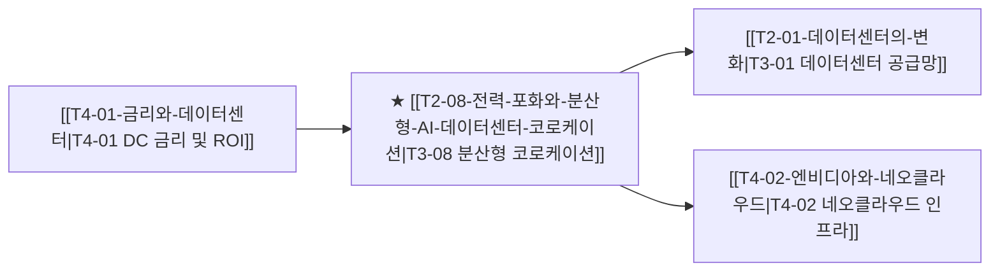

# T3-08 전력 포화와 분산형 AI 데이터센터 코로케이션

## 핵심 논리 및 배경
1. **수도권 및 북미 주요 거점 전력 셧다운**: 버지니아 라우든 카운티, 실리콘밸리 등 메이저 데이터센터 허브의 전력망 대기열(Interconnection Queue)이 5~7년으로 연장.
2. **지리적 분산과 하이퍼스케일 코로케이션**: 저렴하고 즉시 조달 가능한 전력(원전, 수력, 지열)이 있는 외곽 지역으로 AI 학습 클러스터를 이전하고, 추론은 엣지 코로케이션에 분산.
3. **데이터센터 임대료(Cap Rate) 상승**: 신규 공급 제한으로 기보유 코로케이션 사업자(Equinix, Digital Realty)의 계약 갱신 단가(P)와 장기 임대 가치 폭등.

## 밸류체인 및 인과관계 맵


## 핵심 수혜 기업 및 공급망
- **글로벌 코로케이션 리츠**: Equinix (EQIX), Digital Realty (DLR)
- **AI 특화 인프라 호스팅**: Applied Digital (APLD), CoreWeave, Crusoe Energy

## 관련 최근 분석 리포트 & 블로그
```dataview
TABLE file.mtime AS "수정일", tags AS "태그"
FROM "argus" OR "outputs" OR "blog"
WHERE contains(thesis, "T2-08") OR contains(file.outlinks, this.file.link)
SORT file.mtime DESC
LIMIT 5
```
