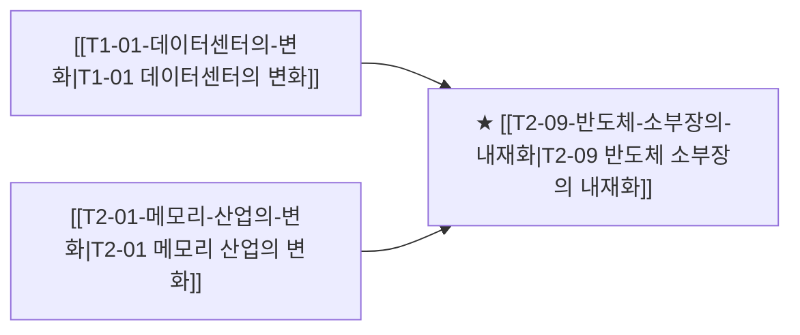

# T2-09 반도체 소부장의 내재화

> 🧭 **상위 인덱스**: [[00-Argus-Master-MOC|Master MOC]] ➔ [[00-Argus-Master-MOC#1-💾-ai-컴퓨트--차세대-반도체-compute--silicon|AI 컴퓨트 & 반도체]]

> 🏷️ **교차 분석 메타데이터**:
> - **성격**: `🚀 주류 성장 (Consensus)` | **스택**: `L0 (소부장)` | **시계**: `2026~2027`
> - **공급망 권역**: `KR` | **핵심 대결 구도**: 해당 없음

---

## 🎯 핵심 가설
미국·일본·네덜란드의 대중 수출통제가 장기화될수록 반도체 소재·부품·장비의 국산화 압력이 높아지고, 한국·일본 소부장 기업의 점유율이 구조적으로 상승한다

---

## 🔗 테제 네트워크 (상호 연관 가설)



- 🔼 **선행 가설 (배경 요인 & 상위 인프라)**:
  - [[T1-01-데이터센터의-변화|T1-01 데이터센터의 변화]] — 글로벌 공급망 재편
  - [[T2-01-메모리-산업의-변화|T2-01 메모리 산업의 변화]] — HBM 고단화 본딩 및 세정 소재 국산화
- ➡️ **동반 및 대체·경쟁 가설**:
  - (해당 없음)
- 🔽 **파생 및 후행 병목 가설**:
  - (해당 없음)

---

## 🏢 연관 기업 & 핵심 기술 허브
- **핵심 기업**: [[Company-원익IPS|원익IPS]], [[Company-주성엔지니어링|주성엔지니어링]], [[Company-동진쎄미켐|동진쎄미켐]], [[Company-솔브레인|솔브레인]], [[Company-포스코퓨처엠|포스코퓨처엠]], [[Company-SK머티리얼즈|SK머티리얼즈]]
- **핵심 기술/토픽**: [[Topic-HBM|HBM]], [[Topic-CoWoS|CoWoS]]

---

## 📈 지지 근거
- 2026-09-04: 삼성전자 로직 하이브리드 본딩 안착으로 소부장 재편 가능성이 언급됐으나 대중 수출통제 장기화나 국산화 점유율 상승을 입증할 신규 수치는 없음
<!-- 시스템이 자동으로 채워주거나 사용자가 직접 메모 -->

---

## 📉 반박 근거
- 2026-09-04: 삼성전자 HBM 연기로 인한 소부장 수주 지연 및 하이브리드 본딩 중심 재편 불확실성 부각
- 2026-09-04: HBM 연기로 인한 첨단 소부장 수요 지연 리스크가 부각되고 수출통제-국산화 연계성을 뒷받침할 증권사 데이터가 전무함
<!-- 가설에 반하는 뉴스/데이터 -->

---

## 📑 관련 산출물 (자동 집계)

### 🤖 Dataview 실시간 역방향 링크
```dataview
TABLE file.mtime AS "작성일", angle AS "관점", tags AS "태그"
FROM "argus" OR "output" OR ""
WHERE contains(thesis, "T1-12") OR contains(thesis, "T1-12") OR contains(file.outlinks, this.file.link)
SORT file.mtime DESC
LIMIT 7
```

### 📌 수동 링크 아카이브
<!-- `블로그 파일명` 형식으로 링크 -->

---

## 📝 분석가 메모
- 음극재 흑연 관세 220% → T-12와 연결
- ASML EUV 중국 차단 → 대체 장비 수요 구조
