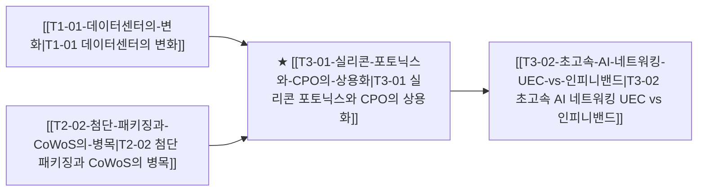

# T3-01 실리콘 포토닉스와 CPO의 상용화

> 🧭 **상위 인덱스**: [[00-Argus-Master-MOC|Master MOC]] ➔ [[00-Argus-Master-MOC#1-💾-ai-컴퓨트--차세대-반도체-compute--silicon|AI 컴퓨트 & 반도체]]

> 🏷️ **교차 분석 메타데이터**:
> - **성격**: `🚀 주류 성장 (Consensus)` | **스택**: `L3 (네트워킹)` | **시계**: `2027~2028`
> - **공급망 권역**: `US`, `TW` | **핵심 대결 구도**: [[Vs-인피니밴드-vs-울트라이더넷|인피니밴드-vs-울트라이더넷]]

---

## 🎯 핵심 가설
구리 배선의 전력·신호 손실 한계로 800G/1.6T 광트랜시버 및 CPO(Co-Packaged Optics)가 데이터센터 스위치 백본으로 급부상한다

---

## 🔗 테제 네트워크 (상호 연관 가설)



- 🔼 **선행 가설 (배경 요인 & 상위 인프라)**:
  - [[T1-01-데이터센터의-변화|T1-01 데이터센터의 변화]] — 데이터센터 내 구리 배선 대역폭 한계
  - [[T2-02-첨단-패키징과-CoWoS의-병목|T2-02 첨단 패키징과 CoWoS의 병목]] — CPO 패키징 통합
- ➡️ **동반 및 대체·경쟁 가설**:
  - (해당 없음)
- 🔽 **파생 및 후행 병목 가설**:
  - [[T3-02-초고속-AI-네트워킹-UEC-vs-인피니밴드|T3-02 초고속 AI 네트워킹 UEC vs 인피니밴드]] — 광 스위칭 네트워크

---

## 🏢 연관 기업 & 핵심 기술 허브
- **핵심 기업**: [[Company-Broadcom|Broadcom]], [[Company-Marvell|Marvell]], [[Company-이수페타시스|이수페타시스]], [[Company-TSMC|TSMC]], [[Company-Cisco|Cisco]], [[Company-코히런트|코히런트]]
- **핵심 기술/토픽**: [[Topic-실리콘포토닉스|실리콘포토닉스]], [[Topic-초고속네트워킹|초고속네트워킹]], [[Topic-CoWoS|CoWoS]]

---

## 📈 지지 근거


---

## 📉 반박 근거


---

## 📑 관련 산출물 (자동 집계)

### 🤖 Dataview 실시간 역방향 링크
```dataview
TABLE file.mtime AS "작성일", angle AS "관점", tags AS "태그"
FROM "argus" OR "output" OR ""
WHERE contains(thesis, "T1-06") OR contains(thesis, "T1-06") OR contains(file.outlinks, this.file.link)
SORT file.mtime DESC
LIMIT 7
```

### 📌 수동 링크 아카이브


---

## 📝 분석가 메모

