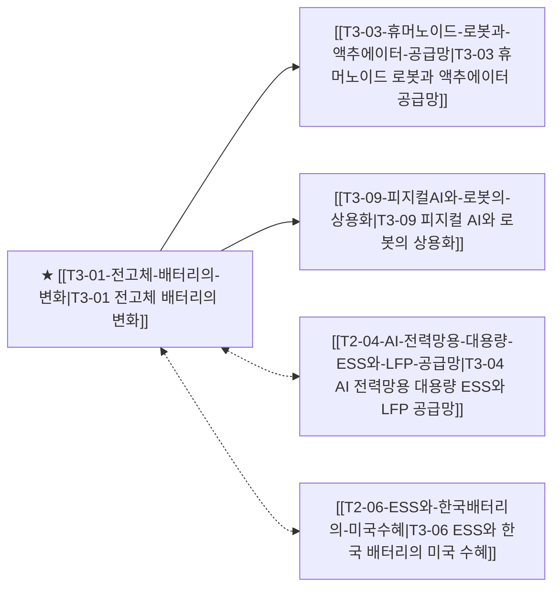

# T3-01 전고체 배터리의 변화

> 🧭 **상위 인덱스**: [[00-Argus-Master-MOC|Master MOC]] ➔ [[00-Argus-Master-MOC#3-🤖-피지컬-ai-로보틱스--엣지-디바이스-physical-ai--edge|피지컬 AI & 엣지 디바이스]]

> 🏷️ **교차 분석 메타데이터**:
> - **성격**: `🚀 주류 성장 (Consensus)` | **스택**: `L0 (소재/배터리)` | **시계**: `2026H2~2028`
> - **공급망 권역**: `KR`, `JP`, `US` | **핵심 대결 구도**: 해당 없음

---

## 🎯 핵심 가설
전고체 배터리는 EV 대량 보급보다 하이엔드(로봇·군사·우주) 시장에 먼저 진입한다

---

## 🔗 테제 네트워크 (상호 연관 가설)



- 🔼 **선행 가설 (배경 요인 & 상위 인프라)**:
  - (독립적 기저 요인)
- ➡️ **동반 및 대체·경쟁 가설**:
  - [[T2-04-AI-전력망용-대용량-ESS와-LFP-공급망|T3-04 AI 전력망용 대용량 ESS와 LFP 공급망]] — 단기 실적 방어 및 LFP 공급망
  - [[T2-06-ESS와-한국배터리의-미국수혜|T3-06 ESS와 한국 배터리의 미국 수혜]] — 북미 공급망 수혜
- 🔽 **파생 및 후행 병목 가설**:
  - [[T3-03-휴머노이드-로봇과-액추에이터-공급망|T3-03 휴머노이드 로봇과 액추에이터 공급망]] — 고에너지밀도 로봇 탑재
  - [[T3-09-피지컬AI와-로봇의-상용화|T3-09 피지컬 AI와 로봇의 상용화]] — 물리 AI 디바이스 전력원

---

## 🏢 연관 기업 & 핵심 기술 허브
- **핵심 기업**: [[Company-LG에너지솔루션|LG에너지솔루션]], [[Company-삼성SDI|삼성SDI]], [[Company-Toyota|Toyota]], [[Company-QuantumScape|QuantumScape]], [[Company-현대차|현대차]]
- **핵심 기술/토픽**: [[Topic-ESS|ESS]], [[Topic-피지컬AI|피지컬AI]]

---

## 📈 지지 근거


---

## 📉 반박 근거


---

## 📑 관련 산출물 (자동 집계)

### 🤖 Dataview 실시간 역방향 링크
```dataview
TABLE file.mtime AS "작성일", angle AS "관점", tags AS "태그"
FROM "argus" OR "output" OR ""
WHERE contains(thesis, "T2-01") OR contains(thesis, "T2-01") OR contains(file.outlinks, this.file.link)
SORT file.mtime DESC
LIMIT 7
```

### 📌 수동 링크 아카이브


---

## 📝 분석가 메모

