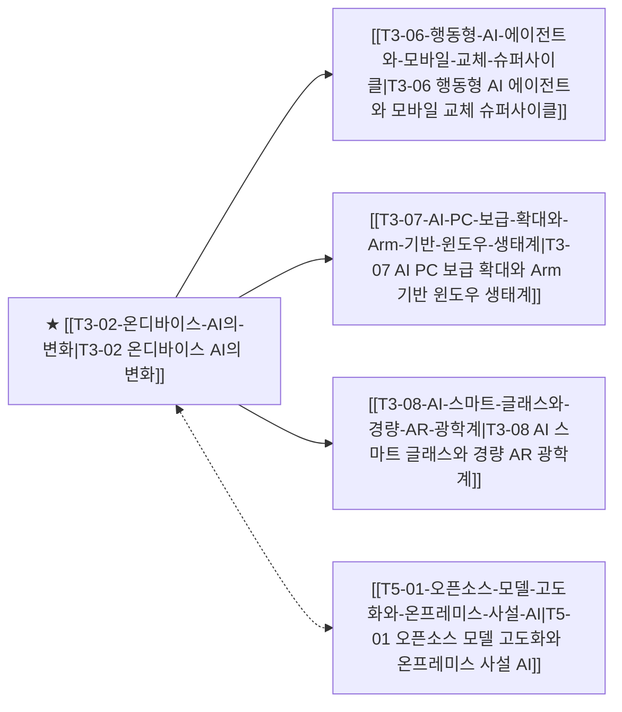

# T3-02 온디바이스 AI의 변화

> 🧭 **상위 인덱스**: [[00-Argus-Master-MOC|Master MOC]] ➔ [[00-Argus-Master-MOC#3-🤖-피지컬-ai-로보틱스--엣지-디바이스-physical-ai--edge|피지컬 AI & 엣지 디바이스]]

> 🏷️ **교차 분석 메타데이터**:
> - **성격**: `🚀 주류 성장 (Consensus)` | **스택**: `L5 (디바이스)` | **시계**: `2026~2027`
> - **공급망 권역**: `US`, `KR` | **핵심 대결 구도**: 해당 없음

---

## 🎯 핵심 가설
45 TOPS NPU 기반 온디바이스 AI가 클라우드 의존을 줄이고 행동형 에이전트 시대를 연다

---

## 🔗 테제 네트워크 (상호 연관 가설)



- 🔼 **선행 가설 (배경 요인 & 상위 인프라)**:
  - (독립적 기저 요인)
- ➡️ **동반 및 대체·경쟁 가설**:
  - [[T5-01-오픈소스-모델-고도화와-온프레미스-사설-AI|T5-01 오픈소스 모델 고도화와 온프레미스 사설 AI]] — 소형 SLM 경량화
- 🔽 **파생 및 후행 병목 가설**:
  - [[T3-06-행동형-AI-에이전트와-모바일-교체-슈퍼사이클|T3-06 행동형 AI 에이전트와 모바일 교체 슈퍼사이클]] — 스마트폰 교체 주기 단축
  - [[T3-07-AI-PC-보급-확대와-Arm-기반-윈도우-생태계|T3-07 AI PC 보급 확대와 Arm 기반 윈도우 생태계]] — 차세대 AI PC 침투
  - [[T3-08-AI-스마트-글래스와-경량-AR-광학계|T3-08 AI 스마트 글래스와 경량 AR 광학계]] — 공간 컴퓨팅 기기 확산

---

## 🏢 연관 기업 & 핵심 기술 허브
- **핵심 기업**: [[Company-Apple|Apple]], [[Company-삼성전자|삼성전자]], [[Company-Qualcomm|Qualcomm]], [[Company-MediaTek|MediaTek]], [[Company-Google|Google]]
- **핵심 기술/토픽**: [[Topic-온디바이스AI|온디바이스AI]], [[Topic-ASIC|ASIC]]

---

## 📈 지지 근거


---

## 📉 반박 근거
- 2026-09-04: 증권사 리포트 3건 모두 GPU/HBM 기반 AI 가속기와 AI 서버 기판 등 클라우드 인프라 수혜에만 집중하고 45 TOPS NPU·온디바이스 에이전트 관련 신규 수치나 확산 사례를 전혀 언급하지 않음
- 2026-09-04: 증권사 리포트 3건 모두 삼성전기·이수페타시스 등 AI 서버 기판과 GPU/HBM 등 클라우드 인프라 가속기에만 집중하고 45 TOPS NPU나 온디바이스 에이전트 관련 신규 팩트·수치가 전무하며 모건스탠리 모멘텀 TMT 지수가 한 달간 53.5% 급락해 AI 하드웨어 모멘텀 붕괴 리스크가 부각됨
- 2026-09-04: 증권사 리포트 3건 모두 GPU/HBM 및 AI 서버 기판 등 클라우드 인프라 수혜만 강조하고 45 TOPS NPU·온디바이스 에이전트 관련 신규 팩트 전무, 모건스탠리 모멘텀 TMT 지수 한 달 -53.5% 급락으로 고밸류 기술주 투자심리 악화 시사

---

## 📑 관련 산출물 (자동 집계)

### 🤖 Dataview 실시간 역방향 링크
```dataview
TABLE file.mtime AS "작성일", angle AS "관점", tags AS "태그"
FROM "argus" OR "output" OR ""
WHERE contains(thesis, "T2-02") OR contains(thesis, "T2-02") OR contains(file.outlinks, this.file.link)
SORT file.mtime DESC
LIMIT 7
```

### 📌 수동 링크 아카이브


---

## 📝 분석가 메모

