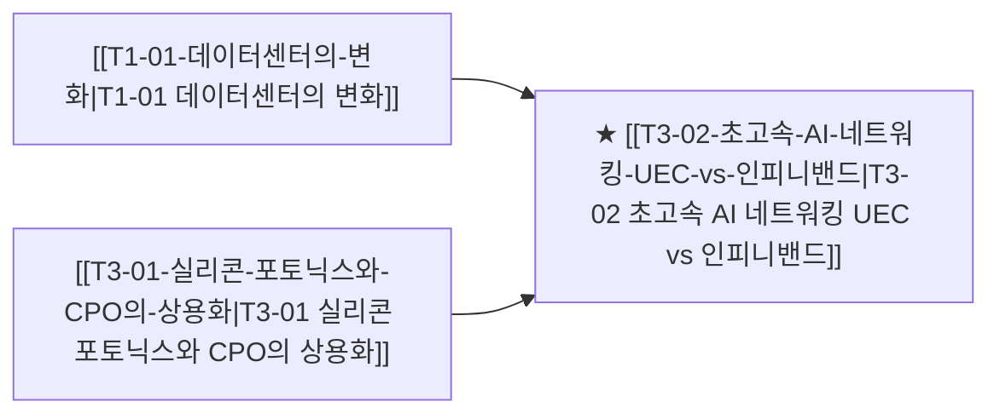

# T3-02 초고속 AI 네트워킹 UEC vs 인피니밴드

> 🧭 **상위 인덱스**: [[00-Argus-Master-MOC|Master MOC]] ➔ [[00-Argus-Master-MOC#1-💾-ai-컴퓨트--차세대-반도체-compute--silicon|AI 컴퓨트 & 반도체]]

> 🏷️ **교차 분석 메타데이터**:
> - **성격**: `🚀 주류 성장 (Consensus)` | **스택**: `L3 (네트워킹)` | **시계**: `2026~2027`
> - **공급망 권역**: `US` | **핵심 대결 구도**: [[Vs-인피니밴드-vs-울트라이더넷|인피니밴드-vs-울트라이더넷]]

---

## 🎯 핵심 가설
엔비디아의 인피니밴드 독점에 맞서 브로드컴, 시스코, 빅테크 중심의 Ultra Ethernet Consortium(UEC)이 이더넷 기반 가성비 백본으로 역전한다

---

## 🔗 테제 네트워크 (상호 연관 가설)



- 🔼 **선행 가설 (배경 요인 & 상위 인프라)**:
  - [[T1-01-데이터센터의-변화|T1-01 데이터센터의 변화]] — 클러스터 스케일아웃 네트워크 병목
  - [[T3-01-실리콘-포토닉스와-CPO의-상용화|T3-01 실리콘 포토닉스와 CPO의 상용화]] — 광 인터커넥트 도입
- ➡️ **동반 및 대체·경쟁 가설**:
  - (해당 없음)
- 🔽 **파생 및 후행 병목 가설**:
  - (해당 없음)

---

## 🏢 연관 기업 & 핵심 기술 허브
- **핵심 기업**: [[Company-Broadcom|Broadcom]], [[Company-Cisco|Cisco]], [[Company-Arista Networks|Arista Networks]], [[Company-NVIDIA|NVIDIA]], [[Company-Marvell|Marvell]], [[Company-이수페타시스|이수페타시스]]
- **핵심 기술/토픽**: [[Topic-초고속네트워킹|초고속네트워킹]], [[Topic-실리콘포토닉스|실리콘포토닉스]]

---

## 📈 지지 근거


---

## 📉 반박 근거
- 2026-09-05: 데이터센터 구축 비용의 최대 병목·예산 포식자가 네트워킹이 아닌 HBM 등 메모리로 지목되며 고금리 ROIC 압박 속 UEC 가성비 백본의 전략적 우선순위와 역전 동력이 희석될 리스크가 부각됨

---

## 📑 관련 산출물 (자동 집계)

### 🤖 Dataview 실시간 역방향 링크
```dataview
TABLE file.mtime AS "작성일", angle AS "관점", tags AS "태그"
FROM "argus" OR "output" OR ""
WHERE contains(thesis, "T1-11") OR contains(thesis, "T1-11") OR contains(file.outlinks, this.file.link)
SORT file.mtime DESC
LIMIT 7
```

### 📌 수동 링크 아카이브


---

## 📝 분석가 메모

